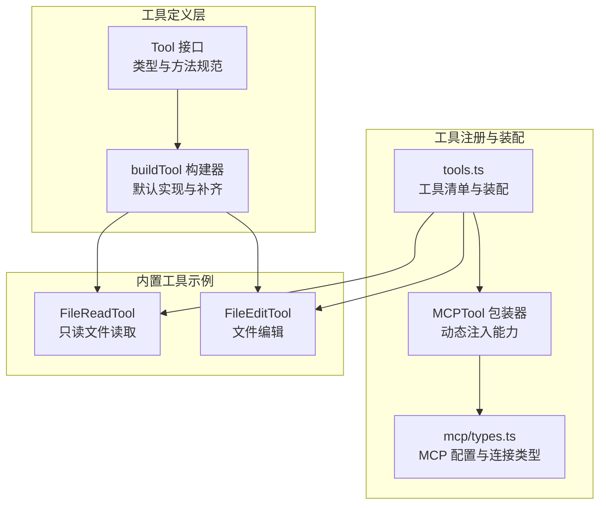
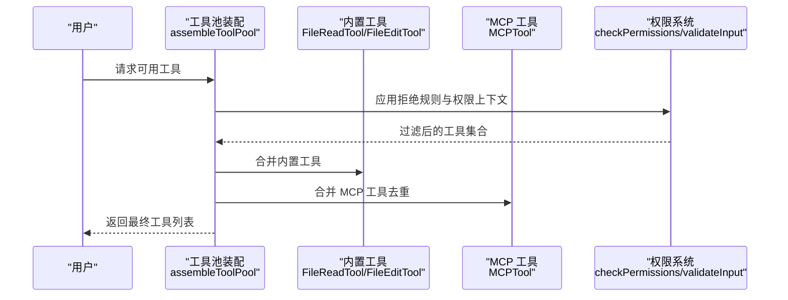
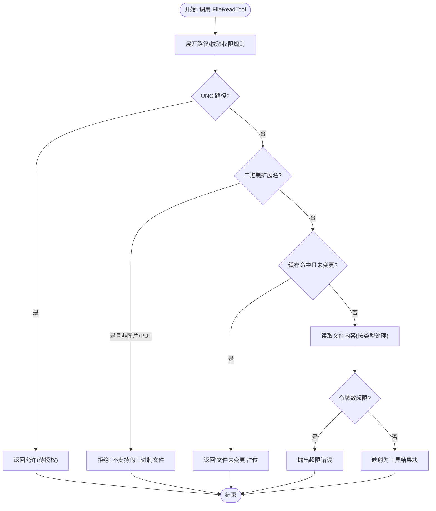
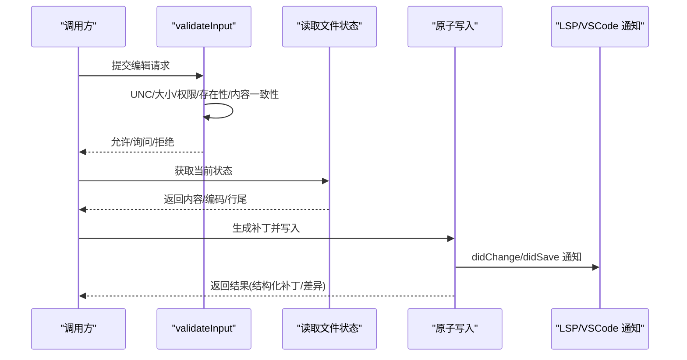
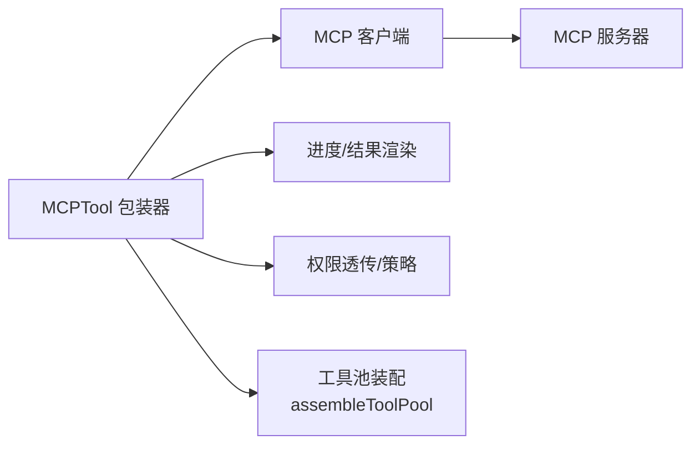
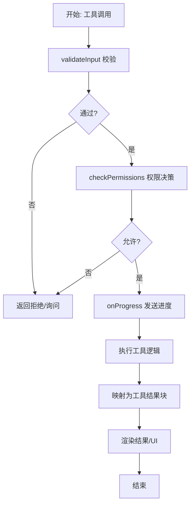
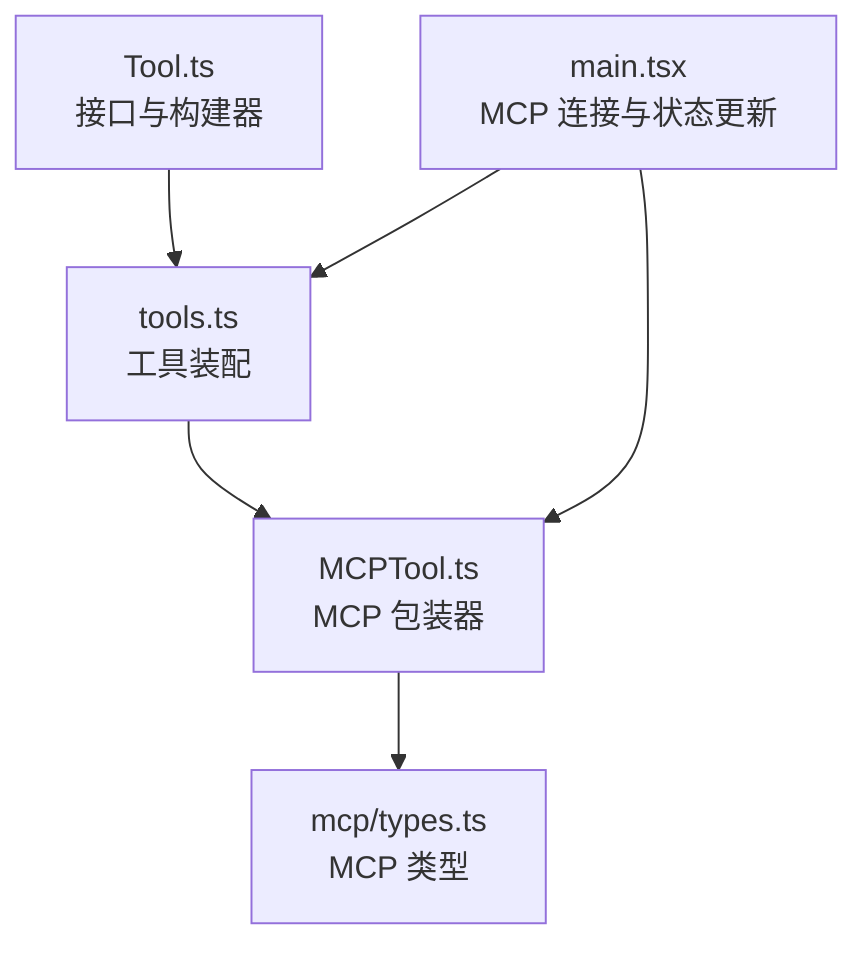

# 自定义工具开发

<cite>
**本文档引用的文件**
- [Tool.ts](file://src/Tool.ts)
- [tools.ts](file://src/tools.ts)
- [FileReadTool.ts](file://src/tools/FileReadTool/FileReadTool.ts)
- [FileEditTool.ts](file://src/tools/FileEditTool/FileEditTool.ts)
- [MCPTool.ts](file://src/tools/MCPTool/MCPTool.ts)
- [types.ts](file://src/services/mcp/types.ts)
- [main.tsx](file://src/main.tsx)
- [README.md](file://README.md)
- [queryHelpers.ts](file://src/utils/queryHelpers.ts)
- [queryProfiler.ts](file://src/utils/queryProfiler.ts)
- [OverflowTestTool.js](file://tools/OverflowTestTool/OverflowTestTool.js)
</cite>

## 目录
1. [简介](#简介)
2. [项目结构](#项目结构)
3. [核心组件](#核心组件)
4. [架构总览](#架构总览)
5. [详细组件分析](#详细组件分析)
6. [依赖关系分析](#依赖关系分析)
7. [性能考虑](#性能考虑)
8. [故障排除指南](#故障排除指南)
9. [结论](#结论)
10. [附录](#附录)

## 简介
本指南面向希望在 Claude Code 中开发自定义工具的开发者，覆盖从工具接口实现、buildTool 构建器使用、权限与安全检查、生命周期与进度报告、结果渲染系统，到 MCP 工具集成、测试策略、调试技巧与性能优化的完整流程。文档以代码库中的实际实现为依据，提供可操作的开发步骤与最佳实践。

## 项目结构
Claude Code 的工具体系围绕统一的 Tool 接口与工具构建器 buildTool 展开，并通过工具池装配函数将内置工具与 MCP 工具合并。权限系统贯穿工具的输入校验、权限决策与 UI 呈现；进度与结果渲染由工具的回调与 UI 组件共同完成。



**图表来源**
- [Tool.ts:783-792](file://src/Tool.ts#L783-L792)
- [tools.ts:193-251](file://src/tools.ts#L193-L251)
- [MCPTool.ts:27-77](file://src/tools/MCPTool/MCPTool.ts#L27-L77)
- [types.ts:124-161](file://src/services/mcp/types.ts#L124-L161)

**章节来源**
- [Tool.ts:362-695](file://src/Tool.ts#L362-L695)
- [tools.ts:193-390](file://src/tools.ts#L193-L390)

## 核心组件
- Tool 接口：定义工具名称、输入输出模式、权限检查、并发安全、是否只读/破坏性、描述生成、渲染与进度回调、以及可选的路径解析、自动分类输入等能力。
- buildTool 构建器：为工具定义提供默认实现（如 isEnabled、isReadOnly、checkPermissions 等），确保工具导出时具备一致的最小能力集。
- 工具池装配：根据权限上下文过滤内置工具，结合 MCP 工具去重合并，形成最终可用工具集合。

关键要点
- 输入/输出模式：通过 Zod 模式或 JSON Schema 描述参数与返回值，支持严格模式与延迟模式。
- 权限与安全：validateInput 与 checkPermissions 双层校验；权限规则匹配与拒绝列表生效；敏感工具需明确 isDestructive/isReadOnly。
- 渲染与进度：renderToolUseMessage/renderToolResultMessage 等回调负责 UI 呈现；进度事件用于长耗时工具的实时反馈。
- MCP 集成：MCPTool 作为包装器，动态注入名称、描述、调用逻辑与权限策略，实现跨服务器工具的统一接入。

**章节来源**
- [Tool.ts:783-792](file://src/Tool.ts#L783-L792)
- [tools.ts:271-390](file://src/tools.ts#L271-L390)

## 架构总览
工具系统采用“接口 + 构建器 + 装配器”的分层设计，内置工具与 MCP 工具在运行期统一纳入工具池，权限系统在请求链路中贯穿始终。



**图表来源**
- [tools.ts:345-367](file://src/tools.ts#L345-L367)
- [tools.ts:383-389](file://src/tools.ts#L383-L389)

**章节来源**
- [tools.ts:345-390](file://src/tools.ts#L345-L390)

## 详细组件分析

### 工具接口与构建器
- Tool 接口：包含 call/description/inputSchema/outputSchema/isReadOnly/isDestructive/interruptBehavior 等方法；支持搜索提示、是否延迟加载、是否 MCP 工具标记、最大结果大小等元数据。
- buildTool：将工具定义与默认实现进行浅合并，补齐常用方法；默认行为偏向安全（非并发安全、非只读、允许权限检查交由通用系统）。

```mermaid
classDiagram
class Tool {
+name : string
+aliases? : string[]
+searchHint? : string
+call(args, context, canUseTool, parentMessage, onProgress)
+description(input, options)
+inputSchema
+outputSchema?
+inputsEquivalent?(a,b)
+isConcurrencySafe(input) : boolean
+isEnabled() : boolean
+isReadOnly(input) : boolean
+isDestructive?(input) : boolean
+interruptBehavior?() : "cancel"|"block"
+isSearchOrReadCommand?(input) : {isSearch,isRead,isList?}
+isOpenWorld?(input) : boolean
+requiresUserInteraction?() : boolean
+isMcp? : boolean
+isLsp? : boolean
+shouldDefer? : boolean
+alwaysLoad? : boolean
+mcpInfo? : {serverName, toolName}
+maxResultSizeChars : number
+strict? : boolean
+backfillObservableInput?(input)
+validateInput?(input, context)
+checkPermissions(input, context)
+getPath?(input) : string
+preparePermissionMatcher?(input)
+prompt(options)
+userFacingName(input?)
+userFacingNameBackgroundColor?(input?)
+isTransparentWrapper?() : boolean
+getToolUseSummary?(input?) : string|null
+getActivityDescription?(input?) : string|null
+toAutoClassifierInput(input)
+mapToolResultToToolResultBlockParam(content, toolUseID)
+renderToolUseMessage(input, options)
+renderToolUseTag?(input?)
+renderToolUseProgressMessage?(progress, options)
+renderToolUseQueuedMessage?()
+renderToolUseRejectedMessage?(input, options)
+renderToolUseErrorMessage?(result, options)
+renderGroupedToolUse?(toolUses, options)
}
class 工具构建器 {
+buildTool(def) : Tool
}
工具构建器 --> Tool : "补齐默认实现"
```

**图表来源**
- [Tool.ts:362-695](file://src/Tool.ts#L362-L695)
- [Tool.ts:783-792](file://src/Tool.ts#L783-L792)

**章节来源**
- [Tool.ts:362-695](file://src/Tool.ts#L362-L695)
- [Tool.ts:783-792](file://src/Tool.ts#L783-L792)

### 文件读取工具（FileReadTool）
- 功能定位：只读文件内容、图片、PDF、Jupyter Notebook 等；支持偏移与限制读取范围；对大文件进行令牌数估算与上限控制；对未变更文件进行缓存去重。
- 安全与权限：UNC 路径不直接访问；设备文件阻断；二进制文件扩展名检测；权限规则匹配；路径展开避免相对路径绕过。
- 渲染与结果：根据类型映射为文本、图像、PDF 元数据或页面提取摘要；提供 UI 摘要与错误消息渲染；支持“内容未变更”占位以节省缓存。
- 性能：文件修改时间戳对比、LRU 缓存去重、令牌数估算与 API 计数双保险。



**图表来源**
- [FileReadTool.ts:496-718](file://src/tools/FileReadTool/FileReadTool.ts#L496-L718)
- [FileReadTool.ts:536-573](file://src/tools/FileReadTool/FileReadTool.ts#L536-L573)

**章节来源**
- [FileReadTool.ts:337-718](file://src/tools/FileReadTool/FileReadTool.ts#L337-L718)

### 文件编辑工具（FileEditTool）
- 功能定位：在读取后对文件进行原子写入；支持替换全部或单次替换；自动检测并提示多处匹配；对笔记本文件进行专门提示；对设置文件进行额外校验。
- 安全与权限：UNC 路径跳过文件系统操作；最大文件大小限制；读取状态一致性检查；团队内存文件的密钥防护；路径展开与权限规则匹配。
- 渲染与结果：返回结构化补丁与差异信息；通知 LSP 与 VSCode 更新；记录文件历史与统计指标；支持“用户已修改”提示。
- 并发与一致性：确保写入前目录存在；写入前后的时间戳与内容一致性检查；失败时抛出“意外修改”错误。



**图表来源**
- [FileEditTool.ts:137-362](file://src/tools/FileEditTool/FileEditTool.ts#L137-L362)
- [FileEditTool.ts:387-595](file://src/tools/FileEditTool/FileEditTool.ts#L387-L595)

**章节来源**
- [FileEditTool.ts:86-595](file://src/tools/FileEditTool/FileEditTool.ts#L86-L595)

### MCP 工具集成
- MCPTool 包装器：作为统一入口，动态注入工具名称、描述、调用逻辑与权限策略；支持进度渲染与截断处理。
- MCP 类型与配置：支持 stdio、sse、http、ws、sdk 等传输方式；OAuth/XAA 支持；服务端能力与资源类型定义。
- 运行期装配：通过工具池装配函数合并内置与 MCP 工具，保持内置工具优先、名称去重与排序稳定。



**图表来源**
- [MCPTool.ts:27-77](file://src/tools/MCPTool/MCPTool.ts#L27-L77)
- [types.ts:124-161](file://src/services/mcp/types.ts#L124-L161)
- [tools.ts:345-367](file://src/tools.ts#L345-L367)

**章节来源**
- [MCPTool.ts:27-77](file://src/tools/MCPTool/MCPTool.ts#L27-L77)
- [types.ts:124-259](file://src/services/mcp/types.ts#L124-L259)
- [tools.ts:345-367](file://src/tools.ts#L345-L367)

### 工具生命周期与进度报告
- 生命周期：工具在调用前执行 validateInput 与 checkPermissions；执行期间可通过 onProgress 回调发送进度；完成后映射为工具结果块并渲染。
- 进度节流：工具进度按父工具使用 ID 进行节流与 LRU 管理，避免高频更新导致性能问题。
- 查询剖析：提供查询阶段分解与日志输出，帮助定位工具执行瓶颈。



**图表来源**
- [Tool.ts:379-385](file://src/Tool.ts#L379-L385)
- [queryHelpers.ts:165-198](file://src/utils/queryHelpers.ts#L165-L198)
- [queryProfiler.ts:244-301](file://src/utils/queryProfiler.ts#L244-L301)

**章节来源**
- [Tool.ts:379-385](file://src/Tool.ts#L379-L385)
- [queryHelpers.ts:165-198](file://src/utils/queryHelpers.ts#L165-L198)
- [queryProfiler.ts:244-301](file://src/utils/queryProfiler.ts#L244-L301)

## 依赖关系分析
- 工具接口与构建器：Tool.ts 定义统一契约，buildTool 提供默认实现，确保所有工具具备一致的最小能力。
- 工具装配：tools.ts 负责根据权限上下文过滤内置工具，再与 MCP 工具合并，保证内置工具优先与名称唯一。
- MCP 集成：MCPTool 与 mcp/types.ts 协作，支持多传输协议与认证方式，运行期动态注入工具能力。
- 运行期装配：main.tsx 在应用启动时批量连接 MCP 服务器，收集工具与命令并更新全局状态。



**图表来源**
- [Tool.ts:362-695](file://src/Tool.ts#L362-L695)
- [tools.ts:345-367](file://src/tools.ts#L345-L367)
- [MCPTool.ts:27-77](file://src/tools/MCPTool/MCPTool.ts#L27-L77)
- [types.ts:124-161](file://src/services/mcp/types.ts#L124-L161)
- [main.tsx:2689-2720](file://src/main.tsx#L2689-L2720)

**章节来源**
- [tools.ts:345-367](file://src/tools.ts#L345-L367)
- [main.tsx:2689-2720](file://src/main.tsx#L2689-L2720)

## 性能考虑
- 输入与输出规模控制：通过 maxResultSizeChars 限制结果大小；对大文件读取进行令牌数估算与上限控制，避免内存与缓存压力。
- 缓存与去重：文件读取结果基于偏移与时间戳进行缓存去重，显著减少重复读取与缓存污染。
- 进度节流：工具进度按父工具使用 ID 进行节流与容量控制，降低高频更新带来的开销。
- 查询剖析：通过阶段分解与日志输出定位工具执行瓶颈，指导进一步优化。

**章节来源**
- [FileReadTool.ts:536-573](file://src/tools/FileReadTool/FileReadTool.ts#L536-L573)
- [queryHelpers.ts:165-198](file://src/utils/queryHelpers.ts#L165-L198)
- [queryProfiler.ts:244-301](file://src/utils/queryProfiler.ts#L244-L301)

## 故障排除指南
- 文件读取失败：检查路径是否存在、UNC 路径、二进制扩展名与设备文件阻断；利用相似文件建议与工作目录提示辅助定位。
- 文件编辑冲突：若读取后文件被外部修改，会触发“意外修改”错误；应先重新读取再编辑。
- 权限相关：UNC 路径与拒绝规则会导致早期放行或拒绝；确认权限上下文与规则匹配。
- MCP 工具不可用：检查服务器连接状态、认证需求与工具名称规范化；查看客户端状态与错误信息。
- 调试与剖析：启用查询剖析日志，关注工具执行阶段耗时；使用进度节流与 LRU 管理避免过度更新。

**章节来源**
- [FileReadTool.ts:418-495](file://src/tools/FileReadTool/FileReadTool.ts#L418-L495)
- [FileEditTool.ts:450-468](file://src/tools/FileEditTool/FileEditTool.ts#L450-L468)
- [main.tsx:2689-2720](file://src/main.tsx#L2689-L2720)

## 结论
通过统一的 Tool 接口与 buildTool 构建器，Claude Code 为自定义工具提供了清晰、安全且可扩展的开发框架。内置工具（如 FileReadTool、FileEditTool）展示了输入校验、权限检查、安全防护与结果渲染的最佳实践；MCP 工具集成则实现了跨服务器工具的统一接入。配合工具池装配、进度节流与查询剖析，开发者可以高效地构建高质量工具并持续优化其性能与稳定性。

## 附录

### 开发流程速查
- 定义工具：使用 buildTool 创建工具对象，至少提供 name、inputSchema、call、renderToolUseMessage 等。
- 实现核心方法：validateInput 校验输入，checkPermissions 处理权限，isReadOnly/isDestructive 明确影响面。
- 渲染与进度：实现 renderToolUseMessage/renderToolResultMessage 与可选的进度回调。
- 注册与发布：将工具加入工具池装配函数，确保名称唯一与权限过滤生效；MCP 工具通过 MCPTool 包装器动态注入。

**章节来源**
- [Tool.ts:783-792](file://src/Tool.ts#L783-L792)
- [tools.ts:345-367](file://src/tools.ts#L345-L367)

### 示例类型与参考
- 简单工具：参考 FileReadTool 的只读特性与严格模式。
- 复杂工具：参考 FileEditTool 的多步校验、原子写入与 LSP/VSCode 通知。
- MCP 工具：参考 MCPTool 的动态注入与权限透传。

**章节来源**
- [FileReadTool.ts:337-718](file://src/tools/FileReadTool/FileReadTool.ts#L337-L718)
- [FileEditTool.ts:86-595](file://src/tools/FileEditTool/FileEditTool.ts#L86-L595)
- [MCPTool.ts:27-77](file://src/tools/MCPTool/MCPTool.ts#L27-L77)

### 测试策略与调试技巧
- 单元测试：针对 validateInput 与 checkPermissions 的边界条件编写用例。
- 集成测试：模拟 MCP 服务器连接与工具调用，验证权限与结果渲染。
- 调试：开启查询剖析日志，观察工具执行阶段耗时；利用进度节流与 LRU 管理避免过度更新。

**章节来源**
- [queryProfiler.ts:244-301](file://src/utils/queryProfiler.ts#L244-L301)
- [queryHelpers.ts:165-198](file://src/utils/queryHelpers.ts#L165-L198)

### 扩展开发指南
- 插件化：通过工具池装配函数合并内置与 MCP 工具，保持内置工具优先与名称去重。
- 最佳实践：明确工具影响面（只读/破坏性）、提供搜索提示与摘要、实现严格模式与输入校验、合理控制结果大小与进度频率。

**章节来源**
- [tools.ts:345-367](file://src/tools.ts#L345-L367)
- [Tool.ts:466](file://src/Tool.ts#L466)