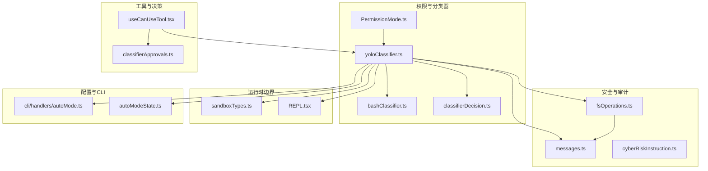
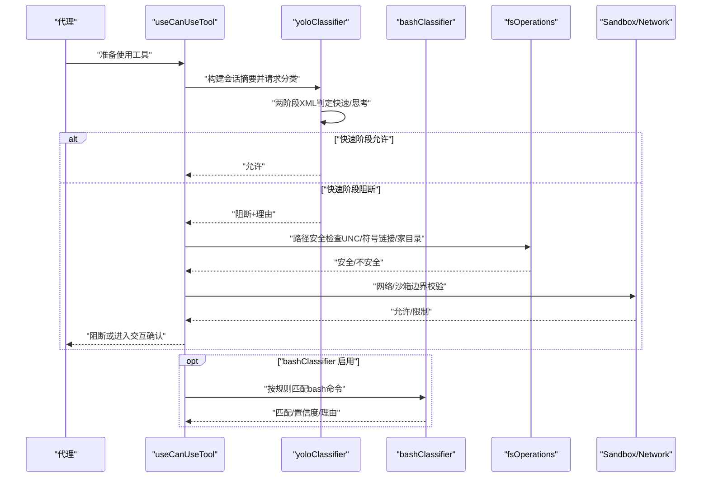
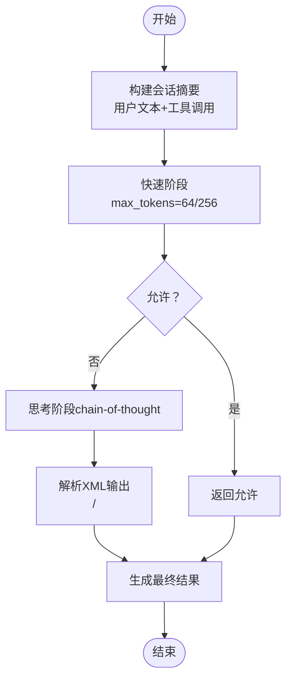
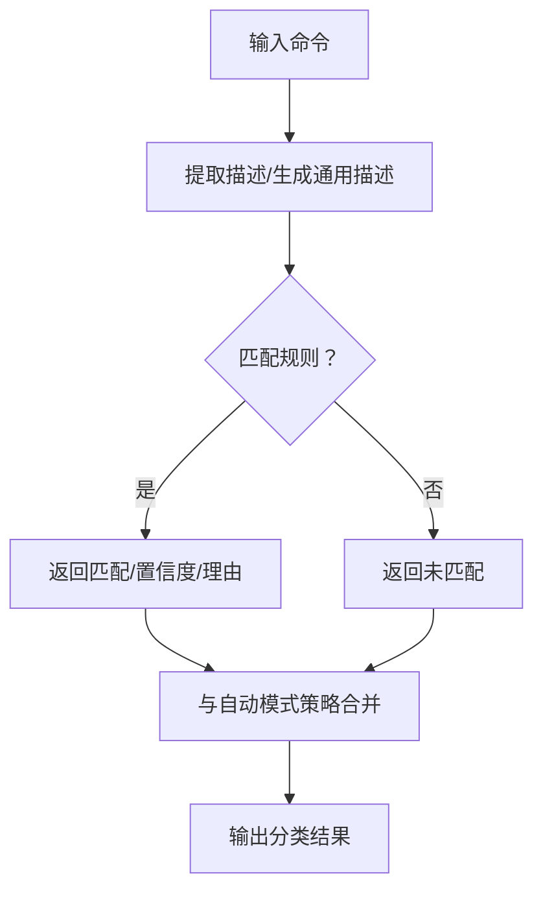
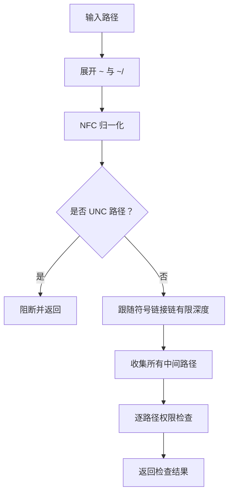
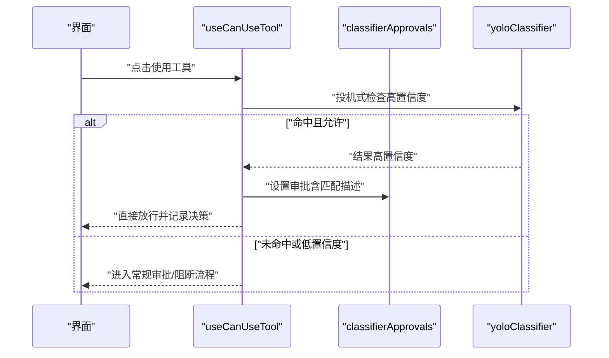
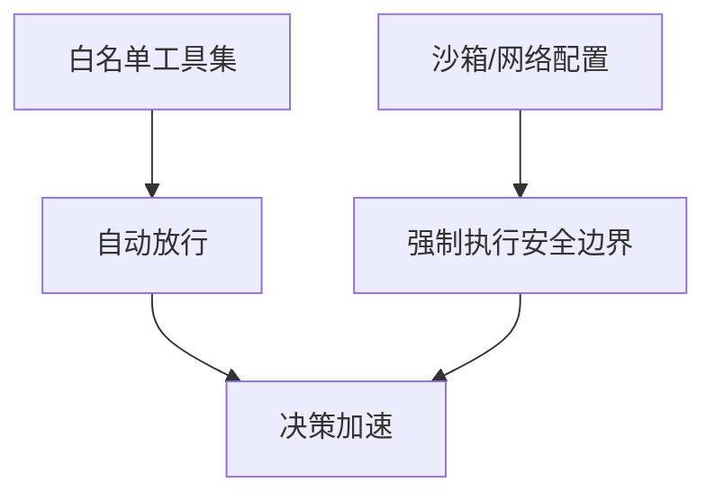
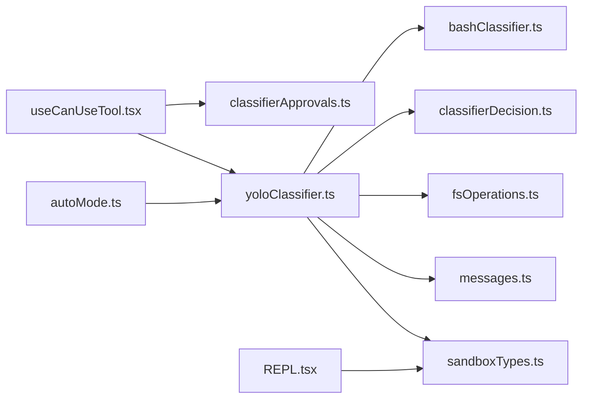

# 危险操作防护

<cite>
**本文引用的文件**
- [src/utils/permissions/yoloClassifier.ts](file://src/utils/permissions/yoloClassifier.ts)
- [src/utils/permissions/classifierDecision.ts](file://src/utils/permissions/classifierDecision.ts)
- [src/utils/permissions/bashClassifier.ts](file://src/utils/permissions/bashClassifier.ts)
- [src/utils/permissions/PermissionMode.ts](file://src/utils/permissions/PermissionMode.ts)
- [src/hooks/useCanUseTool.tsx](file://src/hooks/useCanUseTool.tsx)
- [src/utils/classifierApprovals.ts](file://src/utils/classifierApprovals.ts)
- [src/utils/messages.ts](file://src/utils/messages.ts)
- [src/utils/fsOperations.ts](file://src/utils/fsOperations.ts)
- [src/constants/cyberRiskInstruction.ts](file://src/constants/cyberRiskInstruction.ts)
- [src/entrypoints/sandboxTypes.ts](file://src/entrypoints/sandboxTypes.ts)
- [src/screens/REPL.tsx](file://src/screens/REPL.tsx)
- [src/cli/handlers/autoMode.ts](file://src/cli/handlers/autoMode.ts)
- [src/utils/permissions/autoModeState.ts](file://src/utils/permissions/autoModeState.ts)
- [src/utils/permissions/yoloClassifier.js（外部模板）](file://src/utils/permissions/yoloClassifier.js)
</cite>

## 目录
1. [引言](#引言)
2. [项目结构](#项目结构)
3. [核心组件](#核心组件)
4. [架构总览](#架构总览)
5. [详细组件分析](#详细组件分析)
6. [依赖关系分析](#依赖关系分析)
7. [性能考量](#性能考量)
8. [故障排查指南](#故障排查指南)
9. [结论](#结论)
10. [附录](#附录)

## 引言
本技术文档聚焦于“危险操作防护”机制，系统阐述以下能力与实现：
- 危险操作识别算法与模式匹配机制
- bash 命令分类器的工作原理与潜在危险识别
- 路径验证与安全策略（防路径遍历与恶意文件访问）
- yoloClassifier 的启发式检测方法与模糊/不确定场景处理
- 危险操作的缓解策略与安全边界设置
- 日志记录与审计能力
- 安全配置最佳实践与风险评估指南

## 项目结构
围绕危险操作防护的关键模块分布如下：
- 权限与自动模式分类器：yoloClassifier、bashClassifier、classifierDecision、PermissionMode
- 工具使用决策钩子：useCanUseTool
- 分类器审批与状态：classifierApprovals
- 消息与提示：messages
- 文件系统与路径安全：fsOperations
- 网络沙箱与安全边界：sandboxTypes、REPL 屏幕初始化
- CLI 自动模式规则导出：autoMode handler
- 威胁建模指导：cyberRiskInstruction

图表来源
- [src/utils/permissions/yoloClassifier.ts](file://src/utils/permissions/yoloClassifier.ts)
- [src/utils/permissions/bashClassifier.ts](file://src/utils/permissions/bashClassifier.ts)
- [src/utils/permissions/classifierDecision.ts](file://src/utils/permissions/classifierDecision.ts)
- [src/utils/permissions/PermissionMode.ts](file://src/utils/permissions/PermissionMode.ts)
- [src/hooks/useCanUseTool.tsx](file://src/hooks/useCanUseTool.tsx)
- [src/utils/classifierApprovals.ts](file://src/utils/classifierApprovals.ts)
- [src/utils/messages.ts](file://src/utils/messages.ts)
- [src/utils/fsOperations.ts](file://src/utils/fsOperations.ts)
- [src/constants/cyberRiskInstruction.ts](file://src/constants/cyberRiskInstruction.ts)
- [src/entrypoints/sandboxTypes.ts](file://src/entrypoints/sandboxTypes.ts)
- [src/screens/REPL.tsx](file://src/screens/REPL.tsx)
- [src/cli/handlers/autoMode.ts](file://src/cli/handlers/autoMode.ts)
- [src/utils/permissions/autoModeState.ts](file://src/utils/permissions/autoModeState.ts)

章节来源
- [src/utils/permissions/yoloClassifier.ts](file://src/utils/permissions/yoloClassifier.ts)
- [src/utils/permissions/bashClassifier.ts](file://src/utils/permissions/bashClassifier.ts)
- [src/utils/permissions/classifierDecision.ts](file://src/utils/permissions/classifierDecision.ts)
- [src/utils/permissions/PermissionMode.ts](file://src/utils/permissions/PermissionMode.ts)
- [src/hooks/useCanUseTool.tsx](file://src/hooks/useCanUseTool.tsx)
- [src/utils/classifierApprovals.ts](file://src/utils/classifierApprovals.ts)
- [src/utils/messages.ts](file://src/utils/messages.ts)
- [src/utils/fsOperations.ts](file://src/utils/fsOperations.ts)
- [src/constants/cyberRiskInstruction.ts](file://src/constants/cyberRiskInstruction.ts)
- [src/entrypoints/sandboxTypes.ts](file://src/entrypoints/sandboxTypes.ts)
- [src/screens/REPL.tsx](file://src/screens/REPL.tsx)
- [src/cli/handlers/autoMode.ts](file://src/cli/handlers/autoMode.ts)
- [src/utils/permissions/autoModeState.ts](file://src/utils/permissions/autoModeState.ts)

## 核心组件
- yoloClassifier：自动模式下的两阶段 XML 输出格式分类器，支持快速判定与链式思考阶段，用于对会话历史中的工具调用进行安全判定。
- bashClassifier：bash 命令分类器（外部构建中为桩），在启用时从用户规则与内置描述生成允许/拒绝/询问的策略。
- classifierDecision：自动模式白名单工具集合，避免对只读/非破坏性工具发起分类器调用。
- useCanUseTool：工具使用前的决策钩子，结合分类器结果与审批状态决定放行、阻断或交互确认。
- classifierApprovals：分类器审批状态管理，支持设置、清除与订阅审批状态。
- fsOperations：路径权限检查与安全策略，包括 UNC 阻断、符号链接链追踪、家目录展开与路径归一化。
- sandboxTypes/REPL：网络与沙箱边界定义与初始化，确保安全配置生效并提供不可用原因提示。

章节来源
- [src/utils/permissions/yoloClassifier.ts](file://src/utils/permissions/yoloClassifier.ts)
- [src/utils/permissions/bashClassifier.ts](file://src/utils/permissions/bashClassifier.ts)
- [src/utils/permissions/classifierDecision.ts](file://src/utils/permissions/classifierDecision.ts)
- [src/hooks/useCanUseTool.tsx](file://src/hooks/useCanUseTool.tsx)
- [src/utils/classifierApprovals.ts](file://src/utils/classifierApprovals.ts)
- [src/utils/fsOperations.ts](file://src/utils/fsOperations.ts)
- [src/entrypoints/sandboxTypes.ts](file://src/entrypoints/sandboxTypes.ts)
- [src/screens/REPL.tsx](file://src/screens/REPL.tsx)

## 架构总览
自动模式下，工具调用在进入执行前需通过 yoloClassifier 的两阶段判定：
- 快速阶段：短响应、强停止序列，优先得到“是否阻断”的即时结论
- 思考阶段：在被阻断时触发，要求模型输出链式思考与理由，降低误判

同时，bashClassifier 可作为补充策略，基于用户规则与上下文描述进行匹配；路径安全策略在文件操作前执行，阻断高危路径与符号链接链。

图表来源
- [src/hooks/useCanUseTool.tsx](file://src/hooks/useCanUseTool.tsx)
- [src/utils/permissions/yoloClassifier.ts](file://src/utils/permissions/yoloClassifier.ts)
- [src/utils/permissions/bashClassifier.ts](file://src/utils/permissions/bashClassifier.ts)
- [src/utils/fsOperations.ts](file://src/utils/fsOperations.ts)
- [src/entrypoints/sandboxTypes.ts](file://src/entrypoints/sandboxTypes.ts)

## 详细组件分析

### yoloClassifier：自动模式分类器
- 两阶段判定流程
  - 快速阶段：短响应、强停止序列，优先得到“是否阻断”的即时结论
  - 思考阶段：在被阻断时触发，要求模型输出链式思考与理由，降低误判
- 输出格式
  - 使用 XML 格式：<block>yes/no</block> 与 <reason>...</reason>，并剥离思考内容避免标签误匹配
- 提示工程
  - 将会话历史压缩为紧凑文本，仅包含用户文本与助手工具调用块，避免模型被自然语言误导
  - 支持将 CLAUDE.md 用户配置作为系统提示的一部分，纳入用户意图
- 错误诊断与转储
  - 在 API 错误时写入上下文比较信息与提示词快照，便于复现与共享
- 令牌与缓存
  - 使用 prompt caching（1小时TTL）提升跨调用效率，并统计输入/输出/缓存读取/创建的令牌用量

图表来源
- [src/utils/permissions/yoloClassifier.ts](file://src/utils/permissions/yoloClassifier.ts)

章节来源
- [src/utils/permissions/yoloClassifier.ts](file://src/utils/permissions/yoloClassifier.ts)
- [src/cli/handlers/autoMode.ts](file://src/cli/handlers/autoMode.ts)
- [src/utils/permissions/autoModeState.ts](file://src/utils/permissions/autoModeState.ts)

### bash 命令分类器：识别潜在危险的 shell 命令
- 功能现状
  - 在当前构建中为桩函数，返回“功能未启用”的默认结果
  - 当启用时，将从用户规则与内置描述生成允许/拒绝/询问的策略
- 规则与描述
  - 支持 prompt: 前缀的规则描述，以及生成通用描述的能力
- 与自动模式的协作
  - 可作为自动模式系统提示的一部分，与 yoloClassifier 共同形成多层安全边界

图表来源
- [src/utils/permissions/bashClassifier.ts](file://src/utils/permissions/bashClassifier.ts)

章节来源
- [src/utils/permissions/bashClassifier.ts](file://src/utils/permissions/bashClassifier.ts)

### 路径验证与安全策略：防止路径遍历与恶意访问
- UNC 路径阻断
  - 在 Windows 上，遇到网络路径前缀（// 或 \\）直接返回，避免 DNS/SMB 请求
- 符号链接链追踪
  - 按最大深度遍历符号链接链，收集所有中间目标，确保对任意层级的链接都进行权限检查
- 家目录展开与归一化
  - 对 ~ 与 ~/ 形式的路径进行安全展开，并进行 NFC 归一化，减少绕过尝试
- 多平台转义处理
  - 在 macOS/Linux/WSL 平台移除 shell 转义反斜杠，防止路径注入

图表来源
- [src/utils/fsOperations.ts](file://src/utils/fsOperations.ts)

章节来源
- [src/utils/fsOperations.ts](file://src/utils/fsOperations.ts)

### 工具使用决策与分类器审批
- 决策钩子 useCanUseTool
  - 在工具使用前进行“投机式”分类器检查，若高置信度匹配且允许，则直接放行并记录决策来源
  - 若存在分类器审批，可直接采用审批理由作为放行依据
- 分类器审批状态管理
  - 支持设置、清除、订阅分类器审批状态，以及查询“正在检查中”的状态集合

图表来源
- [src/hooks/useCanUseTool.tsx](file://src/hooks/useCanUseTool.tsx)
- [src/utils/classifierApprovals.ts](file://src/utils/classifierApprovals.ts)

章节来源
- [src/hooks/useCanUseTool.tsx](file://src/hooks/useCanUseTool.tsx)
- [src/utils/classifierApprovals.ts](file://src/utils/classifierApprovals.ts)

### 自动模式白名单与安全边界
- 白名单工具
  - 仅读取/搜索/任务管理/计划模式/消息发送等非破坏性工具被自动放行，避免不必要的分类器调用
- 网络与沙箱边界
  - 通过 sandboxTypes 定义网络域、Unix Socket、本地绑定、代理端口等边界
  - REPL 初始化时检查沙箱可用性，不可用时发出警告或强制退出，确保安全配置生效

图表来源
- [src/utils/permissions/classifierDecision.ts](file://src/utils/permissions/classifierDecision.ts)
- [src/entrypoints/sandboxTypes.ts](file://src/entrypoints/sandboxTypes.ts)
- [src/screens/REPL.tsx](file://src/screens/REPL.tsx)

章节来源
- [src/utils/permissions/classifierDecision.ts](file://src/utils/permissions/classifierDecision.ts)
- [src/entrypoints/sandboxTypes.ts](file://src/entrypoints/sandboxTypes.ts)
- [src/screens/REPL.tsx](file://src/screens/REPL.tsx)

### 日志记录与审计
- 自动模式错误诊断快照
  - 在 API 错误时写入系统提示、用户提示、令牌用量、消息数量等上下文信息，便于复盘
- 分类器请求/响应转储
  - 可选地将请求与响应体写入临时目录，支持会话级错误诊断文件
- 消息与提示
  - 构建 yolo 拒绝消息与分类器不可用提示，指导用户添加权限规则或等待重试

章节来源
- [src/utils/permissions/yoloClassifier.ts](file://src/utils/permissions/yoloClassifier.ts)
- [src/utils/messages.ts](file://src/utils/messages.ts)

## 依赖关系分析
- 组件耦合
  - yoloClassifier 依赖工具查找映射、消息转录、CLAUDE.md 配置、外部模板与 bashClassifier（可选）
  - useCanUseTool 依赖分类器审批状态与决策钩子，形成“投机式放行”与“常规审批”的双轨
  - fsOperations 与 messages 在路径安全与提示生成之间形成协作
- 外部依赖与集成点
  - 网络与沙箱边界由 sandboxTypes 定义，REPL 初始化时加载并校验
  - CLI auto-mode handler 导出默认与合并后的自动模式规则，供用户审阅与定制

图表来源
- [src/utils/permissions/yoloClassifier.ts](file://src/utils/permissions/yoloClassifier.ts)
- [src/utils/permissions/bashClassifier.ts](file://src/utils/permissions/bashClassifier.ts)
- [src/utils/permissions/classifierDecision.ts](file://src/utils/permissions/classifierDecision.ts)
- [src/utils/fsOperations.ts](file://src/utils/fsOperations.ts)
- [src/utils/messages.ts](file://src/utils/messages.ts)
- [src/entrypoints/sandboxTypes.ts](file://src/entrypoints/sandboxTypes.ts)
- [src/hooks/useCanUseTool.tsx](file://src/hooks/useCanUseTool.tsx)
- [src/utils/classifierApprovals.ts](file://src/utils/classifierApprovals.ts)
- [src/screens/REPL.tsx](file://src/screens/REPL.tsx)
- [src/cli/handlers/autoMode.ts](file://src/cli/handlers/autoMode.ts)

章节来源
- [src/utils/permissions/yoloClassifier.ts](file://src/utils/permissions/yoloClassifier.ts)
- [src/utils/permissions/bashClassifier.ts](file://src/utils/permissions/bashClassifier.ts)
- [src/utils/permissions/classifierDecision.ts](file://src/utils/permissions/classifierDecision.ts)
- [src/utils/fsOperations.ts](file://src/utils/fsOperations.ts)
- [src/utils/messages.ts](file://src/utils/messages.ts)
- [src/entrypoints/sandboxTypes.ts](file://src/entrypoints/sandboxTypes.ts)
- [src/hooks/useCanUseTool.tsx](file://src/hooks/useCanUseTool.tsx)
- [src/utils/classifierApprovals.ts](file://src/utils/classifierApprovals.ts)
- [src/screens/REPL.tsx](file://src/screens/REPL.tsx)
- [src/cli/handlers/autoMode.ts](file://src/cli/handlers/autoMode.ts)

## 性能考量
- 令牌与缓存
  - prompt caching（1小时TTL）显著降低重复计算成本
  - 合理设置 max_tokens 与 stop_sequences，避免过度浪费
- 两阶段判定
  - 快速阶段优先，仅在必要时进入思考阶段，平衡延迟与准确性
- 白名单优化
  - 对只读/非破坏性工具直接放行，减少分类器调用次数
- 路径检查
  - 符号链接链的最大深度限制（如 40）防止资源耗尽

## 故障排查指南
- 分类器不可用
  - 使用构建不可用提示消息，建议等待重试或继续其他任务
- API 错误诊断
  - 自动生成上下文比较与提示词快照，定位投影发散与令牌预算问题
- 沙箱不可用
  - REPL 初始化时打印不可用原因，必要时强制退出，避免在不安全配置下运行
- 权限规则建议
  - 在自动模式拒绝时，建议用户添加 Bash 权限规则，避免重复阻断

章节来源
- [src/utils/messages.ts](file://src/utils/messages.ts)
- [src/utils/permissions/yoloClassifier.ts](file://src/utils/permissions/yoloClassifier.ts)
- [src/screens/REPL.tsx](file://src/screens/REPL.tsx)

## 结论
该危险操作防护体系通过“自动模式分类器 + bash 命令分类器 + 路径安全策略 + 沙箱/网络边界 + 白名单优化 + 审计与诊断”的组合，实现了对潜在危险操作的多层次、可配置与可观测的防护。在保证安全的前提下，尽可能减少对正常工作流的干扰，并提供完善的日志与诊断能力以支持持续改进。

## 附录

### 安全配置最佳实践
- 启用自动模式并审阅默认规则，按需添加 allow/soft_deny/environment 规则
- 严格限制网络域与 Unix Socket 访问，仅开放必要端口
- 在 Windows 环境下禁用 UNC 路径访问，避免网络侧发起的潜在攻击面
- 对符号链接链进行深度限制，防止路径穿越与循环链接
- 使用白名单工具集，减少不必要的分类器调用与误判风险

### 风险评估指南
- 以“最小授权”原则配置 allow/soft_deny，优先拒绝高风险动作
- 对 bash 命令进行细粒度描述，提高分类器置信度
- 定期审查分类器错误快照，识别误报与漏报并调整规则
- 结合威胁建模指导（cyberRiskInstruction）评估边界行为，避免协助破坏性活动

章节来源
- [src/constants/cyberRiskInstruction.ts](file://src/constants/cyberRiskInstruction.ts)
- [src/entrypoints/sandboxTypes.ts](file://src/entrypoints/sandboxTypes.ts)
- [src/utils/permissions/yoloClassifier.ts](file://src/utils/permissions/yoloClassifier.ts)
- [src/utils/permissions/bashClassifier.ts](file://src/utils/permissions/bashClassifier.ts)
- [src/utils/fsOperations.ts](file://src/utils/fsOperations.ts)