# 权限控制系统

<cite>
**本文档引用的文件**
- [src/types/permissions.ts](file://src/types/permissions.ts)
- [src/Tool.ts](file://src/Tool.ts)
- [src/hooks/useCanUseTool.tsx](file://src/hooks/useCanUseTool.tsx)
- [src/components/permissions/FallbackPermissionRequest.tsx](file://src/components/permissions/FallbackPermissionRequest.tsx)
- [src/components/permissions/rule/PermissionRuleList.tsx](file://src/components/permissions/rule/PermissionRuleList.tsx)
- [src/components/permissions/rule/AddPermissionRules.tsx](file://src/components/permissions/rule/AddPermissionRules.tsx)
- [src/components/permissions/rule/WorkspaceTab.tsx](file://src/components/permissions/rule/WorkspaceTab.tsx)
- [src/components/BypassPermissionsModeDialog.tsx](file://src/components/BypassPermissionsModeDialog.tsx)
- [src/setup.ts](file://src/setup.ts)
- [src/hooks/useReplBridge.tsx](file://src/hooks/useReplBridge.tsx)
- [src/migrations/migrateBypassPermissionsAcceptedToSettings.ts](file://src/migrations/migrateBypassPermissionsAcceptedToSettings.ts)
</cite>

## 目录
1. [简介](#简介)
2. [项目结构](#项目结构)
3. [核心组件](#核心组件)
4. [架构概览](#架构概览)
5. [详细组件分析](#详细组件分析)
6. [依赖关系分析](#依赖关系分析)
7. [性能考虑](#性能考虑)
8. [故障排除指南](#故障排除指南)
9. [结论](#结论)

## 简介

Claude Code 的权限控制系统是一个多层次的安全框架，旨在保护用户环境免受潜在危险操作的影响。该系统通过规则引擎、权限检查机制和用户交互流程，实现了灵活而强大的访问控制。

权限控制系统的核心目标包括：
- 防止危险工具的意外执行
- 提供透明的权限决策过程
- 支持多种权限模式（自动、手动、绕过）
- 实现细粒度的工具权限控制
- 确保多代理协作中的安全通信

## 项目结构

权限控制系统主要分布在以下模块中：

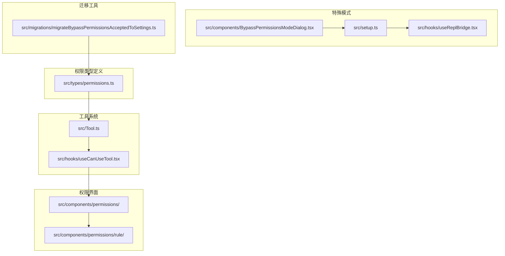

**图表来源**
- [src/types/permissions.ts:1-442](file://src/types/permissions.ts#L1-L442)
- [src/Tool.ts:740-793](file://src/Tool.ts#L740-L793)
- [src/hooks/useCanUseTool.tsx:1-204](file://src/hooks/useCanUseTool.tsx#L1-L204)

**章节来源**
- [src/types/permissions.ts:1-442](file://src/types/permissions.ts#L1-L442)
- [src/Tool.ts:740-793](file://src/Tool.ts#L740-L793)

## 核心组件

### 权限模式系统

权限系统支持多种运行模式，每种模式都有不同的安全级别和用户体验：

| 模式名称 | 安全级别 | 自动决策 | 用户交互 | 适用场景 |
|---------|---------|---------|---------|---------|
| default | 高 | 部分 | 常规确认 | 标准开发环境 |
| acceptEdits | 中高 | 无 | 文件编辑确认 | IDE 集成场景 |
| dontAsk | 中 | 有 | 无 | 受信任环境 |
| plan | 高 | 有 | 计划确认 | 复杂任务规划 |
| auto | 中低 | 全部 | 无或最小化 | AI 辅助场景 |
| bubble | 低 | 有 | 无 | 特殊测试环境 |

### 权限规则引擎

权限规则采用三层结构设计：

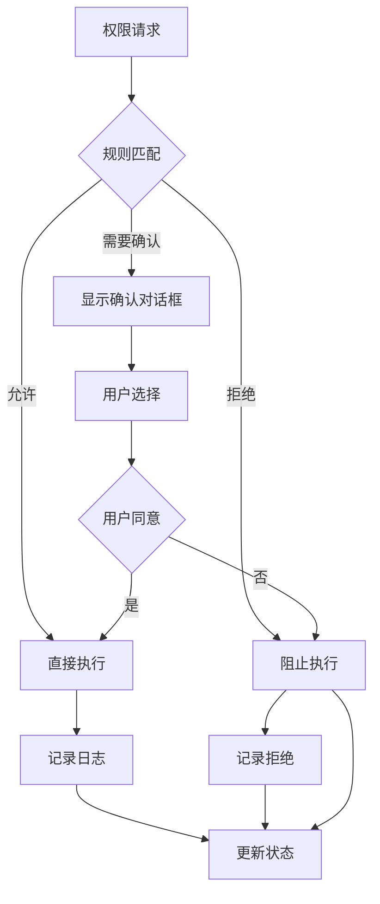

**图表来源**
- [src/hooks/useCanUseTool.tsx:32-183](file://src/hooks/useCanUseTool.tsx#L32-L183)

### 工具权限上下文

每个工具调用都携带完整的权限上下文信息：

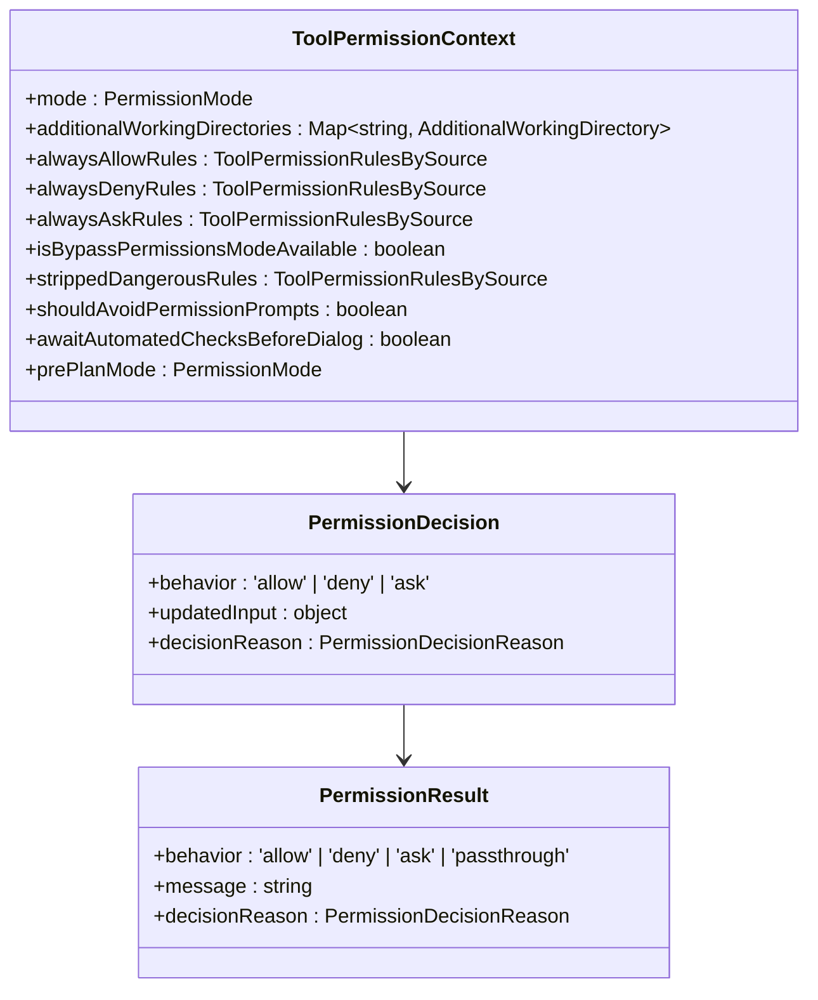

**图表来源**
- [src/types/permissions.ts:414-442](file://src/types/permissions.ts#L414-L442)
- [src/types/permissions.ts:241-267](file://src/types/permissions.ts#L241-L267)

**章节来源**
- [src/types/permissions.ts:16-39](file://src/types/permissions.ts#L16-L39)
- [src/types/permissions.ts:414-442](file://src/types/permissions.ts#L414-L442)

## 架构概览

权限控制系统采用分层架构设计，确保了模块间的松耦合和高内聚：

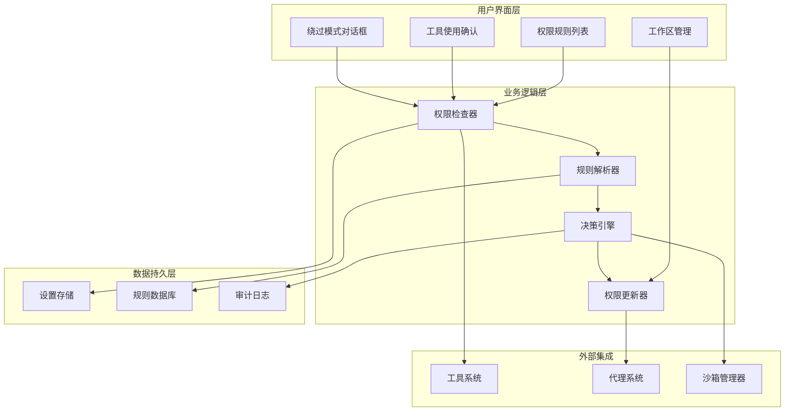

**图表来源**
- [src/components/permissions/rule/PermissionRuleList.tsx:473-800](file://src/components/permissions/rule/PermissionRuleList.tsx#L473-L800)
- [src/hooks/useCanUseTool.tsx:28-191](file://src/hooks/useCanUseTool.tsx#L28-L191)

## 详细组件分析

### 权限检查流程

权限检查是整个系统的核心，负责验证工具调用的合法性：

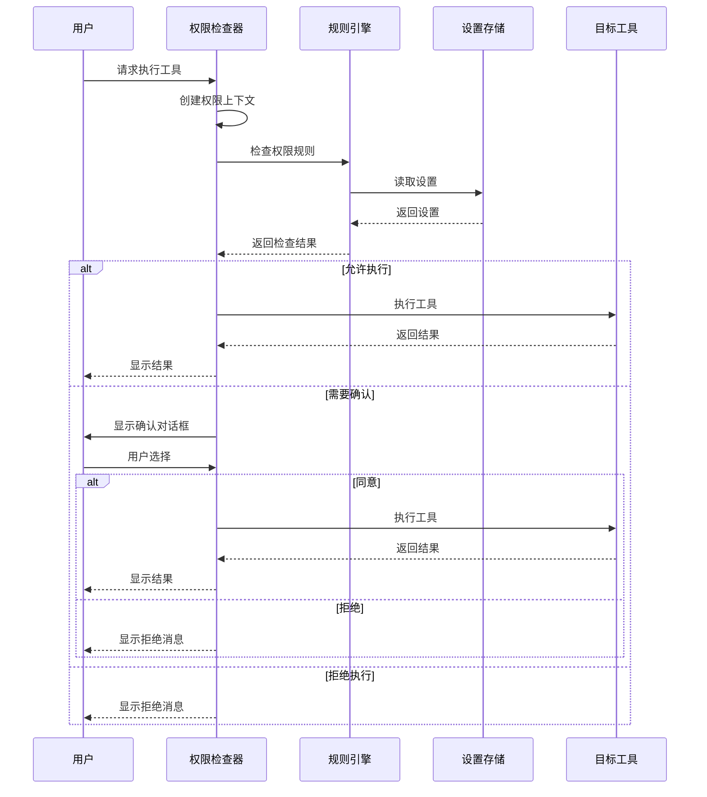

**图表来源**
- [src/hooks/useCanUseTool.tsx:32-183](file://src/hooks/useCanUseTool.tsx#L32-L183)

### 权限规则类型

系统支持三种主要的权限规则类型：

#### 1. 总是允许规则 (alwaysAllowRules)

这些规则允许特定工具在任何情况下自动执行，无需用户确认：

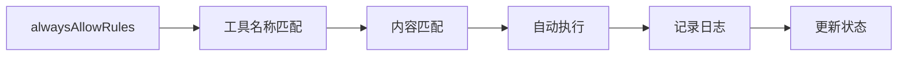

**图表来源**
- [src/types/permissions.ts:419-421](file://src/types/permissions.ts#L419-L421)

#### 2. 总是拒绝规则 (alwaysDenyRules)

这些规则完全阻止特定工具的执行：

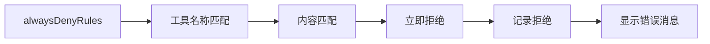

**图表来源**
- [src/types/permissions.ts:434-435](file://src/types/permissions.ts#L434-L435)

#### 3. 总是询问规则 (alwaysAskRules)

这些规则要求每次使用前都进行用户确认：

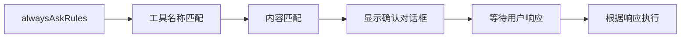

**图表来源**
- [src/types/permissions.ts:436-437](file://src/types/permissions.ts#L436-L437)

### 绕过权限模式

绕过权限模式是一种高风险但必要的功能，用于特殊场景下的快速操作：

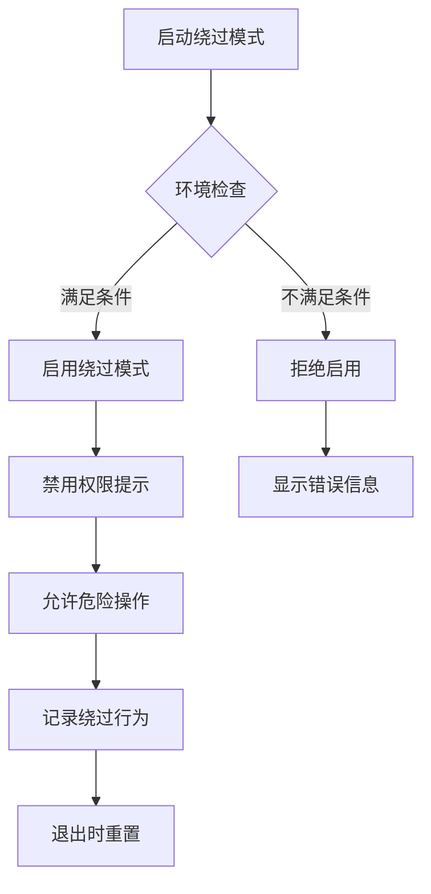

**图表来源**
- [src/components/BypassPermissionsModeDialog.tsx:12-86](file://src/components/BypassPermissionsModeDialog.tsx#L12-L86)
- [src/setup.ts:416-442](file://src/setup.ts#L416-L442)

**章节来源**
- [src/hooks/useCanUseTool.tsx:32-183](file://src/hooks/useCanUseTool.tsx#L32-L183)
- [src/components/permissions/FallbackPermissionRequest.tsx:16-333](file://src/components/permissions/FallbackPermissionRequest.tsx#L16-L333)

### 权限规则管理界面

权限规则管理提供了完整的规则生命周期管理：

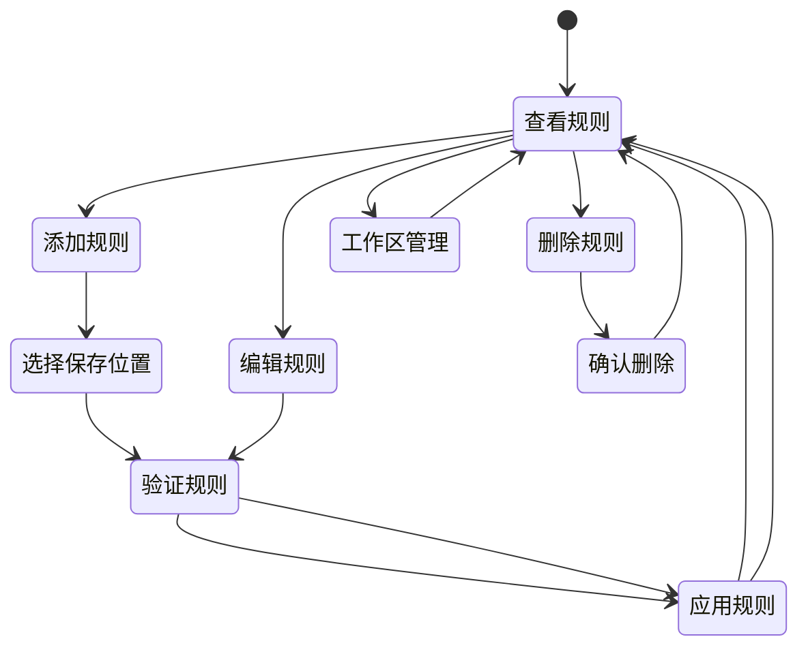

**图表来源**
- [src/components/permissions/rule/PermissionRuleList.tsx:473-800](file://src/components/permissions/rule/PermissionRuleList.tsx#L473-L800)
- [src/components/permissions/rule/AddPermissionRules.tsx:48-176](file://src/components/permissions/rule/AddPermissionRules.tsx#L48-L176)

**章节来源**
- [src/components/permissions/rule/PermissionRuleList.tsx:1-800](file://src/components/permissions/rule/PermissionRuleList.tsx#L1-L800)
- [src/components/permissions/rule/AddPermissionRules.tsx:1-180](file://src/components/permissions/rule/AddPermissionRules.tsx#L1-L180)
- [src/components/permissions/rule/WorkspaceTab.tsx:1-150](file://src/components/permissions/rule/WorkspaceTab.tsx#L1-L150)

## 依赖关系分析

权限控制系统与其他系统组件存在紧密的依赖关系：

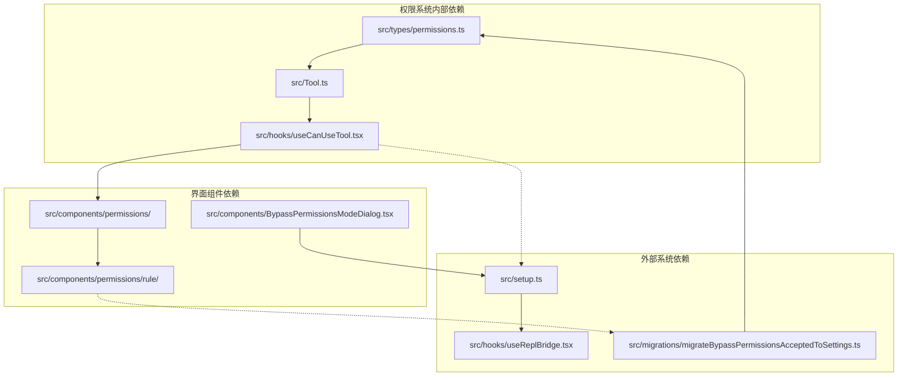

**图表来源**
- [src/Tool.ts:740-793](file://src/Tool.ts#L740-L793)
- [src/hooks/useCanUseTool.tsx:28-191](file://src/hooks/useCanUseTool.tsx#L28-L191)

**章节来源**
- [src/Tool.ts:740-793](file://src/Tool.ts#L740-L793)
- [src/hooks/useReplBridge.tsx:425-449](file://src/hooks/useReplBridge.tsx#L425-L449)

## 性能考虑

权限系统在设计时充分考虑了性能优化：

### 异步权限检查

系统采用异步权限检查机制，避免阻塞主线程：

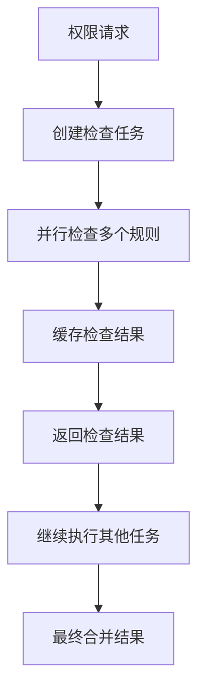

### 内存优化策略

- 使用弱引用避免内存泄漏
- 实现规则缓存机制
- 优化对象创建和销毁

### 网络优化

- 批量处理权限请求
- 实现请求去重
- 使用连接池管理外部连接

## 故障排除指南

### 常见问题诊断

#### 权限检查失败

**症状**: 工具无法执行，显示权限错误

**排查步骤**:
1. 检查权限规则配置
2. 验证工具名称匹配
3. 确认工作区路径权限
4. 查看权限日志

#### 绕过模式异常

**症状**: 绕过模式无法启用或立即失效

**排查步骤**:
1. 检查环境变量设置
2. 验证沙箱状态
3. 确认网络访问权限
4. 查看系统日志

#### 权限规则冲突

**症状**: 规则生效不符合预期

**排查步骤**:
1. 检查规则优先级
2. 验证规则语法
3. 确认规则来源
4. 查看规则冲突检测

**章节来源**
- [src/components/BypassPermissionsModeDialog.tsx:12-86](file://src/components/BypassPermissionsModeDialog.tsx#L12-L86)
- [src/setup.ts:416-442](file://src/setup.ts#L416-L442)

## 结论

Claude Code 的权限控制系统通过精心设计的多层架构，实现了安全与易用性的平衡。系统的主要优势包括：

### 安全性保障
- 多层次权限检查机制
- 细粒度的工具权限控制
- 完善的审计日志记录
- 灵活的绕过模式管理

### 用户体验优化
- 直观的权限规则管理界面
- 智能的权限决策算法
- 灵活的权限模式切换
- 详细的权限解释说明

### 技术架构优势
- 模块化的组件设计
- 清晰的依赖关系管理
- 高效的性能优化策略
- 完善的错误处理机制

该权限系统为 Claude Code 提供了坚实的安全基础，确保在提供强大功能的同时，最大限度地保护用户环境的安全。