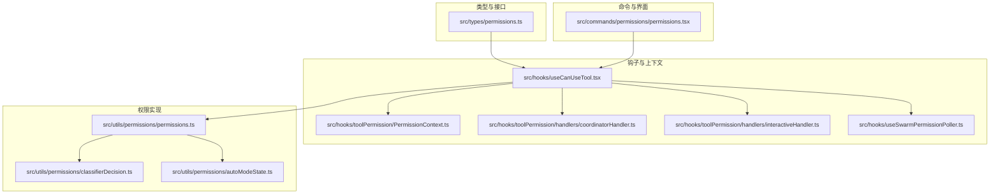
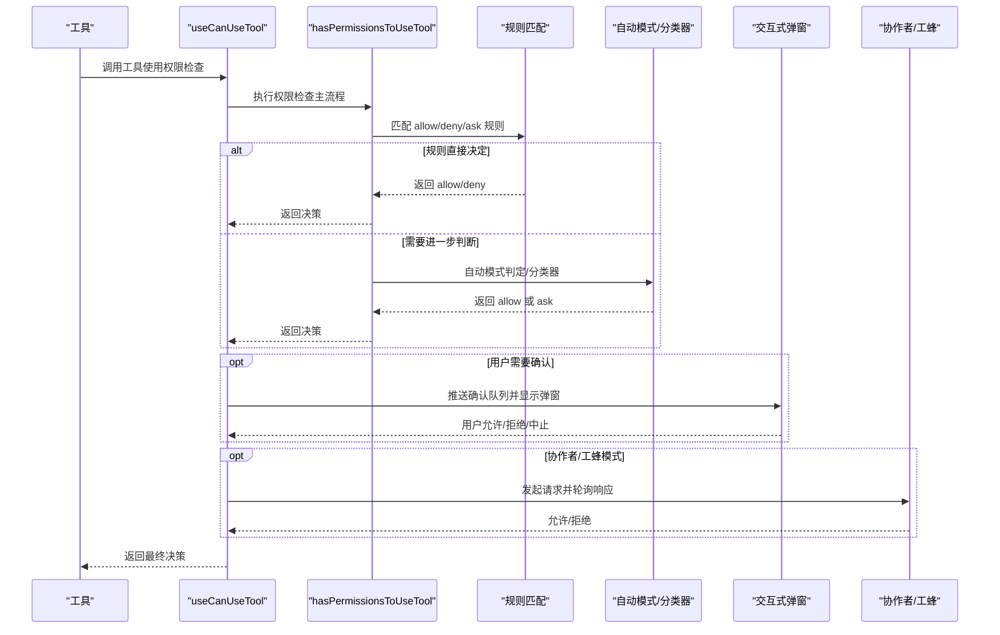
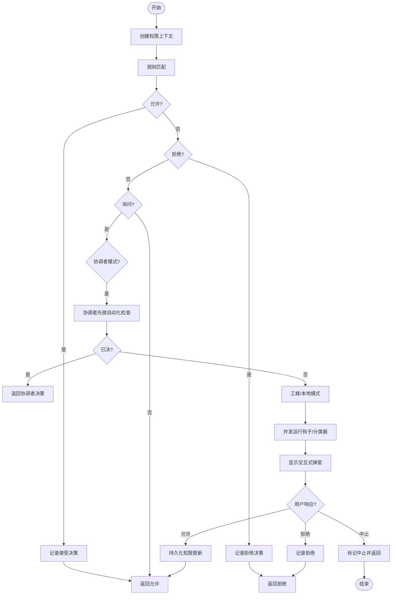
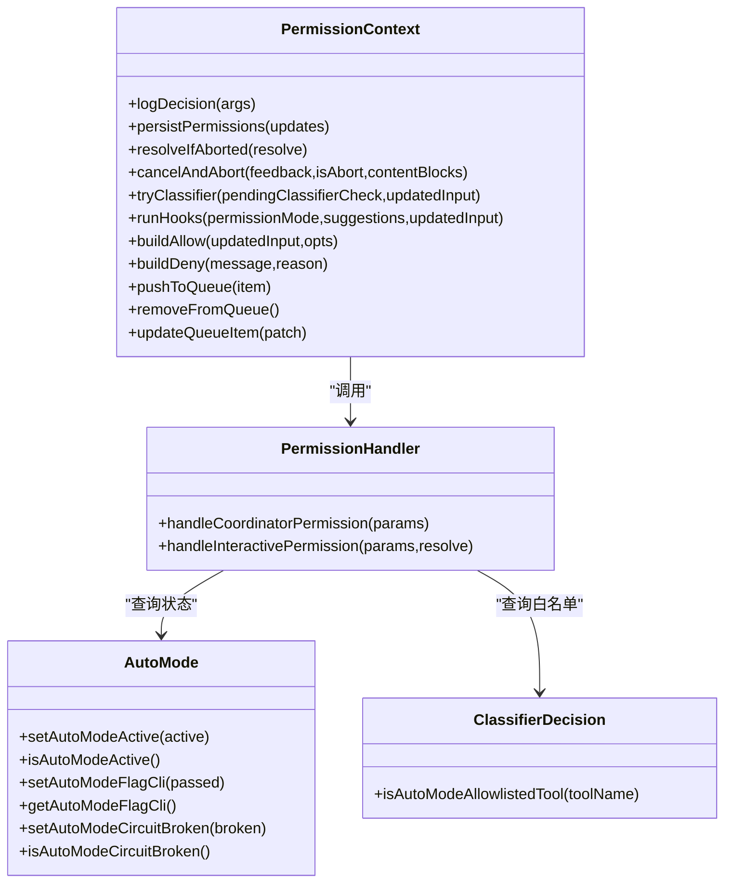
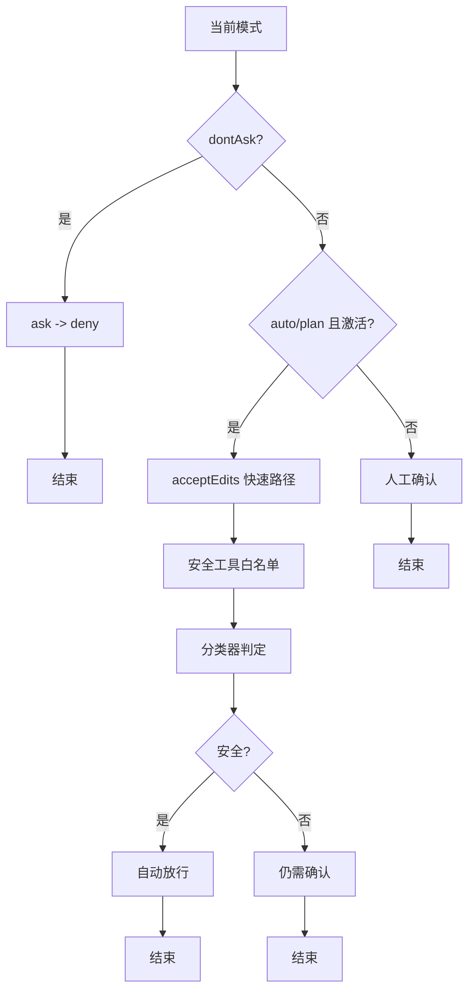
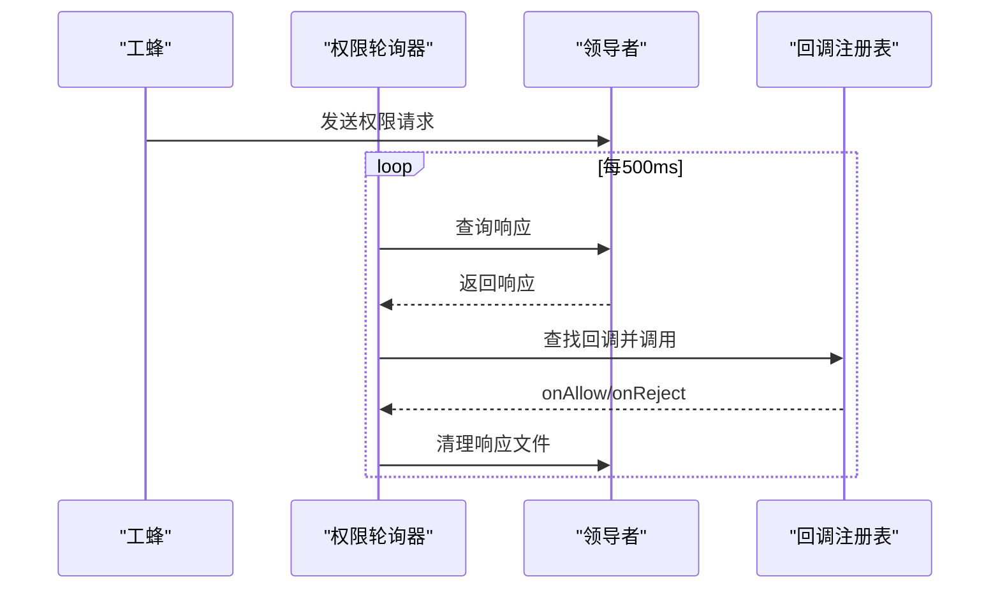
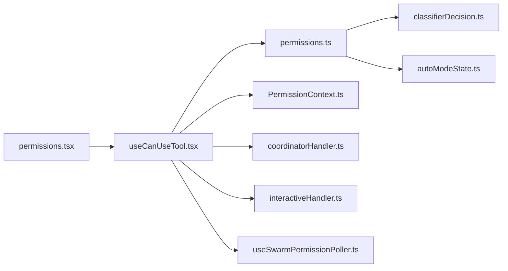

# 权限检查流程

<cite>
**本文档引用的文件**
- [src/types/permissions.ts](file://src/types/permissions.ts)
- [src/hooks/useCanUseTool.tsx](file://src/hooks/useCanUseTool.tsx)
- [src/utils/permissions/permissions.ts](file://src/utils/permissions/permissions.ts)
- [src/hooks/toolPermission/PermissionContext.ts](file://src/hooks/toolPermission/PermissionContext.ts)
- [src/hooks/toolPermission/handlers/interactiveHandler.ts](file://src/hooks/toolPermission/handlers/interactiveHandler.ts)
- [src/hooks/toolPermission/handlers/coordinatorHandler.ts](file://src/hooks/toolPermission/handlers/coordinatorHandler.ts)
- [src/hooks/useSwarmPermissionPoller.ts](file://src/hooks/useSwarmPermissionPoller.ts)
- [src/commands/permissions/permissions.tsx](file://src/commands/permissions/permissions.tsx)
- [src/utils/permissions/classifierDecision.ts](file://src/utils/permissions/classifierDecision.ts)
- [src/utils/permissions/autoModeState.ts](file://src/utils/permissions/autoModeState.ts)
</cite>

## 目录
1. [简介](#简介)
2. [项目结构](#项目结构)
3. [核心组件](#核心组件)
4. [架构总览](#架构总览)
5. [详细组件分析](#详细组件分析)
6. [依赖关系分析](#依赖关系分析)
7. [性能考虑](#性能考虑)
8. [故障排查指南](#故障排查指南)
9. [结论](#结论)

## 简介
本文件系统性阐述权限检查流程，覆盖从工具调用到最终决策的完整路径，深入解析权限分类器工作机制（如何识别危险操作与敏感工具）、权限模式切换逻辑（autoMode、askMode、denyMode 的转换条件）、性能优化策略（缓存与预计算）、失败处理与错误恢复机制，以及调试与监控方法。目标是帮助开发者与运维人员快速理解并高效维护权限体系。

## 项目结构
权限检查相关代码主要分布在以下模块：
- 类型定义：权限模式、行为、规则、决策结果等统一在类型文件中定义，避免循环依赖。
- 钩子层：useCanUseTool 统一入口，协调规则匹配、分类器、交互式弹窗、协作者/工蜂模式等。
- 工具层：各工具可自定义 checkPermissions，作为规则匹配的补充。
- 分类器与自动模式：基于工具名与输入内容进行快速判定或调用大模型分类器。
- 协作与工蜂：支持团队模式下的权限请求与响应同步。

图表来源
- [src/types/permissions.ts:1-442](file://src/types/permissions.ts#L1-L442)
- [src/hooks/useCanUseTool.tsx:1-204](file://src/hooks/useCanUseTool.tsx#L1-L204)
- [src/utils/permissions/permissions.ts:1-800](file://src/utils/permissions/permissions.ts#L1-L800)

章节来源
- [src/types/permissions.ts:1-442](file://src/types/permissions.ts#L1-L442)
- [src/hooks/useCanUseTool.tsx:1-204](file://src/hooks/useCanUseTool.tsx#L1-L204)
- [src/utils/permissions/permissions.ts:1-800](file://src/utils/permissions/permissions.ts#L1-L800)

## 核心组件
- 权限模式与行为
  - 模式：acceptEdits、bypassPermissions、default、dontAsk、plan、auto（按特性启用）。
  - 行为：allow、deny、ask；另含 passthrough 用于特定场景。
- 规则系统
  - 规则来源：用户设置、项目设置、本地设置、标志位设置、策略设置、CLI 参数、命令、会话。
  - 规则值：工具名 + 可选内容（如 Bash(prefix:*)）。
- 决策结果
  - 允许、询问、拒绝；允许时可携带更新后的输入、反馈、内容块等。
- 上下文
  - ToolPermissionContext：包含当前模式、额外工作目录、各类规则集合、是否可用旁路模式、是否避免权限提示、是否等待自动化检查等。

章节来源
- [src/types/permissions.ts:16-36](file://src/types/permissions.ts#L16-L36)
- [src/types/permissions.ts:44](file://src/types/permissions.ts#L44)
- [src/types/permissions.ts:54-79](file://src/types/permissions.ts#L54-L79)
- [src/types/permissions.ts:174-266](file://src/types/permissions.ts#L174-L266)
- [src/types/permissions.ts:427-441](file://src/types/permissions.ts#L427-L441)

## 架构总览
权限检查整体流程如下：

图表来源
- [src/hooks/useCanUseTool.tsx:28-190](file://src/hooks/useCanUseTool.tsx#L28-L190)
- [src/utils/permissions/permissions.ts:473-800](file://src/utils/permissions/permissions.ts#L473-L800)
- [src/hooks/toolPermission/handlers/interactiveHandler.ts:57-531](file://src/hooks/toolPermission/handlers/interactiveHandler.ts#L57-L531)
- [src/hooks/useSwarmPermissionPoller.ts:268-331](file://src/hooks/useSwarmPermissionPoller.ts#L268-L331)

## 详细组件分析

### 权限检查主流程（useCanUseTool）
- 入口函数：useCanUseTool 创建 PermissionContext，封装日志、持久化、队列操作、钩子执行、分类器尝试等能力。
- 流程要点：
  - 若规则直接允许，直接返回允许并记录决策。
  - 若规则要求拒绝，记录并返回拒绝。
  - 若规则要求询问：
    - 在协作者模式下，优先等待协调者完成自动化检查（钩子 + 分类器），若已决则直接返回。
    - 否则进入工蜂/本地模式：异步运行钩子与分类器，同时显示交互式弹窗，竞速用户响应。
  - 分类器预判：对 Bash 工蜂可进行预检，若高置信度通过则提前允许。
  - 异常处理：捕获中止/用户取消，记录并返回“取消”状态，触发中止信号。

图表来源
- [src/hooks/useCanUseTool.tsx:28-190](file://src/hooks/useCanUseTool.tsx#L28-L190)
- [src/hooks/toolPermission/handlers/coordinatorHandler.ts:26-62](file://src/hooks/toolPermission/handlers/coordinatorHandler.ts#L26-L62)
- [src/hooks/toolPermission/handlers/interactiveHandler.ts:57-531](file://src/hooks/toolPermission/handlers/interactiveHandler.ts#L57-L531)

章节来源
- [src/hooks/useCanUseTool.tsx:28-190](file://src/hooks/useCanUseTool.tsx#L28-L190)
- [src/hooks/toolPermission/PermissionContext.ts:96-348](file://src/hooks/toolPermission/PermissionContext.ts#L96-L348)
- [src/hooks/toolPermission/handlers/coordinatorHandler.ts:26-62](file://src/hooks/toolPermission/handlers/coordinatorHandler.ts#L26-L62)
- [src/hooks/toolPermission/handlers/interactiveHandler.ts:57-531](file://src/hooks/toolPermission/handlers/interactiveHandler.ts#L57-L531)

### 权限规则匹配与分类器
- 规则匹配
  - 支持“整工具匹配”和“带内容匹配”（如 Bash(prefix:*)）。
  - MCP 工具支持服务器级规则（如 mcp__server1 匹配该服务器下所有工具）。
  - 提供 getAllowRules/getDenyRules/getAskRules 获取规则列表，并按来源映射。
- 自动模式与分类器
  - autoModeState 控制自动模式的激活状态与电路断开状态。
  - classifierDecision 提供安全工具白名单，跳过不必要的分类器调用。
  - hasPermissionsToUseTool 中：
    - acceptEdits 快速路径：在工作目录内对安全编辑类操作直接放行。
    - 安全工具白名单：跳过分类器，直接放行。
    - 分类器：formatActionForClassifier -> classifyYoloAction，记录成本与延迟指标。
    - 连续拒绝计数：成功放行后重置连续拒绝计数，避免长期阻塞。

图表来源
- [src/hooks/toolPermission/PermissionContext.ts:96-348](file://src/hooks/toolPermission/PermissionContext.ts#L96-L348)
- [src/hooks/toolPermission/handlers/coordinatorHandler.ts:26-62](file://src/hooks/toolPermission/handlers/coordinatorHandler.ts#L26-L62)
- [src/hooks/toolPermission/handlers/interactiveHandler.ts:57-531](file://src/hooks/toolPermission/handlers/interactiveHandler.ts#L57-L531)
- [src/utils/permissions/autoModeState.ts:11-33](file://src/utils/permissions/autoModeState.ts#L11-L33)
- [src/utils/permissions/classifierDecision.ts:96-98](file://src/utils/permissions/classifierDecision.ts#L96-L98)

章节来源
- [src/utils/permissions/permissions.ts:238-302](file://src/utils/permissions/permissions.ts#L238-L302)
- [src/utils/permissions/permissions.ts:520-800](file://src/utils/permissions/permissions.ts#L520-L800)
- [src/utils/permissions/classifierDecision.ts:56-98](file://src/utils/permissions/classifierDecision.ts#L56-L98)
- [src/utils/permissions/autoModeState.ts:11-33](file://src/utils/permissions/autoModeState.ts#L11-L33)

### 权限模式切换逻辑（autoMode、askMode、denyMode）
- dontAsk 模式：将 ask 结果直接转为 deny，不弹窗。
- auto 模式：
  - 当模式为 auto 或 plan 且 autoModeState 激活时，尝试分类器自动放行。
  - 对于敏感安全检查（如敏感路径）且不可由分类器批准的，仍需人工确认。
  - PowerShell 在某些构建中需要显式交互，不受 auto 模式影响。
- acceptEdits 快速路径：在工作目录内的安全编辑操作可绕过分类器。
- circuit breaker：当配置禁用 auto 模式时，阻止再次进入。

图表来源
- [src/utils/permissions/permissions.ts:503-591](file://src/utils/permissions/permissions.ts#L503-L591)
- [src/utils/permissions/permissions.ts:688-800](file://src/utils/permissions/permissions.ts#L688-L800)
- [src/utils/permissions/classifierDecision.ts:56-98](file://src/utils/permissions/classifierDecision.ts#L56-L98)
- [src/utils/permissions/autoModeState.ts:11-33](file://src/utils/permissions/autoModeState.ts#L11-L33)

章节来源
- [src/utils/permissions/permissions.ts:503-591](file://src/utils/permissions/permissions.ts#L503-L591)
- [src/utils/permissions/permissions.ts:688-800](file://src/utils/permissions/permissions.ts#L688-L800)

### 工蜂/协作者权限同步
- 工蜂侧注册回调，定时轮询响应文件，解析并调用对应回调（允许/拒绝）。
- 支持沙箱权限响应与普通权限响应两类回调。
- 响应处理后清理响应文件，避免重复处理。

图表来源
- [src/hooks/useSwarmPermissionPoller.ts:268-331](file://src/hooks/useSwarmPermissionPoller.ts#L268-L331)
- [src/hooks/useSwarmPermissionPoller.ts:231-257](file://src/hooks/useSwarmPermissionPoller.ts#L231-L257)

章节来源
- [src/hooks/useSwarmPermissionPoller.ts:268-331](file://src/hooks/useSwarmPermissionPoller.ts#L268-L331)

### 权限规则管理与界面
- /permissions 命令提供规则列表与重试被拒项的能力，便于用户查看与调整策略。

章节来源
- [src/commands/permissions/permissions.tsx:5-9](file://src/commands/permissions/permissions.tsx#L5-L9)

## 依赖关系分析
- 松耦合设计
  - 类型定义独立于实现，避免循环依赖。
  - 钩子层仅依赖通用接口，具体行为由工具与分类器模块注入。
- 关键依赖链
  - useCanUseTool 依赖 hasPermissionsToUseTool、PermissionContext、交互式处理器、协作者处理器、工蜂轮询器。
  - hasPermissionsToUseTool 依赖规则系统、自动模式状态、分类器决策、拒绝追踪与成本统计。
  - 分类器依赖工具名与输入格式化、消息历史、工具集、上下文模式。

图表来源
- [src/hooks/useCanUseTool.tsx:27-26](file://src/hooks/useCanUseTool.tsx#L27-L26)
- [src/utils/permissions/permissions.ts:473-480](file://src/utils/permissions/permissions.ts#L473-L480)
- [src/hooks/toolPermission/PermissionContext.ts:34-43](file://src/hooks/toolPermission/PermissionContext.ts#L34-L43)
- [src/hooks/toolPermission/handlers/coordinatorHandler.ts:8-14](file://src/hooks/toolPermission/handlers/coordinatorHandler.ts#L8-L14)
- [src/hooks/toolPermission/handlers/interactiveHandler.ts:34-41](file://src/hooks/toolPermission/handlers/interactiveHandler.ts#L34-L41)
- [src/hooks/useSwarmPermissionPoller.ts:16-25](file://src/hooks/useSwarmPermissionPoller.ts#L16-L25)
- [src/utils/permissions/classifierDecision.ts:1-22](file://src/utils/permissions/classifierDecision.ts#L1-L22)
- [src/utils/permissions/autoModeState.ts:1-10](file://src/utils/permissions/autoModeState.ts#L1-L10)
- [src/commands/permissions/permissions.tsx:1-5](file://src/commands/permissions/permissions.tsx#L1-L5)

章节来源
- [src/hooks/useCanUseTool.tsx:27-26](file://src/hooks/useCanUseTool.tsx#L27-L26)
- [src/utils/permissions/permissions.ts:473-480](file://src/utils/permissions/permissions.ts#L473-L480)

## 性能考虑
- 缓存与预计算
  - 分类器检查状态：setClassifierChecking/clearClassifierChecking，避免重复调用与 UI 抖动。
  - 拒绝追踪：记录连续拒绝次数，成功放行后重置，减少后续误判概率。
  - acceptEdits 快速路径：在工作目录内的安全编辑直接放行，跳过分类器。
  - 安全工具白名单：isAutoModeAllowlistedTool 直接放行，避免分类器调用。
- 并发与竞速
  - 钩子与分类器并发执行，竞速用户响应，缩短等待时间。
  - 工蜂轮询间隔 500ms，平衡实时性与资源消耗。
- 成本与可观测性
  - 分类器调用记录 token 使用、延迟、阶段信息，用于成本分析与性能优化。
  - 自动模式决策事件上报，便于评估效果与回归。

章节来源
- [src/hooks/toolPermission/PermissionContext.ts:174-215](file://src/hooks/toolPermission/PermissionContext.ts#L174-L215)
- [src/hooks/toolPermission/handlers/interactiveHandler.ts:433-531](file://src/hooks/toolPermission/handlers/interactiveHandler.ts#L433-L531)
- [src/utils/permissions/permissions.ts:620-686](file://src/utils/permissions/permissions.ts#L620-L686)
- [src/utils/permissions/permissions.ts:688-800](file://src/utils/permissions/permissions.ts#L688-L800)

## 故障排查指南
- 常见问题
  - 分类器异常：分类器 API 失败会被记录但不会中断流程，确保 UI 正常回退到人工确认。
  - 自动模式不可用：当 auto 模式被禁用或 circuit breaker 触发时，自动放行路径被阻断。
  - 工蜂无响应：检查轮询器是否注册回调、响应文件是否存在、领导者是否正确处理请求。
  - 规则冲突：多来源规则叠加导致意外行为，建议通过 /permissions 查看与调整。
- 调试与监控
  - 日志：大量 logForDebugging 与 logError 输出，定位异常与路径选择。
  - 事件：tengu_auto_mode_decision 等事件上报，结合消息 ID 进行关联分析。
  - 中止：AbortError/APIUserAbortError 会触发取消流程，确保资源释放与 UI 清理。

章节来源
- [src/hooks/toolPermission/handlers/interactiveHandler.ts:523-529](file://src/hooks/toolPermission/handlers/interactiveHandler.ts#L523-L529)
- [src/utils/permissions/permissions.ts:572-591](file://src/utils/permissions/permissions.ts#L572-L591)
- [src/hooks/useSwarmPermissionPoller.ts:311-315](file://src/hooks/useSwarmPermissionPoller.ts#L311-L315)
- [src/hooks/useCanUseTool.tsx:171-182](file://src/hooks/useCanUseTool.tsx#L171-L182)

## 结论
权限检查流程以 useCanUseTool 为核心，结合规则匹配、自动模式与分类器、交互式弹窗与协作者/工蜂同步，形成完整的闭环。通过 acceptEdits 快速路径、安全工具白名单、拒绝追踪与分类器状态缓存等策略，系统在保证安全的前提下显著提升用户体验与性能。建议在生产环境中持续关注分类器成本与延迟指标，定期审查规则来源与白名单，确保权限策略与业务需求保持一致。