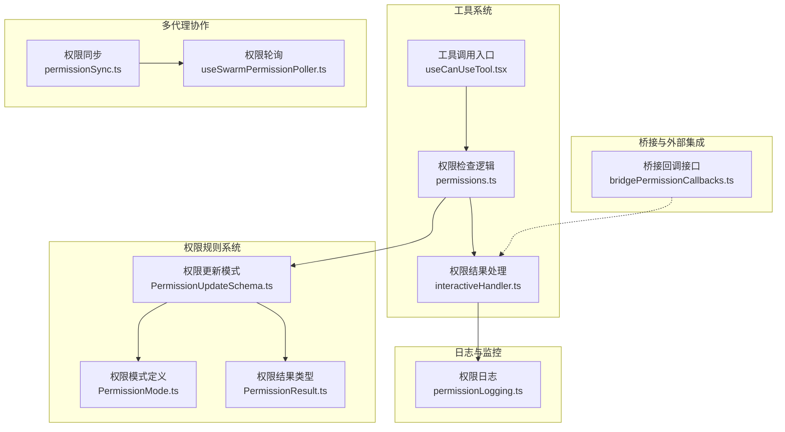
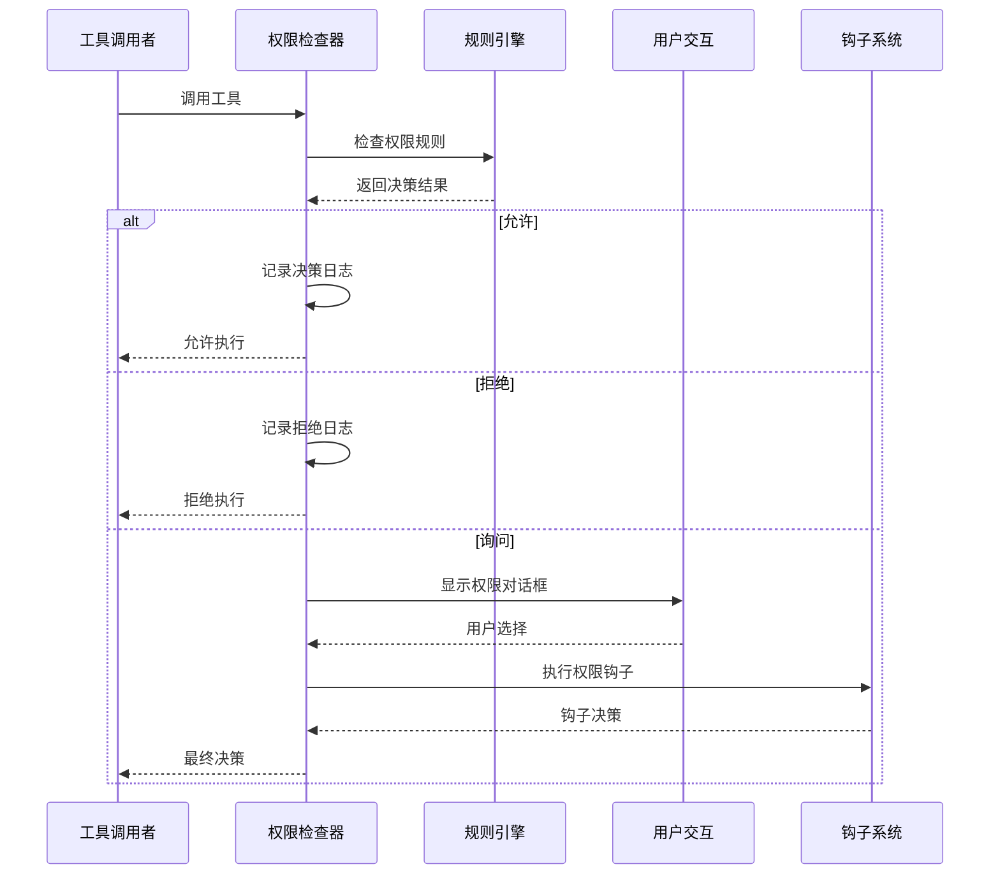
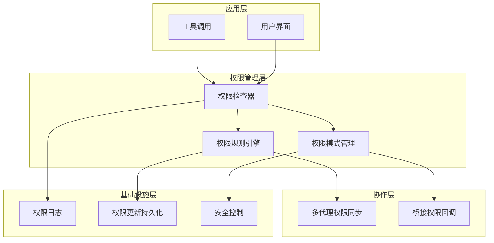
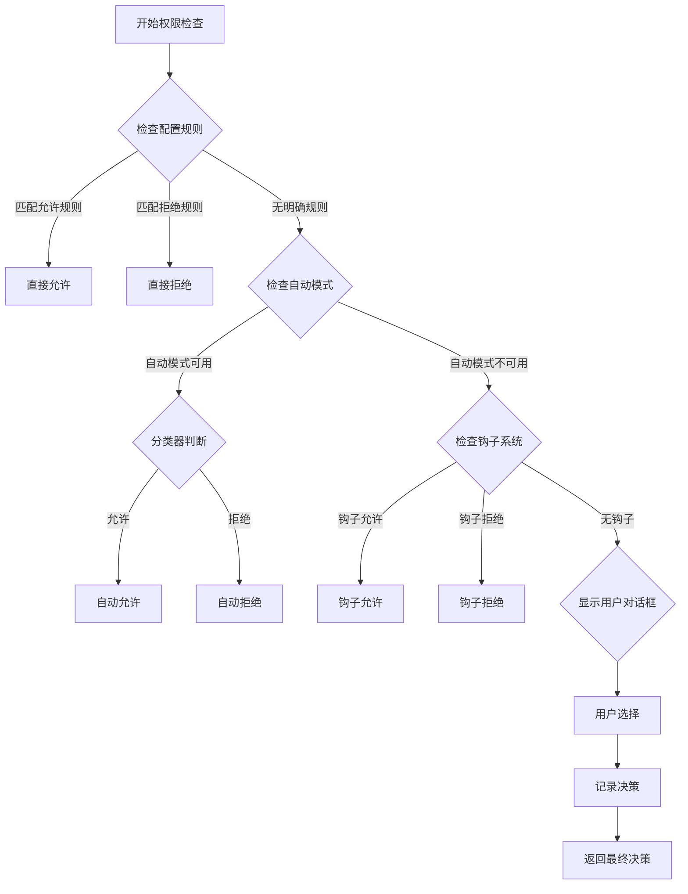
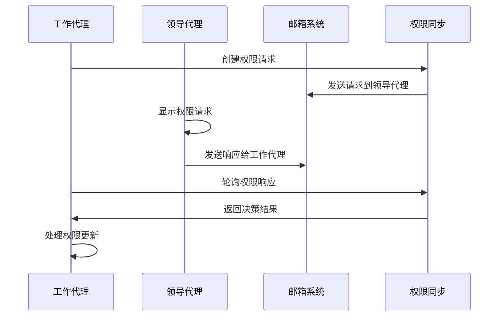
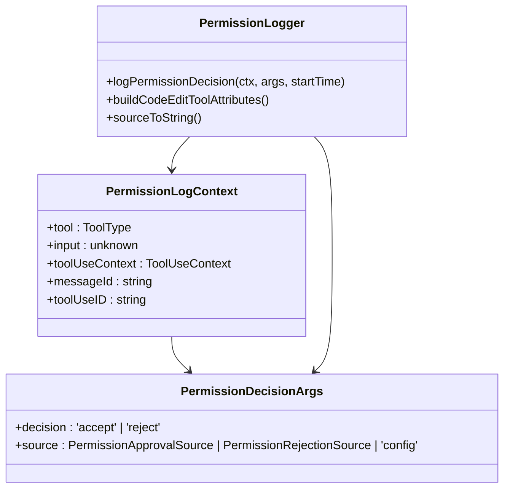
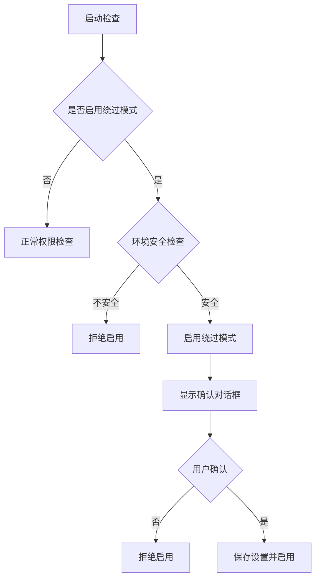
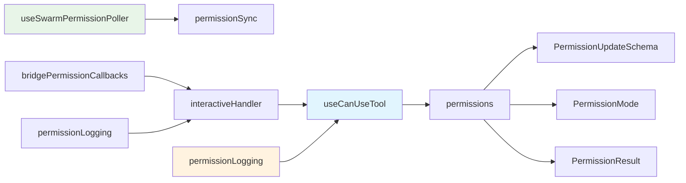

# 权限系统集成

<cite>
**本文档引用的文件**
- [useCanUseTool.tsx](file://src/hooks/useCanUseTool.tsx)
- [permissions.ts](file://src/utils/permissions/permissions.ts)
- [PermissionUpdateSchema.ts](file://src/utils/permissions/PermissionUpdateSchema.ts)
- [permissionSync.ts](file://src/utils/swarm/permissionSync.ts)
- [useSwarmPermissionPoller.ts](file://src/hooks/useSwarmPermissionPoller.ts)
- [permissionLogging.ts](file://src/hooks/toolPermission/permissionLogging.ts)
- [PermissionMode.ts](file://src/utils/permissions/PermissionMode.ts)
- [PermissionResult.ts](file://src/utils/permissions/PermissionResult.ts)
- [bridgePermissionCallbacks.ts](file://src/bridge/bridgePermissionCallbacks.ts)
- [interactiveHandler.ts](file://src/hooks/toolPermission/handlers/interactiveHandler.ts)
- [setup.ts](file://src/setup.ts)
- [BypassPermissionsModeDialog.tsx](file://src/components/BypassPermissionsModeDialog.tsx)
- [useReplBridge.tsx](file://src/hooks/useReplBridge.tsx)
- [print.ts](file://src/cli/print.ts)
- [messages.ts](file://src/utils/messages.ts)
</cite>

## 目录
1. [引言](#引言)
2. [项目结构](#项目结构)
3. [核心组件](#核心组件)
4. [架构概览](#架构概览)
5. [详细组件分析](#详细组件分析)
6. [依赖关系分析](#依赖关系分析)
7. [性能考虑](#性能考虑)
8. [故障排除指南](#故障排除指南)
9. [结论](#结论)
10. [附录](#附录)

## 引言

本文件为权限系统集成的综合技术文档，详细阐述了权限系统如何与工具系统无缝集成，工具调用前的权限检查机制，权限日志记录的实现方式，绕过权限模式的实现原理和安全控制措施，以及权限系统与其他系统组件的集成模式。文档还展示了权限系统在多代理协作环境中的作用和协调机制，并提供了可扩展性设计和插件化支持的方法论。

## 项目结构

权限系统主要分布在以下模块中：

- 工具权限检查：`src/hooks/useCanUseTool.tsx` 和 `src/utils/permissions/permissions.ts`
- 权限规则与更新：`src/utils/permissions/PermissionUpdateSchema.ts`
- 多代理协作：`src/utils/swarm/permissionSync.ts` 和 `src/hooks/useSwarmPermissionPoller.ts`
- 日志记录：`src/hooks/toolPermission/permissionLogging.ts`
- 权限模式：`src/utils/permissions/PermissionMode.ts`
- 桥接回调：`src/bridge/bridgePermissionCallbacks.ts`
- 交互式处理：`src/hooks/toolPermission/handlers/interactiveHandler.ts`
- 绕过权限模式：`src/setup.ts`、`src/components/BypassPermissionsModeDialog.tsx`、`src/hooks/useReplBridge.tsx`、`src/cli/print.ts`

**图表来源**
- [useCanUseTool.tsx:28-191](file://src/hooks/useCanUseTool.tsx#L28-L191)
- [permissions.ts:473-800](file://src/utils/permissions/permissions.ts#L473-L800)
- [permissionSync.ts:1-200](file://src/utils/swarm/permissionSync.ts#L1-L200)

**章节来源**
- [useCanUseTool.tsx:28-191](file://src/hooks/useCanUseTool.tsx#L28-L191)
- [permissions.ts:473-800](file://src/utils/permissions/permissions.ts#L473-L800)

## 核心组件

### 工具权限检查器

`useCanUseTool` 是权限系统的核心入口，负责：

- 创建权限上下文
- 执行权限检查
- 处理不同决策类型（允许、拒绝、询问）
- 集成多种权限处理机制

**图表来源**
- [useCanUseTool.tsx:32-170](file://src/hooks/useCanUseTool.tsx#L32-L170)
- [permissions.ts:473-800](file://src/utils/permissions/permissions.ts#L473-L800)

### 权限规则系统

权限规则系统采用分层设计：

- **规则来源**：用户设置、项目设置、本地设置、会话设置、命令行参数
- **规则行为**：允许（allow）、拒绝（deny）、询问（ask）
- **规则值**：支持通配符和特定内容匹配

**章节来源**
- [PermissionUpdateSchema.ts:27-78](file://src/utils/permissions/PermissionUpdateSchema.ts#L27-L78)
- [permissions.ts:122-302](file://src/utils/permissions/permissions.ts#L122-L302)

## 架构概览

权限系统采用分层架构，确保安全性与灵活性的平衡：

**图表来源**
- [permissions.ts:473-800](file://src/utils/permissions/permissions.ts#L473-L800)
- [permissionSync.ts:1-200](file://src/utils/swarm/permissionSync.ts#L1-L200)
- [permissionLogging.ts:181-235](file://src/hooks/toolPermission/permissionLogging.ts#L181-L235)

## 详细组件分析

### 权限检查流程

权限检查采用多阶段决策机制：

**图表来源**
- [permissions.ts:505-800](file://src/utils/permissions/permissions.ts#L505-L800)
- [useCanUseTool.tsx:38-170](file://src/hooks/useCanUseTool.tsx#L38-L170)

### 多代理协作机制

在多代理环境中，权限决策通过以下机制协调：

**图表来源**
- [permissionSync.ts:676-783](file://src/utils/swarm/permissionSync.ts#L676-L783)
- [useSwarmPermissionPoller.ts:268-298](file://src/hooks/useSwarmPermissionPoller.ts#L268-L298)

### 权限日志记录

权限日志系统提供完整的审计跟踪：

**图表来源**
- [permissionLogging.ts:20-239](file://src/hooks/toolPermission/permissionLogging.ts#L20-L239)

**章节来源**
- [permissionLogging.ts:181-235](file://src/hooks/toolPermission/permissionLogging.ts#L181-L235)

### 绕过权限模式

绕过权限模式提供高风险但必要的功能：

**图表来源**
- [setup.ts:416-442](file://src/setup.ts#L416-L442)
- [BypassPermissionsModeDialog.tsx:27-42](file://src/components/BypassPermissionsModeDialog.tsx#L27-L42)

**章节来源**
- [setup.ts:416-442](file://src/setup.ts#L416-L442)
- [BypassPermissionsModeDialog.tsx:1-86](file://src/components/BypassPermissionsModeDialog.tsx#L1-L86)

## 依赖关系分析

权限系统的关键依赖关系：

**图表来源**
- [useCanUseTool.tsx:20-27](file://src/hooks/useCanUseTool.tsx#L20-L27)
- [useSwarmPermissionPoller.ts:16-26](file://src/hooks/useSwarmPermissionPoller.ts#L16-L26)

**章节来源**
- [useCanUseTool.tsx:20-27](file://src/hooks/useCanUseTool.tsx#L20-L27)
- [useSwarmPermissionPoller.ts:16-26](file://src/hooks/useSwarmPermissionPoller.ts#L16-L26)

## 性能考虑

权限系统在设计时充分考虑了性能优化：

### 缓存策略
- 权限规则缓存避免重复解析
- 分类器结果缓存减少API调用
- 决策历史缓存支持快速查询

### 异步处理
- 权限钩子异步执行不阻塞主线程
- 分类器检查后台运行
- 多代理权限同步使用轮询机制

### 内存管理
- 权限上下文生命周期管理
- 回调注册表自动清理
- 中断信号处理确保资源释放

## 故障排除指南

### 常见问题诊断

**权限检查失败**
- 检查权限规则配置
- 验证工具输入格式
- 确认权限模式设置

**多代理权限同步问题**
- 检查邮箱系统连接
- 验证团队配置
- 确认文件权限

**绕过权限模式异常**
- 检查环境安全条件
- 验证用户确认流程
- 审核安全日志

**章节来源**
- [permissionSync.ts:256-312](file://src/utils/swarm/permissionSync.ts#L256-L312)
- [useSwarmPermissionPoller.ts:231-257](file://src/hooks/useSwarmPermissionPoller.ts#L231-L257)

## 结论

权限系统通过分层架构、多代理协作和完善的日志记录，实现了安全与易用性的平衡。系统支持灵活的权限规则配置、自动化的权限决策和全面的安全控制。绕过权限模式仅在严格的安全条件下启用，确保高风险操作的可控性。

## 附录

### 集成测试方法论

**单元测试**
- 权限规则解析测试
- 权限决策逻辑测试
- 日志记录完整性测试

**集成测试**
- 多代理权限同步测试
- 桥接权限回调测试
- 绕过权限模式测试

**端到端测试**
- 工具调用权限检查测试
- 用户交互流程测试
- 错误处理场景测试

### 插件化支持

权限系统支持通过以下方式扩展：

- **权限钩子**：自定义权限检查逻辑
- **权限处理器**：扩展新的权限处理方式
- **权限存储**：支持不同的权限数据存储
- **权限通知**：集成第三方通知系统