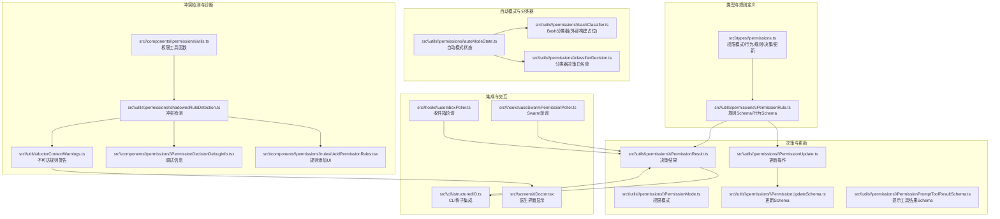
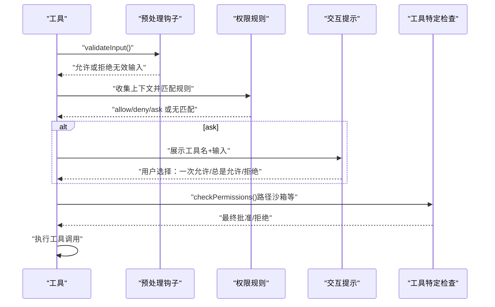
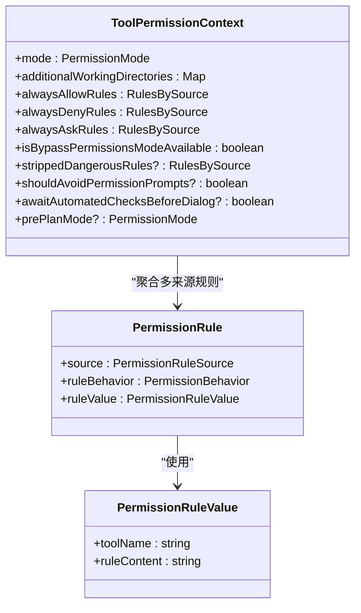
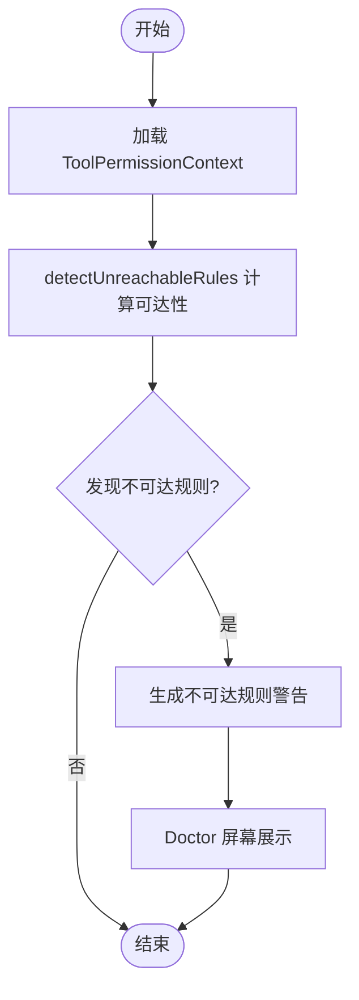
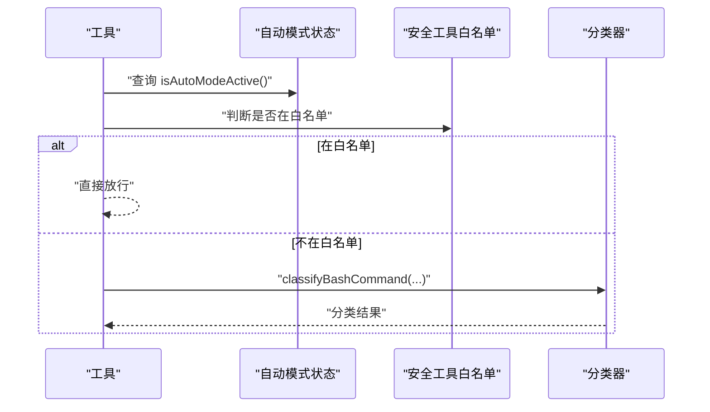
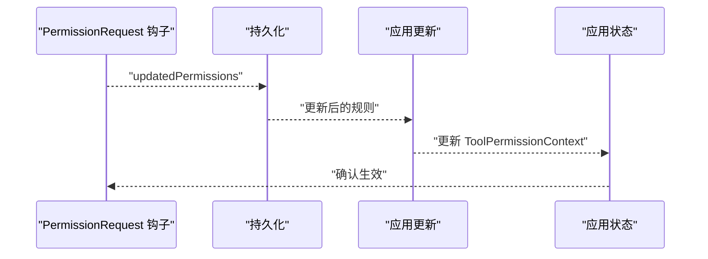
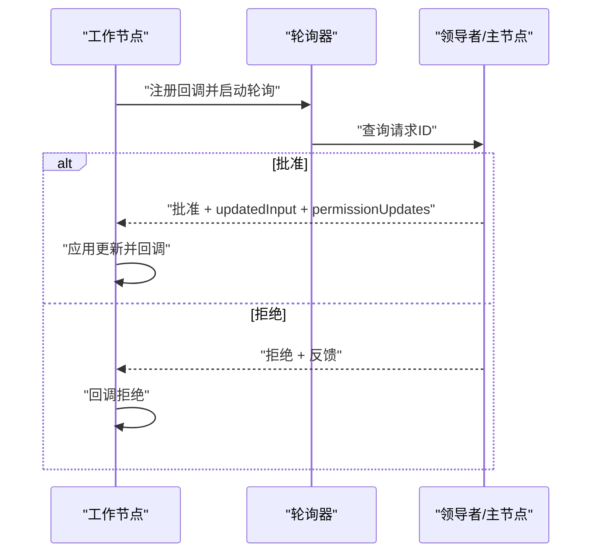
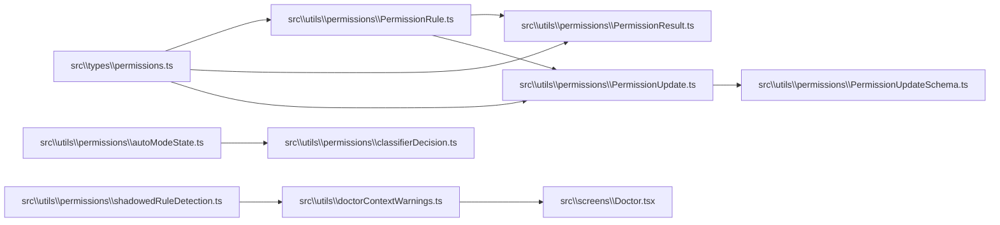

# 权限规则引擎

<cite>
**本文引用的文件**
- [README.md](file://README.md)
- [src\types\permissions.ts](file://src\types\permissions.ts)
- [src\utils\permissions\PermissionRule.ts](file://src\utils\permissions\PermissionRule.ts)
- [src\utils\permissions\PermissionMode.ts](file://src\utils\permissions\PermissionMode.ts)
- [src\utils\permissions\PermissionResult.ts](file://src\utils\permissions\PermissionResult.ts)
- [src\utils\permissions\PermissionUpdate.ts](file://src\utils\permissions\PermissionUpdate.ts)
- [src\utils\permissions\PermissionUpdateSchema.ts](file://src\utils\permissions\PermissionUpdateSchema.ts)
- [src\utils\permissions\PermissionPromptToolResultSchema.ts](file://src\utils\permissions\PermissionPromptToolResultSchema.ts)
- [src\utils\permissions\autoModeState.ts](file://src\utils\permissions\autoModeState.ts)
- [src\utils\permissions\bashClassifier.ts](file://src\utils\permissions\bashClassifier.ts)
- [src\utils\permissions\classifierDecision.ts](file://src\utils\permissions\classifierDecision.ts)
- [src\utils\permissions\shadowedRuleDetection.ts](file://src\utils\permissions\shadowedRuleDetection.ts)
- [src\utils\doctorContextWarnings.ts](file://src\utils\doctorContextWarnings.ts)
- [src\components\permissions\utils.ts](file://src\components\permissions\utils.ts)
- [src\components\permissions\PermissionDecisionDebugInfo.tsx](file://src\components\permissions\PermissionDecisionDebugInfo.tsx)
- [src\components\permissions\rules\AddPermissionRules.tsx](file://src\components\permissions\rules\AddPermissionRules.tsx)
- [src\cli\structuredIO.ts](file://src\cli\structuredIO.ts)
- [src\hooks\useSwarmPermissionPoller.ts](file://src\hooks\useSwarmPermissionPoller.ts)
- [src\hooks\useInboxPoller.ts](file://src\hooks\useInboxPoller.ts)
- [src\screens\Doctor.tsx](file://src\screens\Doctor.tsx)
</cite>

## 目录
1. [简介](#简介)
2. [项目结构](#项目结构)
3. [核心组件](#核心组件)
4. [架构总览](#架构总览)
5. [详细组件分析](#详细组件分析)
6. [依赖关系分析](#依赖关系分析)
7. [性能考量](#性能考量)
8. [故障排查指南](#故障排查指南)
9. [结论](#结论)
10. [附录](#附录)

## 简介
本技术文档围绕权限规则引擎展开，系统性阐述规则类型与结构（alwaysAllowRules、alwaysDenyRules、alwaysAskRules）、规则解析与匹配流程、优先级与冲突检测（shadowedRuleDetection）、最佳实践与语法规则、性能优化与缓存策略，以及如何扩展新规则类型以满足新的权限需求。文档同时结合代码中的类型定义、工具函数与组件，给出可操作的实现参考与可视化图示。

## 项目结构
权限规则引擎由“类型定义层”“规则值与行为层”“决策结果与更新层”“检测与诊断层”“交互与集成层”构成，贯穿 CLI、工具钩子、Swarm 团队协作与医生诊断等场景。

图表来源
- [src\types\permissions.ts:1-442](file://src\types\permissions.ts#L1-L442)
- [src\utils\permissions\PermissionRule.ts:1-41](file://src\utils\permissions\PermissionRule.ts#L1-L41)
- [src\utils\permissions\PermissionMode.ts](file://src\utils\permissions\PermissionMode.ts)
- [src\utils\permissions\PermissionResult.ts](file://src\utils\permissions\PermissionResult.ts)
- [src\utils\permissions\PermissionUpdate.ts](file://src\utils\permissions\PermissionUpdate.ts)
- [src\utils\permissions\PermissionUpdateSchema.ts](file://src\utils\permissions\PermissionUpdateSchema.ts)
- [src\utils\permissions\PermissionPromptToolResultSchema.ts](file://src\utils\permissions\PermissionPromptToolResultSchema.ts)
- [src\utils\permissions\autoModeState.ts:1-40](file://src\utils\permissions\autoModeState.ts#L1-L40)
- [src\utils\permissions\bashClassifier.ts:1-62](file://src\utils\permissions\bashClassifier.ts#L1-L62)
- [src\utils\permissions\classifierDecision.ts:1-99](file://src\utils\permissions\classifierDecision.ts#L1-L99)
- [src\utils\permissions\shadowedRuleDetection.ts](file://src\utils\permissions\shadowedRuleDetection.ts)
- [src\utils\doctorContextWarnings.ts:1-237](file://src\utils\doctorContextWarnings.ts#L1-L237)
- [src\components\permissions\utils.ts](file://src\components\permissions\utils.ts)
- [src\components\permissions\PermissionDecisionDebugInfo.tsx](file://src\components\permissions\PermissionDecisionDebugInfo.tsx)
- [src\components\permissions\rules\AddPermissionRules.tsx](file://src\components\permissions\rules\AddPermissionRules.tsx)
- [src\cli\structuredIO.ts:811-859](file://src\cli\structuredIO.ts#L811-L859)
- [src\hooks\useSwarmPermissionPoller.ts:247-298](file://src\hooks\useSwarmPermissionPoller.ts#L247-L298)
- [src\hooks\useInboxPoller.ts:296-337](file://src\hooks\useInboxPoller.ts#L296-L337)
- [src\screens\Doctor.tsx:459-473](file://src\screens\Doctor.tsx#L459-L473)

章节来源
- [README.md:567-605](file://README.md#L567-L605)
- [src\types\permissions.ts:1-442](file://src\types\permissions.ts#L1-L442)

## 核心组件
- 规则类型与来源：alwaysAllowRules、alwaysDenyRules、alwaysAskRules 均以统一的 PermissionRule 结构表示，包含来源（source）、行为（ruleBehavior）与值（ruleValue）。值中包含 toolName 与可选 ruleContent，后者可用于承载自定义内容（如分类器描述）。
- 决策结果：PermissionDecision 支持 allow、ask、deny 三态；PermissionResult 还支持 passthrough 以透传给下游处理。
- 更新机制：PermissionUpdate 定义了 addRules、replaceRules、removeRules、setMode、addDirectories、removeDirectories 等操作，并通过 PermissionUpdateSchema 校验。
- 模式与自动模式：PermissionMode 提供多种运行模式（如 acceptEdits、bypassPermissions、default、dontAsk、plan、auto、bubble），autoModeState 负责自动模式的启用状态与电路断开保护。
- 分类器与安全：bashClassifier 为外部构建占位，classifierDecision 提供自动模式下安全工具白名单，避免对只读安全工具进行额外分类器检查。

章节来源
- [src\types\permissions.ts:44-146](file://src\types\permissions.ts#L44-L146)
- [src\utils\permissions\PermissionRule.ts:19-41](file://src\utils\permissions\PermissionRule.ts#L19-L41)
- [src\utils\permissions\PermissionResult.ts](file://src\utils\permissions\PermissionResult.ts)
- [src\utils\permissions\PermissionUpdate.ts:98-131](file://src\utils\permissions\PermissionUpdate.ts#L98-L131)
- [src\utils\permissions\PermissionUpdateSchema.ts](file://src\utils\permissions\PermissionUpdateSchema.ts)
- [src\utils\permissions\PermissionMode.ts](file://src\utils\permissions\PermissionMode.ts)
- [src\utils\permissions\autoModeState.ts:1-40](file://src\utils\permissions\autoModeState.ts#L1-L40)
- [src\utils\permissions\classifierDecision.ts:56-98](file://src\utils\permissions\classifierDecision.ts#L56-L98)

## 架构总览
权限规则引擎在工具调用前执行，遵循“输入校验 → 预处理钩子 → 权限规则 → 交互提示 → 工具特定检查”的流程。规则来源包括用户设置、项目设置、本地设置、策略设置、命令行参数、会话等。

图表来源
- [README.md:567-605](file://README.md#L567-L605)
- [src\cli\structuredIO.ts:811-859](file://src\cli\structuredIO.ts#L811-L859)

## 详细组件分析

### 规则类型与结构
- 规则值（PermissionRuleValue）：包含 toolName 与 ruleContent（可选），用于标识目标工具及可选的规则内容（如分类器描述）。
- 规则行为（PermissionBehavior）：allow、deny、ask。
- 规则来源（PermissionRuleSource）：userSettings、projectSettings、localSettings、flagSettings、policySettings、cliArg、command、session。
- 上下文（ToolPermissionContext）：聚合各来源的规则集合（alwaysAllowRules、alwaysDenyRules、alwaysAskRules），并包含模式、附加工作目录、是否可用绕过权限模式等。

图表来源
- [src\types\permissions.ts:67-80](file://src\types\permissions.ts#L67-L80)
- [src\types\permissions.ts:419-441](file://src\types\permissions.ts#L419-L441)

章节来源
- [src\types\permissions.ts:44-146](file://src\types\permissions.ts#L44-L146)

### 规则解析、匹配与优先级
- 解析：规则值通过 permissionRuleValueSchema 校验，确保 toolName 存在且 ruleContent 可选。
- 匹配：在 ToolPermissionContext 中，按 alwaysAllowRules → alwaysDenyRules → alwaysAskRules 的顺序进行匹配；若无匹配，则进入交互提示阶段。
- 优先级：allow/deny/ask 的优先级由规则顺序决定；当存在更具体的规则时，应覆盖更宽泛的规则（例如针对具体工具的 allow 应优先于工具通配的 ask）。
- 交互提示：PermissionAskDecision 支持建议性的 PermissionUpdate 与元数据，便于用户快速采纳推荐。

章节来源
- [src\utils\permissions\PermissionRule.ts:25-41](file://src\utils\permissions\PermissionRule.ts#L25-L41)
- [src\types\permissions.ts:199-226](file://src\types\permissions.ts#L199-L226)

### 冲突检测与解决：shadowedRuleDetection
- 目标：检测“不可达规则”，即被更宽泛规则遮蔽的具体规则（如某工具的 allow 规则被该工具的 ask 规则遮蔽）。
- 机制：detectUnreachableRules 接收 ToolPermissionContext，计算每条规则的可达性，返回不可达规则列表及其原因与修复建议。
- 诊断：doctorContextWarnings 与 Doctor 屏幕将不可达规则以警告形式呈现，帮助用户识别配置问题。

图表来源
- [src\utils\permissions\shadowedRuleDetection.ts:192-210](file://src\utils\permissions\shadowedRuleDetection.ts#L192-L210)
- [src\utils\doctorContextWarnings.ts:210-237](file://src\utils\doctorContextWarnings.ts#L210-L237)
- [src\screens\Doctor.tsx:459-473](file://src\screens\Doctor.tsx#L459-L473)

章节来源
- [src\utils\permissions\shadowedRuleDetection.ts](file://src\utils\permissions\shadowedRuleDetection.ts)
- [src\utils\doctorContextWarnings.ts:210-237](file://src\utils\doctorContextWarnings.ts#L210-L237)
- [src\screens\Doctor.tsx:459-473](file://src\screens\Doctor.tsx#L459-L473)

### 自动模式与分类器
- 自动模式状态：autoModeState 提供活动状态、CLI 标志与电路断开状态，防止重复进入或在被踢出后再次进入。
- 安全工具白名单：classifierDecision.isAutoModeAllowlistedTool 列举无需分类器检查的安全工具，减少不必要的 API 调用。
- Bash 分类器：bashClassifier 在外部构建中为占位实现，提供描述提取与规则内容格式化能力。

图表来源
- [src\utils\permissions\autoModeState.ts:1-40](file://src\utils\permissions\autoModeState.ts#L1-L40)
- [src\utils\permissions\classifierDecision.ts:56-98](file://src\utils\permissions\classifierDecision.ts#L56-L98)
- [src\utils\permissions\bashClassifier.ts:1-62](file://src\utils\permissions\bashClassifier.ts#L1-L62)

章节来源
- [src\utils\permissions\autoModeState.ts:1-40](file://src\utils\permissions\autoModeState.ts#L1-L40)
- [src\utils\permissions\classifierDecision.ts:56-98](file://src\utils\permissions\classifierDecision.ts#L56-L98)
- [src\utils\permissions\bashClassifier.ts:1-62](file://src\utils\permissions\bashClassifier.ts#L1-L62)

### 权限更新与持久化
- 更新操作：支持新增、替换、删除规则，设置模式，增删附加工作目录等。
- 持久化：在 CLI 钩子中，当钩子返回允许并携带 updatedPermissions 时，会调用 persistPermissionUpdates 并应用到当前 ToolPermissionContext，随后通过 setAppState 更新全局状态。

图表来源
- [src\cli\structuredIO.ts:811-859](file://src\cli\structuredIO.ts#L811-L859)

章节来源
- [src\cli\structuredIO.ts:811-859](file://src\cli\structuredIO.ts#L811-L859)
- [src\utils\permissions\PermissionUpdate.ts:98-131](file://src\utils\permissions\PermissionUpdate.ts#L98-L131)

### Swarm 与团队协作中的权限
- 轮询响应：useSwarmPermissionPoller 与 useInboxPoller 负责在团队协作场景下轮询权限响应，当收到批准时应用 updatedInput 与 permissionUpdates，并清理响应文件。

图表来源
- [src\hooks\useSwarmPermissionPoller.ts:247-298](file://src\hooks\useSwarmPermissionPoller.ts#L247-L298)
- [src\hooks\useInboxPoller.ts:296-337](file://src\hooks\useInboxPoller.ts#L296-L337)

章节来源
- [src\hooks\useSwarmPermissionPoller.ts:247-298](file://src\hooks\useSwarmPermissionPoller.ts#L247-L298)
- [src\hooks\useInboxPoller.ts:296-337](file://src\hooks\useInboxPoller.ts#L296-L337)

## 依赖关系分析
- 类型与规则：types/permissions.ts 为纯类型定义，避免循环依赖；其他模块仅从该文件导入类型。
- 规则值与行为：PermissionRule.ts 提供 Schema 与类型导出，作为规则解析与校验的基础。
- 决策与更新：PermissionResult.ts、PermissionUpdate.ts 与 PermissionUpdateSchema.ts 形成决策与更新的闭环。
- 冲突检测：shadowedRuleDetection.ts 依赖 ToolPermissionContext，doctorContextWarnings.ts 与 Doctor 屏幕负责可视化呈现。
- 自动模式：autoModeState.ts 与 classifierDecision.ts 协同，避免对安全工具进行不必要的分类器检查。

图表来源
- [src\types\permissions.ts:1-442](file://src\types\permissions.ts#L1-L442)
- [src\utils\permissions\PermissionRule.ts:1-41](file://src\utils\permissions\PermissionRule.ts#L1-L41)
- [src\utils\permissions\PermissionResult.ts](file://src\utils\permissions\PermissionResult.ts)
- [src\utils\permissions\PermissionUpdate.ts:98-131](file://src\utils\permissions\PermissionUpdate.ts#L98-L131)
- [src\utils\permissions\PermissionUpdateSchema.ts](file://src\utils\permissions\PermissionUpdateSchema.ts)
- [src\utils\permissions\shadowedRuleDetection.ts](file://src\utils\permissions\shadowedRuleDetection.ts)
- [src\utils\doctorContextWarnings.ts:210-237](file://src\utils\doctorContextWarnings.ts#L210-L237)
- [src\screens\Doctor.tsx:459-473](file://src\screens\Doctor.tsx#L459-L473)
- [src\utils\permissions\autoModeState.ts:1-40](file://src\utils\permissions\autoModeState.ts#L1-L40)
- [src\utils\permissions\classifierDecision.ts:56-98](file://src\utils\permissions\classifierDecision.ts#L56-L98)

章节来源
- [src\types\permissions.ts:1-442](file://src\types\permissions.ts#L1-L442)
- [src\utils\permissions\PermissionRule.ts:1-41](file://src\utils\permissions\PermissionRule.ts#L1-L41)
- [src\utils\permissions\PermissionUpdate.ts:98-131](file://src\utils\permissions\PermissionUpdate.ts#L98-L131)
- [src\utils\permissions\shadowedRuleDetection.ts](file://src\utils\permissions\shadowedRuleDetection.ts)
- [src\utils\doctorContextWarnings.ts:210-237](file://src\utils\doctorContextWarnings.ts#L210-L237)
- [src\screens\Doctor.tsx:459-473](file://src\screens\Doctor.tsx#L459-L473)
- [src\utils\permissions\autoModeState.ts:1-40](file://src\utils\permissions\autoModeState.ts#L1-L40)
- [src\utils\permissions\classifierDecision.ts:56-98](file://src\utils\permissions\classifierDecision.ts#L56-L98)

## 性能考量
- 规则匹配复杂度：规则匹配通常为 O(R)（R 为规则数量），可通过按来源分桶与工具名索引降低查找成本。
- 缓存策略：对规则解析结果与分类器结果进行缓存，避免重复计算；自动模式下对白名单工具跳过分类器检查，显著降低延迟。
- 异步分类器：PendingClassifierCheck 支持异步评估，减少阻塞；autoModeState 提供电路断开保护，防止异常回路导致的性能退化。
- I/O 优化：在 Swarm/收件箱轮询中采用固定周期轮询与并发控制，避免频繁 I/O。

## 故障排查指南
- 不可达规则：使用 doctorContextWarnings 与 Doctor 屏幕查看不可达规则警告，根据修复建议调整规则顺序或范围。
- 规则冲突：在 AddPermissionRules UI 中重新编辑规则，利用 detectUnreachableRules 的实时检测反馈，避免 allow 被 ask 遮蔽。
- 自动模式异常：检查 autoModeState 的活动状态与电路断开标志，确认是否因外部策略导致自动模式被禁用。
- 分类器不可用：在外部构建中 bashClassifier 为占位实现，需启用内部特性或切换到替代模式。

章节来源
- [src\utils\doctorContextWarnings.ts:210-237](file://src\utils\doctorContextWarnings.ts#L210-L237)
- [src\screens\Doctor.tsx:459-473](file://src\screens\Doctor.tsx#L459-L473)
- [src\components\permissions\rules\AddPermissionRules.tsx:9-93](file://src\components\permissions\rules\AddPermissionRules.tsx#L9-L93)
- [src\utils\permissions\autoModeState.ts:1-40](file://src\utils\permissions\autoModeState.ts#L1-L40)
- [src\utils\permissions\bashClassifier.ts:1-62](file://src\utils\permissions\bashClassifier.ts#L1-L62)

## 结论
权限规则引擎通过统一的规则值与行为模型、严格的来源与模式管理、完善的冲突检测与诊断机制，实现了灵活而安全的权限控制。结合自动模式与分类器白名单，既能提升用户体验，又能保障安全性。建议在生产环境中定期使用医生诊断与不可达规则检测，持续优化规则配置。

## 附录

### 最佳实践
- 明确规则优先级：先定义更具体的 allow 规则，再定义更宽泛的 ask/deny 规则；避免 allow 被后续 ask 遮蔽。
- 使用来源隔离：将不同环境（用户/项目/本地/策略）的规则分离，便于审计与维护。
- 合理使用自动模式：对安全工具使用白名单，减少分类器调用；对敏感操作保持交互提示。
- 持续监控与诊断：开启 doctor 警告，定期审查不可达规则与权限模式变更。

### 规则表达式语法说明
- 规则值结构：包含 toolName 与可选 ruleContent。toolName 用于匹配目标工具；ruleContent 可承载自定义内容（如分类器描述）。
- 行为枚举：allow、deny、ask。
- 来源枚举：userSettings、projectSettings、localSettings、flagSettings、policySettings、cliArg、command、session。
- 更新操作：addRules、replaceRules、removeRules、setMode、addDirectories、removeDirectories。

章节来源
- [src\types\permissions.ts:44-146](file://src\types\permissions.ts#L44-L146)
- [src\utils\permissions\PermissionRule.ts:25-41](file://src\utils\permissions\PermissionRule.ts#L25-L41)
- [src\utils\permissions\PermissionUpdate.ts:98-131](file://src\utils\permissions\PermissionUpdate.ts#L98-L131)