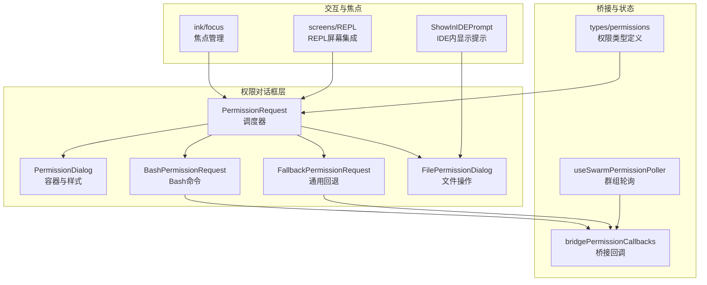
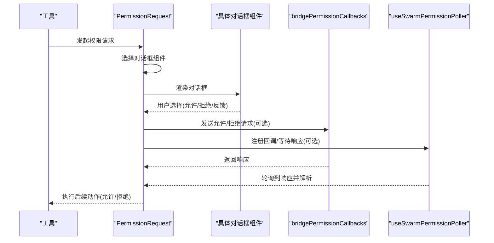
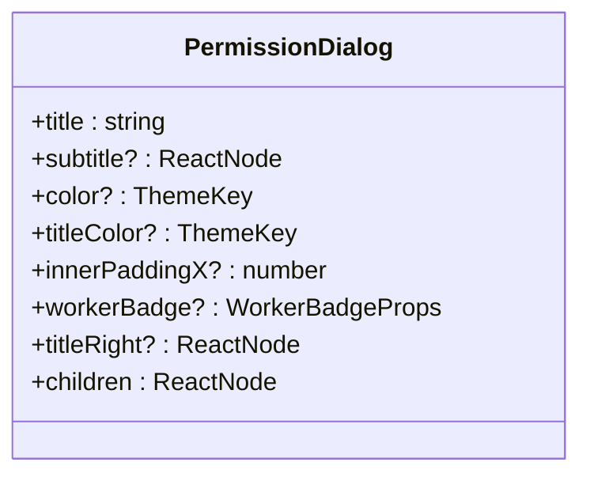
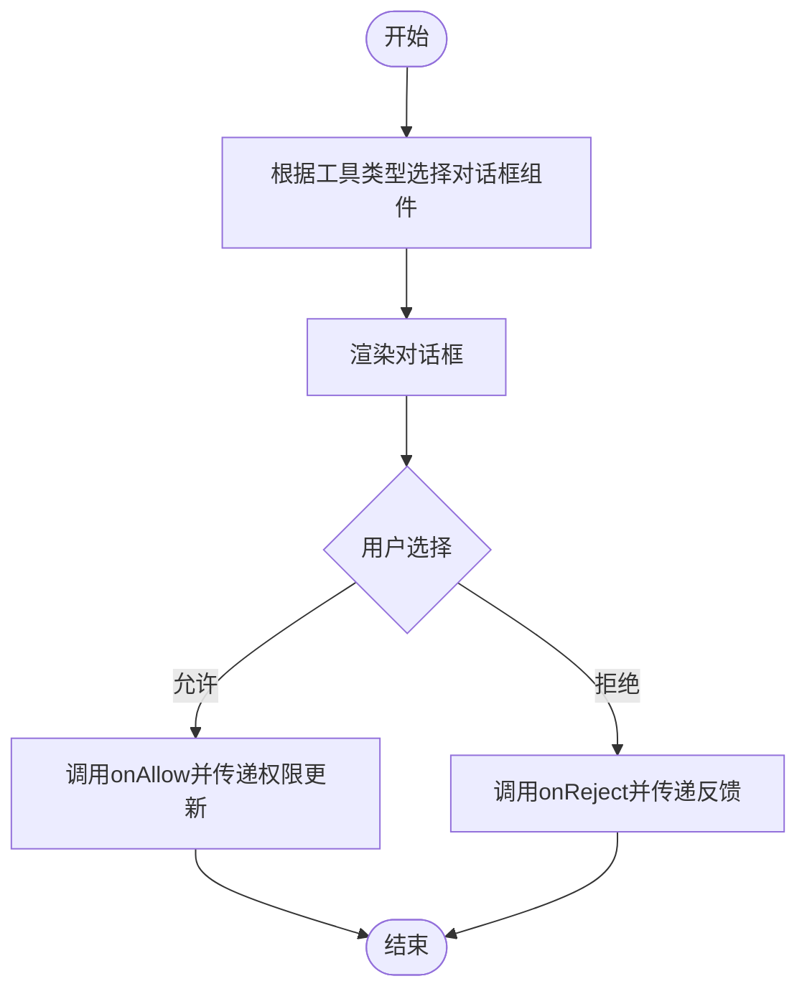
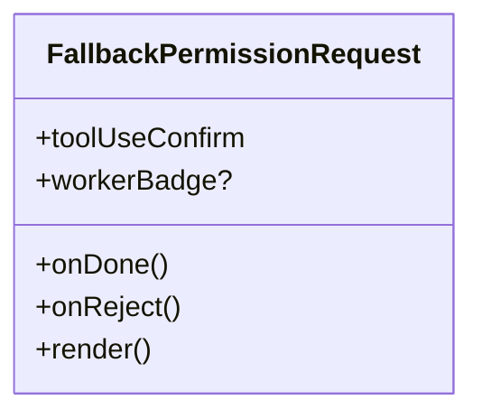
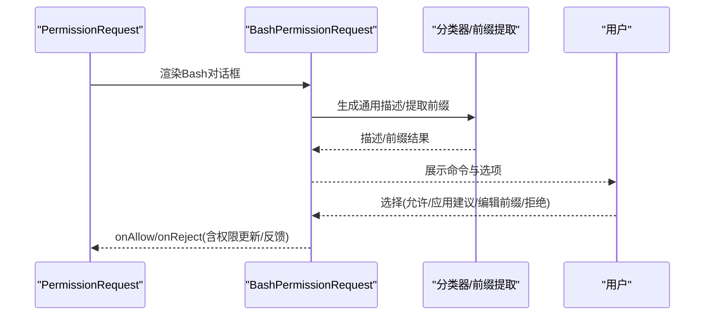
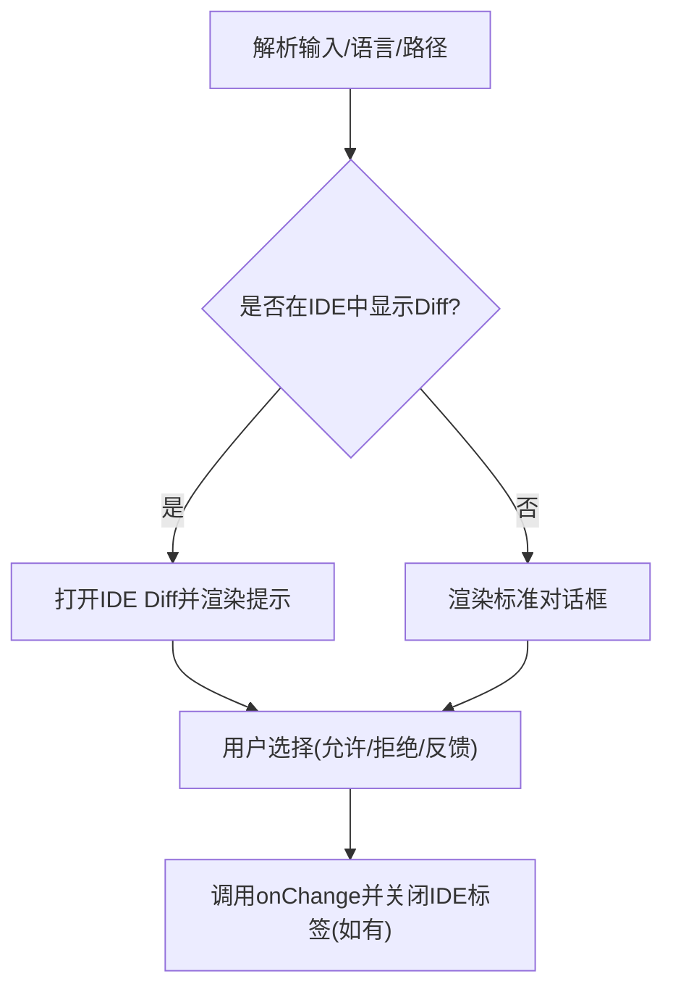
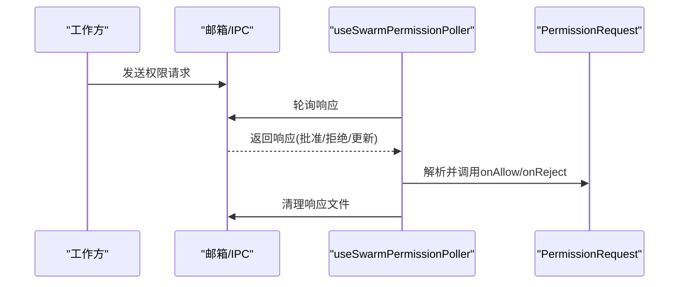
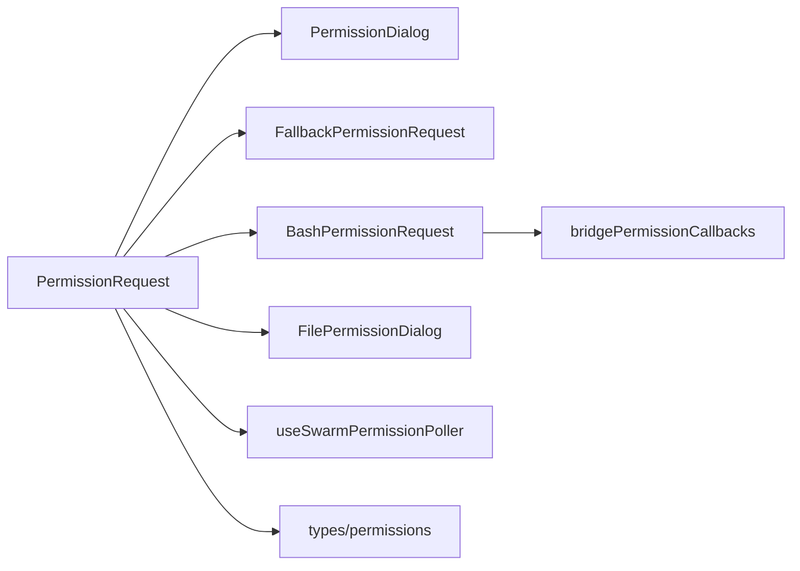

# 用户交互对话框

<cite>
**本文档引用的文件**
- [src/components/permissions/PermissionDialog.tsx](file://src/components/permissions/PermissionDialog.tsx)
- [src/components/permissions/PermissionRequest.tsx](file://src/components/permissions/PermissionRequest.tsx)
- [src/components/permissions/FallbackPermissionRequest.tsx](file://src/components/permissions/FallbackPermissionRequest.tsx)
- [src/components/permissions/BashPermissionRequest/BashPermissionRequest.tsx](file://src/components/permissions/BashPermissionRequest/BashPermissionRequest.tsx)
- [src/components/permissions/FilePermissionDialog/FilePermissionDialog.tsx](file://src/components/permissions/FilePermissionDialog/FilePermissionDialog.tsx)
- [src/components/permissions/PermissionDialog.tsx](file://src/components/permissions/PermissionDialog.tsx)
- [src/components/permissions/PermissionRequest.tsx](file://src/components/permissions/PermissionRequest.tsx)
- [src/components/permissions/FallbackPermissionRequest.tsx](file://src/components/permissions/FallbackPermissionRequest.tsx)
- [src/components/permissions/BashPermissionRequest/BashPermissionRequest.tsx](file://src/components/permissions/BashPermissionRequest/BashPermissionRequest.tsx)
- [src/components/permissions/FilePermissionDialog/FilePermissionDialog.tsx](file://src/components/permissions/FilePermissionDialog/FilePermissionDialog.tsx)
- [src/bridge/bridgePermissionCallbacks.ts](file://src/bridge/bridgePermissionCallbacks.ts)
- [src/hooks/useSwarmPermissionPoller.ts](file://src/hooks/useSwarmPermissionPoller.ts)
- [src/types/permissions.ts](file://src/types/permissions.ts)
- [src/screens/REPL.tsx](file://src/screens/REPL.tsx)
- [src/components/ShowInIDEPrompt.tsx](file://src/components/ShowInIDEPrompt.tsx)
- [src/ink/focus.ts](file://src/ink/focus.ts)
</cite>

## 目录
1. [引言](#引言)
2. [项目结构](#项目结构)
3. [核心组件](#核心组件)
4. [架构总览](#架构总览)
5. [详细组件分析](#详细组件分析)
6. [依赖关系分析](#依赖关系分析)
7. [性能考量](#性能考量)
8. [故障排除指南](#故障排除指南)
9. [结论](#结论)
10. [附录](#附录)

## 引言
本文件面向权限用户交互对话框的UI组件，系统性阐述设计理念、用户体验考量、不同权限请求类型的对话框实现、可视化呈现方式、定制化选项、异步处理与状态管理、无障碍与国际化支持。目标是帮助开发者与产品人员理解并高效扩展权限对话框体系。

## 项目结构
权限对话框体系位于 `src/components/permissions` 目录下，围绕统一的 `PermissionDialog` 容器与 `PermissionRequest` 调度器展开，并针对不同工具类型（如 Bash、文件操作、Web 访问等）提供专门的对话框组件；同时通过桥接回调、沙箱与群组模式钩子实现跨进程/跨设备的权限同步与响应。

**图表来源**
- [src/components/permissions/PermissionDialog.tsx:1-72](file://src/components/permissions/PermissionDialog.tsx#L1-L72)
- [src/components/permissions/PermissionRequest.tsx:1-217](file://src/components/permissions/PermissionRequest.tsx#L1-L217)
- [src/components/permissions/FallbackPermissionRequest.tsx:1-333](file://src/components/permissions/FallbackPermissionRequest.tsx#L1-L333)
- [src/components/permissions/BashPermissionRequest/BashPermissionRequest.tsx:1-482](file://src/components/permissions/BashPermissionRequest/BashPermissionRequest.tsx#L1-L482)
- [src/components/permissions/FilePermissionDialog/FilePermissionDialog.tsx:1-204](file://src/components/permissions/FilePermissionDialog/FilePermissionDialog.tsx#L1-L204)
- [src/bridge/bridgePermissionCallbacks.ts:1-44](file://src/bridge/bridgePermissionCallbacks.ts#L1-L44)
- [src/hooks/useSwarmPermissionPoller.ts:1-331](file://src/hooks/useSwarmPermissionPoller.ts#L1-L331)
- [src/types/permissions.ts:1-80](file://src/types/permissions.ts#L1-L80)
- [src/components/ShowInIDEPrompt.tsx:129-169](file://src/components/ShowInIDEPrompt.tsx#L129-L169)
- [src/ink/focus.ts:1-181](file://src/ink/focus.ts#L1-L181)
- [src/screens/REPL.tsx:2069-2096](file://src/screens/REPL.tsx#L2069-L2096)

**章节来源**
- [src/components/permissions/PermissionDialog.tsx:1-72](file://src/components/permissions/PermissionDialog.tsx#L1-L72)
- [src/components/permissions/PermissionRequest.tsx:1-217](file://src/components/permissions/PermissionRequest.tsx#L1-L217)

## 核心组件
- 统一容器：`PermissionDialog` 提供边框、内边距、标题区与右侧装饰位，支持主题色与工作方块徽章。
- 调度器：`PermissionRequest` 基于工具类型选择具体对话框组件，注册键盘中断、通知消息、粘性页脚等。
- 通用回退：`FallbackPermissionRequest` 面向未覆盖的工具类型，提供“是/否/不再询问”等基础选项。
- 工具专用：`BashPermissionRequest`、`FilePermissionDialog` 等针对特定场景优化体验与信息密度。
- 桥接回调：`bridgePermissionCallbacks` 定义桥接层的请求/响应协议与校验。
- 群组轮询：`useSwarmPermissionPoller` 在群组模式下轮询响应并安全解析权限更新。
- 类型定义：`types/permissions` 抽象出权限模式、行为与规则类型，避免循环依赖。

**章节来源**
- [src/components/permissions/PermissionDialog.tsx:1-72](file://src/components/permissions/PermissionDialog.tsx#L1-L72)
- [src/components/permissions/PermissionRequest.tsx:1-217](file://src/components/permissions/PermissionRequest.tsx#L1-L217)
- [src/components/permissions/FallbackPermissionRequest.tsx:1-333](file://src/components/permissions/FallbackPermissionRequest.tsx#L1-L333)
- [src/bridge/bridgePermissionCallbacks.ts:1-44](file://src/bridge/bridgePermissionCallbacks.ts#L1-L44)
- [src/hooks/useSwarmPermissionPoller.ts:1-331](file://src/hooks/useSwarmPermissionPoller.ts#L1-L331)
- [src/types/permissions.ts:1-80](file://src/types/permissions.ts#L1-L80)

## 架构总览
权限对话框的运行时流程如下：工具发起权限检查后，若需要人工确认，调度器根据工具类型选择对应对话框组件渲染；用户交互触发允许/拒绝，经由回调写入权限更新或直接放行；在桥接/群组/沙箱等场景下，通过桥接回调或轮询机制异步获取结果并更新UI。

**图表来源**
- [src/components/permissions/PermissionRequest.tsx:146-217](file://src/components/permissions/PermissionRequest.tsx#L146-L217)
- [src/components/permissions/BashPermissionRequest/BashPermissionRequest.tsx:71-133](file://src/components/permissions/BashPermissionRequest/BashPermissionRequest.tsx#L71-L133)
- [src/bridge/bridgePermissionCallbacks.ts:10-27](file://src/bridge/bridgePermissionCallbacks.ts#L10-L27)
- [src/hooks/useSwarmPermissionPoller.ts:268-331](file://src/hooks/useSwarmPermissionPoller.ts#L268-L331)

## 详细组件分析

### 统一容器：PermissionDialog
- 设计要点：圆角边框、左右/底部无边框、可配置内边距X、标题区支持副标题与右侧装饰、工作方块徽章。
- 可定制项：颜色主题键、内边距、标题右部区域、子节点内容区。
- 适用场景：所有权限对话框的基础容器，确保一致的视觉与交互基线。

**图表来源**
- [src/components/permissions/PermissionDialog.tsx:7-16](file://src/components/permissions/PermissionDialog.tsx#L7-L16)

**章节来源**
- [src/components/permissions/PermissionDialog.tsx:1-72](file://src/components/permissions/PermissionDialog.tsx#L1-L72)

### 调度器：PermissionRequest
- 功能：按工具类型映射到对应对话框组件；注册中断键绑定；生成通知消息；支持粘性页脚以增强长内容可读性。
- 关键点：默认回退到通用对话框；对计划模式、评审产物、工作流脚本等特性条件加载。

**图表来源**
- [src/components/permissions/PermissionRequest.tsx:47-82](file://src/components/permissions/PermissionRequest.tsx#L47-L82)
- [src/components/permissions/PermissionRequest.tsx:146-217](file://src/components/permissions/PermissionRequest.tsx#L146-L217)

**章节来源**
- [src/components/permissions/PermissionRequest.tsx:1-217](file://src/components/permissions/PermissionRequest.tsx#L1-L217)

### 通用回退：FallbackPermissionRequest
- 适用范围：未覆盖的工具类型。
- 交互：提供“是/不再询问/否”三选；记录事件元数据；支持平台信息与消息ID。
- 体验：简洁明确的工具名与描述展示，配合规则解释组件。

**图表来源**
- [src/components/permissions/FallbackPermissionRequest.tsx:16-333](file://src/components/permissions/FallbackPermissionRequest.tsx#L16-L333)

**章节来源**
- [src/components/permissions/FallbackPermissionRequest.tsx:1-333](file://src/components/permissions/FallbackPermissionRequest.tsx#L1-L333)

### Bash命令权限：BashPermissionRequest
- 特性：支持自动分类器、前缀建议、破坏性命令警告、沙箱状态提示、调试信息开关、输入反馈模式。
- 流程：解析命令与描述；生成通用描述；提取/编辑可编辑前缀；根据结果生成选项；记录事件与分析上下文；最终调用允许/拒绝回调。

**图表来源**
- [src/components/permissions/BashPermissionRequest/BashPermissionRequest.tsx:136-482](file://src/components/permissions/BashPermissionRequest/BashPermissionRequest.tsx#L136-L482)

**章节来源**
- [src/components/permissions/BashPermissionRequest/BashPermissionRequest.tsx:1-482](file://src/components/permissions/BashPermissionRequest/BashPermissionRequest.tsx#L1-L482)

### 文件操作权限：FilePermissionDialog
- 特性：支持IDE Diff预览、符号链接目标提示、语言高亮、路径解析、输入解析与变更应用。
- 流程：解析输入、计算语言名称、检测符号链接、决定是否在IDE中打开Diff、生成选项与反馈；支持自定义内容与规则解释。

**图表来源**
- [src/components/permissions/FilePermissionDialog/FilePermissionDialog.tsx:48-204](file://src/components/permissions/FilePermissionDialog/FilePermissionDialog.tsx#L48-L204)
- [src/components/ShowInIDEPrompt.tsx:129-169](file://src/components/ShowInIDEPrompt.tsx#L129-L169)

**章节来源**
- [src/components/permissions/FilePermissionDialog/FilePermissionDialog.tsx:1-204](file://src/components/permissions/FilePermissionDialog/FilePermissionDialog.tsx#L1-L204)
- [src/components/ShowInIDEPrompt.tsx:129-169](file://src/components/ShowInIDEPrompt.tsx#L129-L169)

### 桥接与群组：异步处理与状态管理
- 桥接回调：定义请求/响应格式与类型断言，保证跨进程通信的健壮性。
- 群组轮询：在工作方模式下定时轮询响应文件，解析权限更新，清理响应并调用回调。
- REPL集成：在权限对话框出现/消失时滚动定位，保持用户可见性与上下文连续性。

**图表来源**
- [src/bridge/bridgePermissionCallbacks.ts:10-27](file://src/bridge/bridgePermissionCallbacks.ts#L10-L27)
- [src/hooks/useSwarmPermissionPoller.ts:268-331](file://src/hooks/useSwarmPermissionPoller.ts#L268-L331)
- [src/screens/REPL.tsx:2069-2096](file://src/screens/REPL.tsx#L2069-L2096)

**章节来源**
- [src/bridge/bridgePermissionCallbacks.ts:1-44](file://src/bridge/bridgePermissionCallbacks.ts#L1-L44)
- [src/hooks/useSwarmPermissionPoller.ts:1-331](file://src/hooks/useSwarmPermissionPoller.ts#L1-L331)
- [src/screens/REPL.tsx:2069-2096](file://src/screens/REPL.tsx#L2069-L2096)

## 依赖关系分析
- 组件耦合：`PermissionRequest` 作为调度器，仅依赖工具类型与对话框组件接口，降低耦合。
- 外部依赖：桥接回调与群组轮询分别处理跨进程与群组协作，避免在UI层引入复杂逻辑。
- 类型解耦：权限类型定义独立于实现，便于维护与测试。

**图表来源**
- [src/components/permissions/PermissionRequest.tsx:47-82](file://src/components/permissions/PermissionRequest.tsx#L47-L82)
- [src/bridge/bridgePermissionCallbacks.ts:1-44](file://src/bridge/bridgePermissionCallbacks.ts#L1-L44)
- [src/hooks/useSwarmPermissionPoller.ts:1-331](file://src/hooks/useSwarmPermissionPoller.ts#L1-L331)
- [src/types/permissions.ts:1-80](file://src/types/permissions.ts#L1-L80)

**章节来源**
- [src/components/permissions/PermissionRequest.tsx:1-217](file://src/components/permissions/PermissionRequest.tsx#L1-L217)
- [src/types/permissions.ts:1-80](file://src/types/permissions.ts#L1-L80)

## 性能考量
- 渲染优化：使用 `useMemo` 缓存昂贵计算（如命令描述、前缀、语言名称），避免重复渲染。
- 轮询节流：群组轮询间隔固定且防并发，减少I/O压力。
- 视觉反馈：闪烁动画与延迟提示在必要时才启用，避免不必要的重渲染。
- 滚动与焦点：REPL中对权限对话框出现/消失进行滚动定位，减少布局抖动。

[本节不直接分析具体代码文件，无需“章节来源”]

## 故障排除指南
- 分类器/前缀解析失败：降级使用原始描述或空描述，不影响交互。
- 权限更新格式异常：群组轮询在解析时过滤非法条目并记录调试日志。
- 桥接响应缺失：检查请求ID与订阅是否正确，确认取消/响应时机。
- IDE Diff异常：检查配置与编辑参数，确保输入解析与变更应用正确。

**章节来源**
- [src/hooks/useSwarmPermissionPoller.ts:35-53](file://src/hooks/useSwarmPermissionPoller.ts#L35-L53)
- [src/bridge/bridgePermissionCallbacks.ts:29-40](file://src/bridge/bridgePermissionCallbacks.ts#L29-L40)

## 结论
权限对话框体系通过统一容器、灵活调度器与专用组件，实现了对多类型工具的一致化与差异化结合。借助桥接回调与群组轮询，系统在复杂运行环境下仍能保持稳定的异步处理与状态管理。通过可定制的样式、布局与交互行为，以及完善的错误处理与性能优化，该体系为用户提供了清晰、可控且可扩展的权限交互体验。

[本节不直接分析具体代码文件，无需“章节来源”]

## 附录

### 无障碍与国际化支持
- 键盘导航：焦点管理器提供Tab顺序与焦点移动，确保键盘可达性。
- 文本与颜色：使用主题键控制颜色与强调，避免仅依赖颜色传达信息。
- 国际化：文本内容通过工具描述与用户可读名称生成，支持多语言环境下的描述展示。

**章节来源**
- [src/ink/focus.ts:1-181](file://src/ink/focus.ts#L1-L181)
- [src/components/permissions/PermissionRequest.tsx:128-143](file://src/components/permissions/PermissionRequest.tsx#L128-L143)