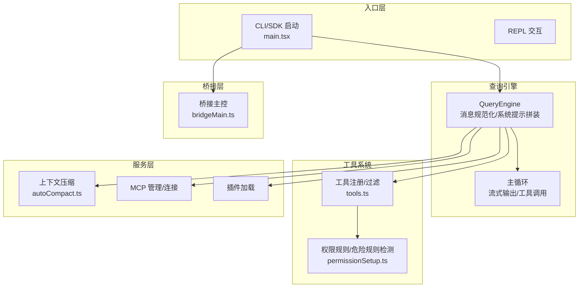
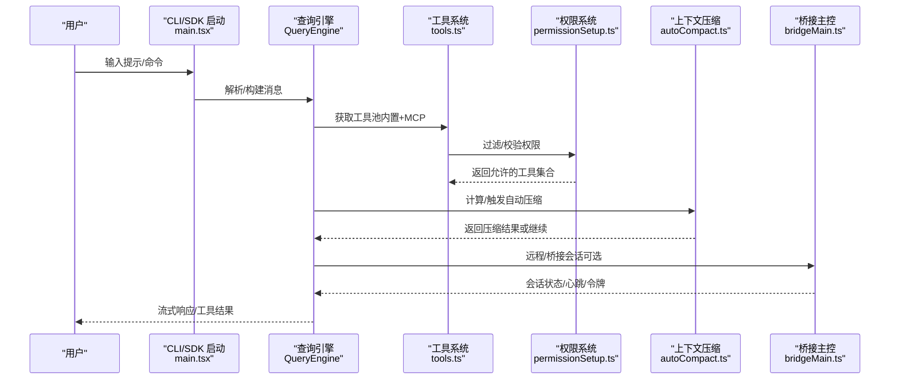
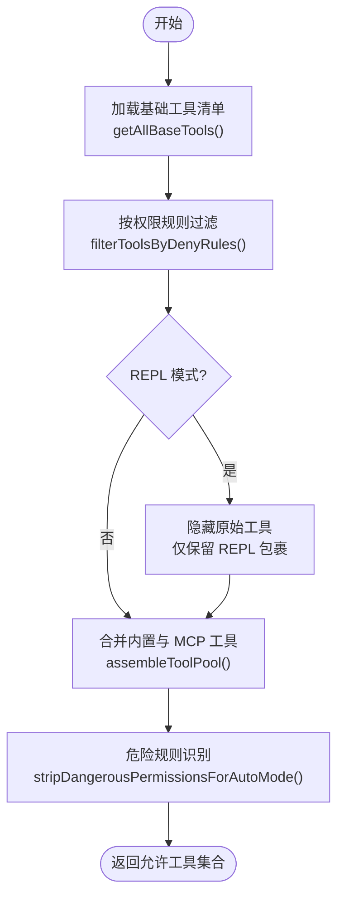
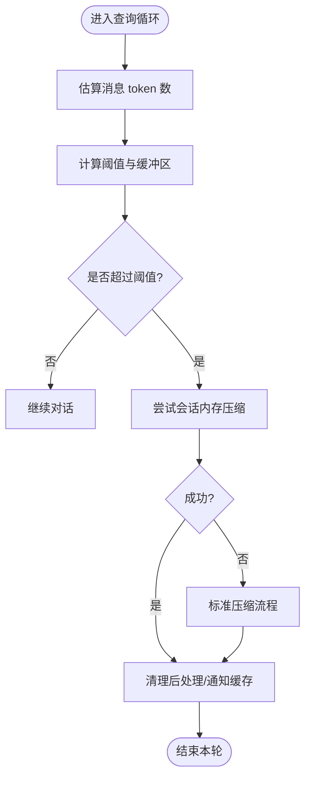
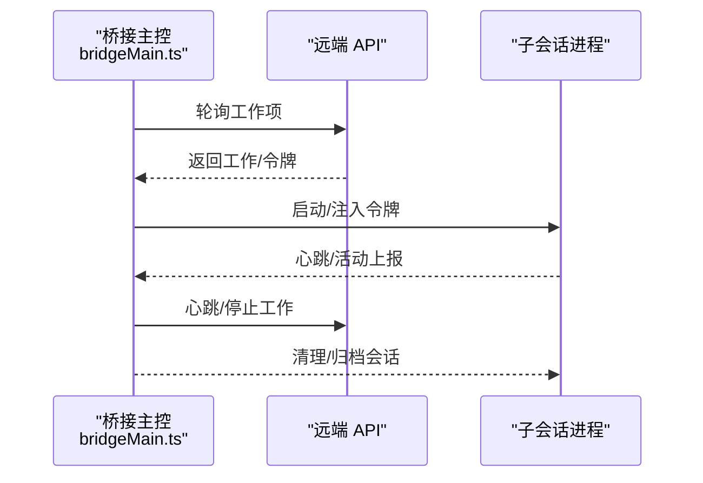
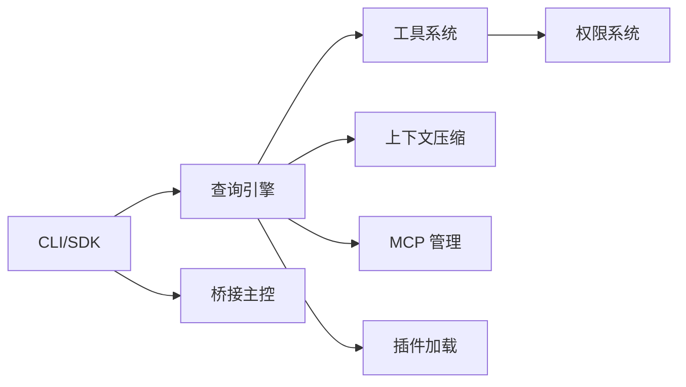

# 核心特性

<cite>
**本文引用的文件**
- [README.md](file://README.md)
- [src/tools.ts](file://src/tools.ts)
- [src/commands.ts](file://src/commands.ts)
- [src/main.tsx](file://src/main.tsx)
- [src/utils/permissions/permissionSetup.ts](file://src/utils/permissions/permissionSetup.ts)
- [src/services/compact/autoCompact.ts](file://src/services/compact/autoCompact.ts)
- [src/bridge/bridgeMain.ts](file://src/bridge/bridgeMain.ts)
</cite>

## 目录
1. [简介](#简介)
2. [项目结构](#项目结构)
3. [核心组件](#核心组件)
4. [架构总览](#架构总览)
5. [详细组件分析](#详细组件分析)
6. [依赖分析](#依赖分析)
7. [性能考量](#性能考量)
8. [故障排查指南](#故障排查指南)
9. [结论](#结论)
10. [附录](#附录)

## 简介
本文件面向希望系统掌握 Claude Code 核心能力的开发者，围绕以下关键特性进行深入解析：  
- 40+ 内置工具系统（可扩展、按需裁剪、MCP 工具融合）  
- 权限控制系统（规则引擎、危险规则识别、自动模式安全门禁）  
- 上下文管理（自动压缩、会话记忆优先压缩、多策略并存）  
- 多代理协作（主/子代理、远程桥接、团队任务板）  
- 与 CLI/SDK 的统一入口、命令体系与插件生态  

目标是帮助你理解这些特性如何协同工作，形成从“输入提示”到“工具执行/多代理协作”的完整开发体验，并提供使用建议与最佳实践。

## 项目结构
- 入口层：CLI/SDK 启动路径与 REPL 交互  
- 查询引擎：消息规范化、系统提示拼装、主循环与流式输出  
- 工具系统：统一工具接口、权限校验、渲染与进度展示  
- 服务层：API 客户端、上下文压缩、MCP 管理、插件加载  
- 状态层：应用状态存储、权限上下文、会话持久化  
- 桥接层：Claude Desktop/远程桥接、会话生命周期管理  

图表来源
- [src/main.tsx:585-800](file://src/main.tsx#L585-L800)
- [src/tools.ts:193-390](file://src/tools.ts#L193-L390)
- [src/utils/permissions/permissionSetup.ts:597-646](file://src/utils/permissions/permissionSetup.ts#L597-L646)
- [src/services/compact/autoCompact.ts:160-239](file://src/services/compact/autoCompact.ts#L160-L239)
- [src/bridge/bridgeMain.ts:141-200](file://src/bridge/bridgeMain.ts#L141-L200)

章节来源
- [README.md:383-446](file://README.md#L383-L446)
- [src/main.tsx:585-800](file://src/main.tsx#L585-L800)

## 核心组件
- 工具系统与权限
  - 工具注册与动态装配：支持内置工具与 MCP 工具合并，按权限规则过滤，支持 REPL 模式下的工具屏蔽与优先级排序。  
  - 权限规则引擎：支持 allow/deny/ask 三类规则，结合 CLI/设置源叠加；提供危险规则识别（如 Bash(*)、PowerShell(*)、Agent(*)），并在自动模式下进行安全剥离与恢复。  
- 上下文管理
  - 自动压缩阈值与缓冲区策略：基于模型上下文窗口与最大输出令牌预留，动态计算触发阈值；在会话内存压缩失败时回退到标准压缩流程。  
  - 会话记忆优先压缩：优先尝试会话内存压缩，失败再走标准压缩，减少 API 调用与成本。  
- 多代理协作
  - 主/子代理：支持 in-process、fork、worktree、remote 四种模式；通过 SendMessageTool、TaskCreate/Update/Delete、TeamCreate/Delete 实现跨代理通信与任务编排。  
  - 桥接远程：桥接主控负责环境/会话生命周期、心跳、令牌刷新、容量唤醒与错误处理，支撑多会话并发与高可用。  
- 命令体系与插件生态
  - 命令注册与动态加载：内置命令 + 技能目录 + 插件技能 + 流程脚本命令的统一聚合，支持远程/桥接安全命令白名单。  
  - 插件与技能：插件命令与技能命令统一纳入命令索引，动态去重与排序，确保提示缓存稳定性。

章节来源
- [src/tools.ts:193-390](file://src/tools.ts#L193-L390)
- [src/utils/permissions/permissionSetup.ts:295-342](file://src/utils/permissions/permissionSetup.ts#L295-L342)
- [src/services/compact/autoCompact.ts:160-239](file://src/services/compact/autoCompact.ts#L160-L239)
- [src/bridge/bridgeMain.ts:141-200](file://src/bridge/bridgeMain.ts#L141-L200)
- [src/commands.ts:476-517](file://src/commands.ts#L476-L517)

## 架构总览
下图展示了从入口到工具执行、权限校验与上下文压缩的关键流转，以及桥接远程与多代理协作的集成点。

图表来源
- [src/main.tsx:585-800](file://src/main.tsx#L585-L800)
- [src/tools.ts:345-367](file://src/tools.ts#L345-L367)
- [src/utils/permissions/permissionSetup.ts:597-646](file://src/utils/permissions/permissionSetup.ts#L597-L646)
- [src/services/compact/autoCompact.ts:241-351](file://src/services/compact/autoCompact.ts#L241-L351)
- [src/bridge/bridgeMain.ts:141-200](file://src/bridge/bridgeMain.ts#L141-L200)

## 详细组件分析

### 工具系统与权限控制
- 工具注册与装配
  - 统一入口：getAllBaseTools 生成基础工具清单，结合条件编译与环境开关（如嵌入搜索工具、PowerShell 工具、工作树模式、协调者模式等）动态启用。  
  - 合并与去重：assembleToolPool 将内置工具与 MCP 工具按名称去重，内置工具优先，保证提示缓存稳定。  
  - REPL 模式：当 REPL 启用时，隐藏原始 Bash/File 等工具，仅通过 REPL VM 提供受限访问。  
- 权限控制
  - 规则来源：CLI 参数、设置文件、会话决策等；支持 alwaysAllow/alwaysDeny/alwaysAsk 三类规则。  
  - 危险规则识别：对 Bash(*)、PowerShell(*)、Agent(*) 等可能绕过自动模式分类器的规则进行识别与剥离；在进入自动模式前清理，在退出时恢复。  
  - 交互式确认：若无匹配规则，默认弹窗让用户“一次性/总是允许/拒绝”。  
- 使用建议
  - 通过 --tools 预设或自定义列表限制工具面，降低误操作风险。  
  - 在团队环境中，优先使用 alwaysDeny/alwaysAsk 规则集中管控，避免 Bash(*) 等高危规则。  
  - 结合 MCP 工具时，注意工具命名前缀与资源列表，避免跨服务器工具被意外放行。

图表来源
- [src/tools.ts:193-251](file://src/tools.ts#L193-L251)
- [src/tools.ts:345-367](file://src/tools.ts#L345-L367)
- [src/utils/permissions/permissionSetup.ts:510-553](file://src/utils/permissions/permissionSetup.ts#L510-L553)

章节来源
- [src/tools.ts:193-390](file://src/tools.ts#L193-L390)
- [src/utils/permissions/permissionSetup.ts:295-342](file://src/utils/permissions/permissionSetup.ts#L295-L342)
- [src/utils/permissions/permissionSetup.ts:597-646](file://src/utils/permissions/permissionSetup.ts#L597-L646)

### 上下文管理与自动压缩
- 触发策略
  - 基于模型上下文窗口与最大输出令牌预留，计算有效上下文窗口与自动压缩阈值；在会话内存压缩失败时，回退到标准压缩流程。  
  - 提供警告/错误阈值与阻断上限，避免持续失败导致的 API 调用风暴。  
- 会话记忆优先
  - 优先尝试会话内存压缩（trySessionMemoryCompaction），成功后重置摘要指针并清理后续状态，显著降低压缩成本。  
- 使用建议
  - 在长对话场景中开启自动压缩，合理设置阻断上限以避免无限重试。  
  - 对于需要更高保真度的历史片段，可结合手动 /compact 或 snip 策略进行精细控制。

图表来源
- [src/services/compact/autoCompact.ts:160-239](file://src/services/compact/autoCompact.ts#L160-L239)
- [src/services/compact/autoCompact.ts:241-351](file://src/services/compact/autoCompact.ts#L241-L351)

章节来源
- [src/services/compact/autoCompact.ts:160-239](file://src/services/compact/autoCompact.ts#L160-L239)
- [src/services/compact/autoCompact.ts:241-351](file://src/services/compact/autoCompact.ts#L241-L351)

### 多代理协作与远程桥接
- 子代理与团队协作
  - 模式：默认（共享缓存）、fork（独立进程，共享文件缓存）、worktree（隔离工作树）、remote（桥接到远程容器）。  
  - 通信：SendMessageTool、TaskCreate/Update/Delete、TeamCreate/Delete 实现跨代理消息与任务编排。  
- 桥接主控
  - 生命周期：环境/会话创建、心跳、令牌刷新、容量唤醒、错误处理与超时监控。  
  - 并发：支持多会话模式，空闲时以心跳轮询维持连接，容量饱和时采用“仅心跳”策略降低开销。  
- 使用建议
  - 在远程/CI 场景中，优先使用 remote 模式与桥接主控，结合容量唤醒与令牌刷新策略保障稳定性。  
  - 团队协作时，明确任务板与消息边界，避免跨代理冲突；必要时启用 worktree 隔离变更。

图表来源
- [src/bridge/bridgeMain.ts:141-200](file://src/bridge/bridgeMain.ts#L141-L200)
- [src/bridge/bridgeMain.ts:442-591](file://src/bridge/bridgeMain.ts#L442-L591)

章节来源
- [src/bridge/bridgeMain.ts:141-200](file://src/bridge/bridgeMain.ts#L141-L200)
- [src/bridge/bridgeMain.ts:442-591](file://src/bridge/bridgeMain.ts#L442-L591)

### 命令体系与插件生态
- 命令聚合
  - 内置命令 + 技能目录 + 插件技能 + 流程脚本命令统一加载与去重，动态技能插入到合适位置，保持命令索引稳定。  
  - 远程/桥接安全命令白名单：仅允许本地状态无关的命令通过桥接通道执行，避免远程环境中的副作用。  
- 插件与技能
  - 技能与插件命令统一纳入索引，支持描述与使用场景标注，便于模型选择合适的“技能工具”。  
- 使用建议
  - 在远程/移动端使用时，优先选择白名单内的命令，避免执行需要本地终端/文件系统权限的命令。  
  - 动态技能加载失败不应阻断系统运行，保持降级路径与日志记录以便诊断。

章节来源
- [src/commands.ts:476-517](file://src/commands.ts#L476-L517)
- [src/commands.ts:619-686](file://src/commands.ts#L619-L686)

## 依赖分析
- 组件耦合
  - 查询引擎依赖工具系统与权限系统，同时与上下文压缩、MCP、插件加载形成松耦合集成。  
  - 桥接主控与远程 API 独立演进，通过工作秘密与心跳协议解耦。  
- 外部依赖与集成点
  - MCP 协议：工具注册、认证与资源列表；与内置工具合并时遵循命名规范与权限透传。  
  - 分析与遥测：统计缓存键与事件上报，用于优化与审计。  
- 循环依赖规避
  - 工具系统通过懒加载与条件编译避免循环依赖；命令体系对重型模块采用延迟导入。

图表来源
- [src/main.tsx:585-800](file://src/main.tsx#L585-L800)
- [src/tools.ts:193-251](file://src/tools.ts#L193-L251)
- [src/utils/permissions/permissionSetup.ts:597-646](file://src/utils/permissions/permissionSetup.ts#L597-L646)
- [src/services/compact/autoCompact.ts:160-239](file://src/services/compact/autoCompact.ts#L160-L239)
- [src/bridge/bridgeMain.ts:141-200](file://src/bridge/bridgeMain.ts#L141-L200)

章节来源
- [src/tools.ts:193-251](file://src/tools.ts#L193-L251)
- [src/utils/permissions/permissionSetup.ts:597-646](file://src/utils/permissions/permissionSetup.ts#L597-L646)
- [src/services/compact/autoCompact.ts:160-239](file://src/services/compact/autoCompact.ts#L160-L239)
- [src/bridge/bridgeMain.ts:141-200](file://src/bridge/bridgeMain.ts#L141-L200)

## 性能考量
- 工具与命令加载
  - 使用 memoize 缓存命令与技能索引，避免重复磁盘 I/O 与动态导入开销。  
  - REPL 模式下隐藏原始工具，减少模型提示长度与缓存碎片。  
- 上下文压缩
  - 自动压缩阈值与缓冲区策略平衡吞吐与成本；会话内存优先压缩显著降低 API 调用次数。  
  - 失败熔断机制（连续失败上限）避免无效重试带来的资源浪费。  
- 桥接并发
  - 多会话模式下采用“仅心跳”策略与容量唤醒，降低空闲时的网络与 CPU 开销。  
  - 令牌刷新与重连策略减少因 JWT 过期导致的工作中断。

## 故障排查指南
- 权限相关
  - 若出现“危险规则”或“自动模式无法进入”，检查 Bash/PowerShell/Agent 规则是否过于宽泛；必要时移除或收紧规则。  
  - 使用 removeDangerousPermissions 与 restoreDangerousPermissions 进行临时清理与恢复。  
- 上下文压缩
  - 若自动压缩频繁失败，检查阻断上限与模型输出预留是否合理；适当提高阻断上限或关闭自动压缩以定位问题。  
  - 关注 consecutiveFailures 熔断状态，避免无限重试。  
- 桥接远程
  - 若会话异常中断，查看心跳失败、令牌过期与容量唤醒日志；确认网络与服务器配置。  
  - 多会话模式下，关注 at-capacity 心跳与轮询间隔设置，避免紧随式轮询导致的抖动。  
- 命令与插件
  - 动态技能加载失败不会阻断系统，但会影响命令索引；检查日志并清理缓存后重试。

章节来源
- [src/utils/permissions/permissionSetup.ts:472-503](file://src/utils/permissions/permissionSetup.ts#L472-L503)
- [src/services/compact/autoCompact.ts:257-266](file://src/services/compact/autoCompact.ts#L257-L266)
- [src/bridge/bridgeMain.ts:202-270](file://src/bridge/bridgeMain.ts#L202-L270)
- [src/commands.ts:523-539](file://src/commands.ts#L523-L539)

## 结论
Claude Code 的核心特性围绕“可扩展工具系统 + 安全权限控制 + 智能上下文压缩 + 多代理协作 + 远程桥接”展开。通过统一的工具注册与权限规则引擎，既能满足个人高效开发，也能在团队与远程环境中保持安全与可控。自动压缩与会话记忆优先策略有效平衡成本与效果，而桥接主控与多代理协作则提供了强大的分布式与并行能力。建议在生产环境中结合预设工具、严格权限规则与合理的压缩策略，以获得更稳态的开发体验。

## 附录
- 使用示例与最佳实践
  - 工具与权限
    - 使用 --tools default 限定工具面，配合 alwaysDeny/alwaysAsk 规则集中管控。  
    - 在自动模式下避免 Bash(*) 等高危规则，必要时通过危险规则识别与剥离流程进行治理。  
  - 上下文管理
    - 长对话场景开启自动压缩，设置合理阻断上限；对关键历史片段使用手动压缩或 snip 策略。  
  - 多代理协作
    - 远程/CI 场景优先使用 remote 模式与桥接主控；团队协作明确任务板与消息边界，必要时启用 worktree 隔离。  
  - 命令与插件
    - 在远程/移动端优先使用白名单命令；动态技能加载失败不影响系统运行，保持降级路径与日志记录。