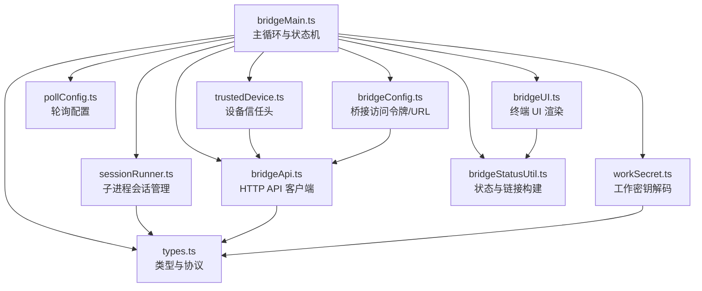
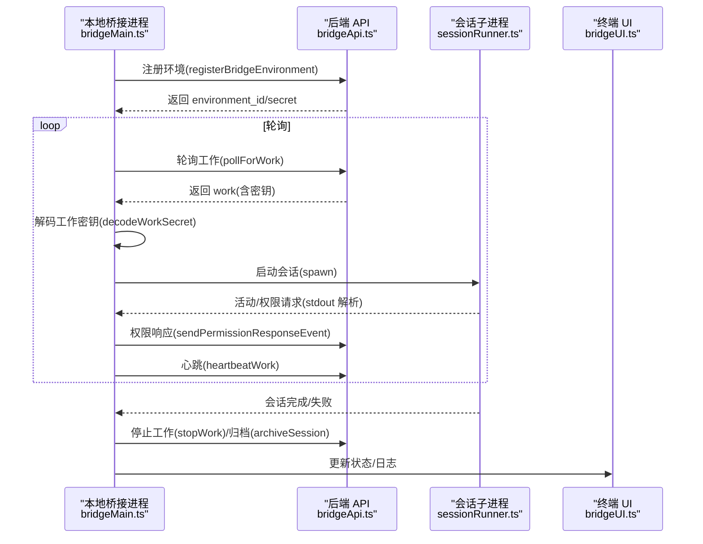
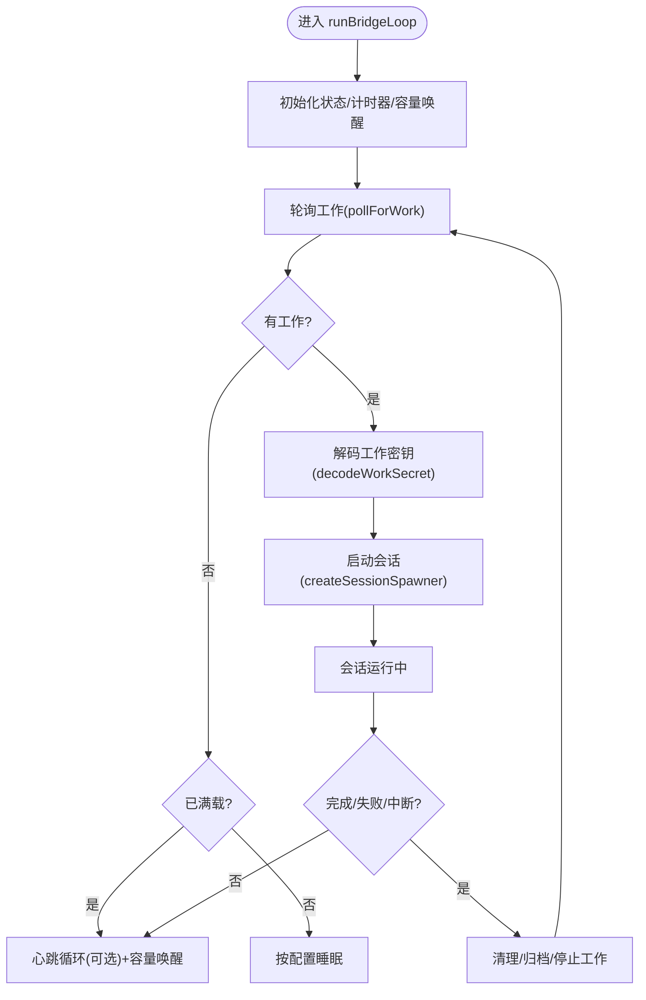
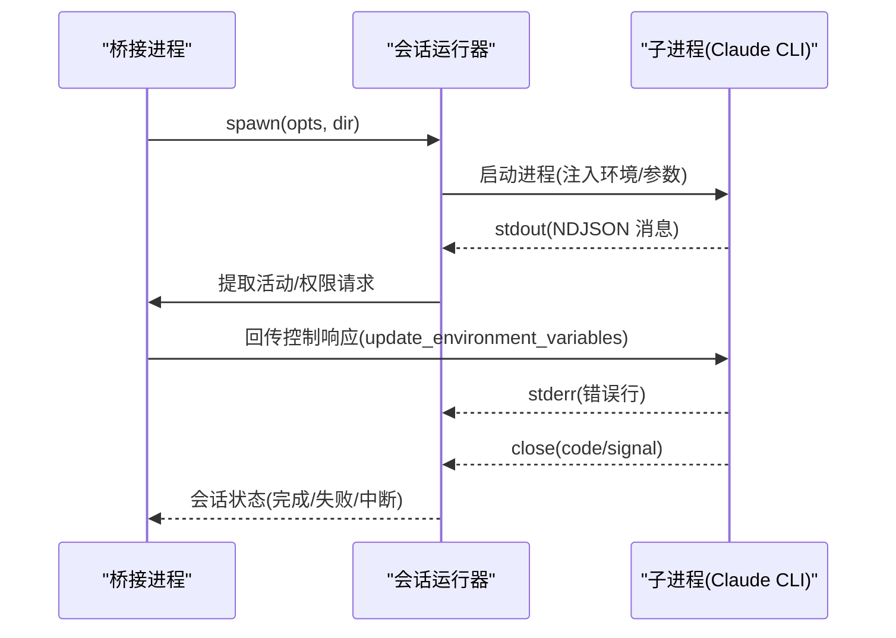
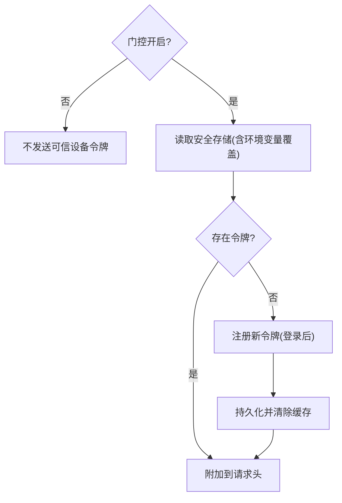
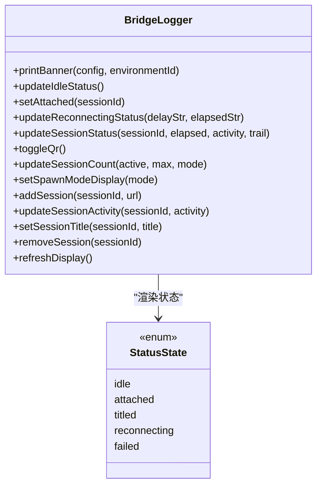
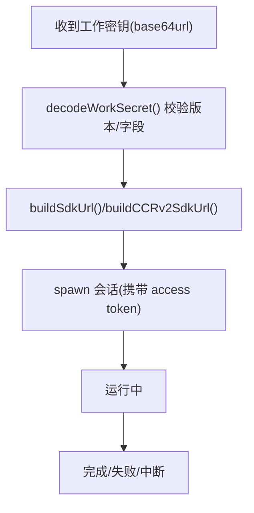
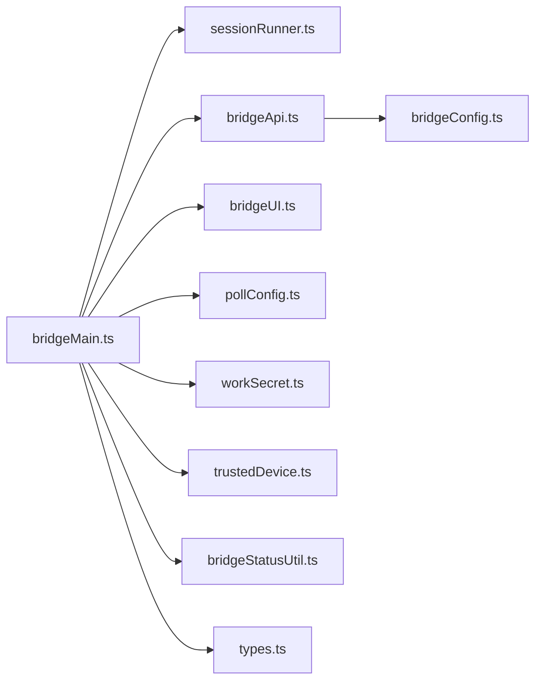

# 桌面集成

<cite>
**本文引用的文件**
- [bridgeMain.ts](file://src/bridge/bridgeMain.ts)
- [bridgeEnabled.ts](file://src/bridge/bridgeEnabled.ts)
- [trustedDevice.ts](file://src/bridge/trustedDevice.ts)
- [bridgeUI.ts](file://src/bridge/bridgeUI.ts)
- [types.ts](file://src/bridge/types.ts)
- [sessionRunner.ts](file://src/bridge/sessionRunner.ts)
- [pollConfig.ts](file://src/bridge/pollConfig.ts)
- [bridgeApi.ts](file://src/bridge/bridgeApi.ts)
- [bridgeStatusUtil.ts](file://src/bridge/bridgeStatusUtil.ts)
- [workSecret.ts](file://src/bridge/workSecret.ts)
- [bridgeConfig.ts](file://src/bridge/bridgeConfig.ts)
- [init.ts](file://src/commands/init.ts)
</cite>

## 目录
1. [简介](#简介)
2. [项目结构](#项目结构)
3. [核心组件](#核心组件)
4. [架构总览](#架构总览)
5. [详细组件分析](#详细组件分析)
6. [依赖关系分析](#依赖关系分析)
7. [性能考量](#性能考量)
8. [故障排除指南](#故障排除指南)
9. [结论](#结论)
10. [附录](#附录)

## 简介
本文件系统性阐述 Claude Code 的桌面集成功能，聚焦于“桥接（bridge）”子系统在本地环境中的实现与运行机制。内容涵盖：桌面应用检测与桥接初始化、UI 集成与状态显示、设备信任验证、会话生命周期管理、状态同步与心跳、用户界面适配、配置项与开关、安全与权限、以及交互模式与数据传输协议。目标是帮助开发者与运维人员理解并正确使用、扩展与排障桌面桥接能力。

## 项目结构
与桌面集成直接相关的代码集中在 src/bridge 目录，围绕以下关键模块协同工作：
- 初始化与主循环：bridgeMain.ts
- 能力与开关：bridgeEnabled.ts
- 设备信任：trustedDevice.ts
- 用户界面：bridgeUI.ts
- 类型定义：types.ts
- 会话运行器：sessionRunner.ts
- 轮询策略：pollConfig.ts
- API 客户端：bridgeApi.ts
- 状态工具：bridgeStatusUtil.ts
- 工作密钥解析：workSecret.ts
- 桥接配置：bridgeConfig.ts
- 命令入口：init.ts（用于初始化项目说明）

图表来源
- [bridgeMain.ts](file://src/bridge/bridgeMain.ts)
- [bridgeApi.ts](file://src/bridge/bridgeApi.ts)
- [sessionRunner.ts](file://src/bridge/sessionRunner.ts)
- [bridgeUI.ts](file://src/bridge/bridgeUI.ts)
- [pollConfig.ts](file://src/bridge/pollConfig.ts)
- [workSecret.ts](file://src/bridge/workSecret.ts)
- [trustedDevice.ts](file://src/bridge/trustedDevice.ts)
- [bridgeStatusUtil.ts](file://src/bridge/bridgeStatusUtil.ts)
- [types.ts](file://src/bridge/types.ts)
- [bridgeConfig.ts](file://src/bridge/bridgeConfig.ts)

章节来源
- [bridgeMain.ts](file://src/bridge/bridgeMain.ts)
- [bridgeEnabled.ts](file://src/bridge/bridgeEnabled.ts)
- [trustedDevice.ts](file://src/bridge/trustedDevice.ts)
- [bridgeUI.ts](file://src/bridge/bridgeUI.ts)
- [types.ts](file://src/bridge/types.ts)
- [sessionRunner.ts](file://src/bridge/sessionRunner.ts)
- [pollConfig.ts](file://src/bridge/pollConfig.ts)
- [bridgeApi.ts](file://src/bridge/bridgeApi.ts)
- [bridgeStatusUtil.ts](file://src/bridge/bridgeStatusUtil.ts)
- [workSecret.ts](file://src/bridge/workSecret.ts)
- [bridgeConfig.ts](file://src/bridge/bridgeConfig.ts)
- [init.ts](file://src/commands/init.ts)

## 核心组件
- 主循环与状态机：负责轮询工作、心跳、会话生命周期、错误处理与重连、容量管理与空闲节流等。
- 会话运行器：封装子进程 spawn、标准流解析、活动追踪、权限请求转发、令牌更新等。
- API 客户端：统一的 OAuth/环境密钥认证、带重试的 401 处理、环境注册/注销、工作确认/停止、会话归档、权限事件发送、心跳等。
- UI 日志器：终端内动态状态行渲染、QR 连接码生成、会话列表、工具活动轨迹、失败/重连提示等。
- 设备信任：可信设备令牌的读取、缓存、注册、清理；在特定门控开启时作为请求头发送。
- 轮询配置：通过 GrowthBook 动态下发的多维度轮询间隔与容量节流策略。
- 工作密钥：对服务端下发的 base64url 密钥进行版本校验与字段校验，并派生 SDK URL。
- 类型与协议：定义工作响应、会话句柄、权限事件、桥接配置、客户端接口等。
- 桥接配置：统一解析桥接访问令牌与基础 URL（支持开发覆盖）。

章节来源
- [bridgeMain.ts](file://src/bridge/bridgeMain.ts)
- [sessionRunner.ts](file://src/bridge/sessionRunner.ts)
- [bridgeApi.ts](file://src/bridge/bridgeApi.ts)
- [bridgeUI.ts](file://src/bridge/bridgeUI.ts)
- [trustedDevice.ts](file://src/bridge/trustedDevice.ts)
- [pollConfig.ts](file://src/bridge/pollConfig.ts)
- [workSecret.ts](file://src/bridge/workSecret.ts)
- [types.ts](file://src/bridge/types.ts)
- [bridgeConfig.ts](file://src/bridge/bridgeConfig.ts)

## 架构总览
桌面桥接以“本地桥接进程 + 子进程会话 + Web API + 终端 UI”的方式工作。桥接进程向后端轮询工作，解码工作密钥后启动子进程会话，通过 WebSocket 或 HTTP(S) 与会话入口通信，实时上报活动与权限请求，同时维护心跳与容量节流，最终在会话结束时归档或停止工作。

图表来源
- [bridgeMain.ts](file://src/bridge/bridgeMain.ts)
- [bridgeApi.ts](file://src/bridge/bridgeApi.ts)
- [sessionRunner.ts](file://src/bridge/sessionRunner.ts)
- [bridgeUI.ts](file://src/bridge/bridgeUI.ts)

## 详细组件分析

### 桥接主循环与状态同步
- 能力与开关：通过特性门控与订阅者身份检查决定是否启用桥接模式；提供阻塞式与非阻塞式检查，以及可诊断的禁用原因。
- 初始化：打印横幅、设置调试日志路径、预热 UI 显示、根据初始会话 ID 决定是否立即附着。
- 轮询与心跳：按容量与配置动态选择“仅心跳”“仅轮询”“心跳+轮询”组合，避免空闲时过度轮询；在连接断开后记录断连时长并统计重连事件。
- 会话生命周期：捕获会话完成/中断/失败状态，清理定时器、工作树、令牌刷新计划；多会话模式下归档会话，单会话模式下终止轮询循环。
- 令牌刷新：对 v1 使用 OAuth 直接更新，对 v2 通过服务器重新派发触发；在心跳失败时主动触发 reconnectSession。
- 错误处理：区分致命错误（如 401/403/404/410）与可恢复错误；对可抑制的 403（如权限不足）不向上抛出。

图表来源
- [bridgeMain.ts](file://src/bridge/bridgeMain.ts)
- [sessionRunner.ts](file://src/bridge/sessionRunner.ts)
- [bridgeApi.ts](file://src/bridge/bridgeApi.ts)

章节来源
- [bridgeMain.ts](file://src/bridge/bridgeMain.ts)
- [bridgeEnabled.ts](file://src/bridge/bridgeEnabled.ts)

### 会话运行器与交互协议
- 子进程启动：拼装参数与环境变量，注入会话访问令牌、沙箱开关、v1/v2 传输标志；支持调试文件与转录文件。
- 标准流解析：从 stdout 解析 NDJSON，提取工具调用、文本输出、结果与错误，维护最近活动环形缓冲区；从 stderr 收集最近错误行。
- 权限请求：当子进程发出“can_use_tool”类控制请求时，桥接转发为权限事件，等待服务器决策后再回传控制响应。
- 令牌更新：通过 stdin 发送“更新环境变量”消息，使子进程即时切换会话令牌。
- 退出处理：根据退出码/信号区分完成/失败/中断，关闭转录文件并通知上层。

图表来源
- [sessionRunner.ts](file://src/bridge/sessionRunner.ts)
- [bridgeApi.ts](file://src/bridge/bridgeApi.ts)

章节来源
- [sessionRunner.ts](file://src/bridge/sessionRunner.ts)
- [types.ts](file://src/bridge/types.ts)

### 设备信任验证与安全机制
- 门控：通过 GrowthBook 门控 tengu_sessions_elevated_auth_enforcement 控制是否发送可信设备令牌。
- 令牌来源：优先读取测试/企业覆盖的环境变量，否则从安全存储读取；读取操作被 memoize 缓存，减少系统调用。
- 注册：登录后在会话窗口期内调用 /auth/trusted_devices 注册设备，持久化 token 并清除缓存；必要时清理旧 token。
- 请求头：在 API 请求头中附加 X-Trusted-Device-Token，配合服务端增强认证策略。
- 清理：登出或环境变更时清除缓存与持久化 token。

图表来源
- [trustedDevice.ts](file://src/bridge/trustedDevice.ts)
- [bridgeApi.ts](file://src/bridge/bridgeApi.ts)

章节来源
- [trustedDevice.ts](file://src/bridge/trustedDevice.ts)
- [bridgeApi.ts](file://src/bridge/bridgeApi.ts)

### 用户界面与状态适配
- 状态机：idle/attached/titled/reconnecting/failed，结合闪烁动画与 QR 码展示连接 URL。
- 会话列表：多会话模式下显示每个会话标题、活动摘要与链接；单会话模式在主状态行显示标题。
- 工具活动：最近工具调用摘要在一定时间窗内可见，随会话活动刷新。
- 调试与日志：支持 ANT 用户显示调试日志路径；verbose 模式下转发子进程 stderr 到桥接进程。
- QR 码：根据当前 URL 生成 QR 码，支持显示/隐藏切换。

图表来源
- [bridgeUI.ts](file://src/bridge/bridgeUI.ts)
- [bridgeStatusUtil.ts](file://src/bridge/bridgeStatusUtil.ts)
- [types.ts](file://src/bridge/types.ts)

章节来源
- [bridgeUI.ts](file://src/bridge/bridgeUI.ts)
- [bridgeStatusUtil.ts](file://src/bridge/bridgeStatusUtil.ts)
- [types.ts](file://src/bridge/types.ts)

### 数据传输协议与工作密钥
- 工作密钥：base64url 编码的 JSON，包含版本、会话入口 JWT、API 基础 URL、源信息、鉴权信息、可选参数等；版本必须为 1。
- SDK URL 构建：根据 API 基础 URL 推导 ws/wss 入口路径；本地使用 v2，生产使用 v1（经由网关重写）。
- 会话 ID 对比：兼容 cse_* 与 session_* 前缀差异，基于 UUID 尾部比较确保一致性。
- CCR v2 注册：为 v2 会话调用 /worker/register 获取 worker_epoch，供子进程 CCRClient 使用。

图表来源
- [workSecret.ts](file://src/bridge/workSecret.ts)
- [types.ts](file://src/bridge/types.ts)

章节来源
- [workSecret.ts](file://src/bridge/workSecret.ts)
- [types.ts](file://src/bridge/types.ts)

### 轮询策略与容量管理
- 配置来源：GrowthBook 动态下发，包含不同容量下的轮询间隔、心跳间隔、回收阈值、会话保活间隔等。
- 校验规则：对间隔进行最小值约束与互斥校验，防止配置导致紧循环或无节流。
- 多会话节流：在容量满载时采用“心跳+轮询”组合或仅心跳，避免对后端造成压力。

章节来源
- [pollConfig.ts](file://src/bridge/pollConfig.ts)
- [bridgeMain.ts](file://src/bridge/bridgeMain.ts)

### 访问令牌与基础 URL 解析
- 开发覆盖：支持 CLAUDE_BRIDGE_OAUTH_TOKEN 与 CLAUDE_BRIDGE_BASE_URL 环境变量覆盖。
- 默认来源：从 OAuth 配置读取访问令牌与基础 URL。
- API 请求头：统一注入 Authorization、Anthropic 版本、Beta 标记、运行器版本等。

章节来源
- [bridgeConfig.ts](file://src/bridge/bridgeConfig.ts)
- [bridgeApi.ts](file://src/bridge/bridgeApi.ts)

## 依赖关系分析
- 模块耦合：bridgeMain.ts 依赖 sessionRunner.ts、bridgeApi.ts、bridgeUI.ts、pollConfig.ts、workSecret.ts、trustedDevice.ts、bridgeStatusUtil.ts、types.ts；形成“主循环-运行器-UI-配置-协议-信任”的闭环。
- 外部依赖：axios 用于 HTTP 请求；子进程用于会话执行；QR 码库用于连接二维码生成；chalk 用于终端颜色输出。
- 循环依赖规避：bridgeEnabled.ts 通过延迟导入避免与 auth 模块的循环；bridgeApi.ts 通过可选回调处理 401 刷新，避免深层依赖。

图表来源
- [bridgeMain.ts](file://src/bridge/bridgeMain.ts)
- [sessionRunner.ts](file://src/bridge/sessionRunner.ts)
- [bridgeApi.ts](file://src/bridge/bridgeApi.ts)
- [bridgeUI.ts](file://src/bridge/bridgeUI.ts)
- [pollConfig.ts](file://src/bridge/pollConfig.ts)
- [workSecret.ts](file://src/bridge/workSecret.ts)
- [trustedDevice.ts](file://src/bridge/trustedDevice.ts)
- [bridgeStatusUtil.ts](file://src/bridge/bridgeStatusUtil.ts)
- [types.ts](file://src/bridge/types.ts)
- [bridgeConfig.ts](file://src/bridge/bridgeConfig.ts)

章节来源
- [bridgeMain.ts](file://src/bridge/bridgeMain.ts)
- [bridgeApi.ts](file://src/bridge/bridgeApi.ts)
- [sessionRunner.ts](file://src/bridge/sessionRunner.ts)
- [bridgeUI.ts](file://src/bridge/bridgeUI.ts)
- [pollConfig.ts](file://src/bridge/pollConfig.ts)
- [workSecret.ts](file://src/bridge/workSecret.ts)
- [trustedDevice.ts](file://src/bridge/trustedDevice.ts)
- [bridgeStatusUtil.ts](file://src/bridge/bridgeStatusUtil.ts)
- [types.ts](file://src/bridge/types.ts)
- [bridgeConfig.ts](file://src/bridge/bridgeConfig.ts)

## 性能考量
- 轮询节流：通过 at-capacity 与心跳配置避免空闲轮询；在多会话场景下优先心跳维持活性，降低网络压力。
- 令牌刷新：提前 5 分钟触发刷新，v2 通过 reconnectSession 触发服务端重新派发，避免会话无声死亡。
- UI 渲染：状态行按固定周期刷新，避免频繁重绘；QR 码按需生成，减少计算开销。
- 子进程 IO：stdout/stderr 流解析采用逐行读取与环形缓冲，限制内存占用；转录文件异步写入并错误兜底。
- 缓存与去抖：可信设备令牌读取 memoize；GrowthBook 配置带刷新窗口，避免频繁拉取。

## 故障排除指南
- 登录/权限问题
  - 症状：出现“必须登录”或 401/403。
  - 排查：确认已使用 claude.ai 账号登录且具备 profile scope；检查 getBridgeDisabledReason 的返回信息；确认环境变量未覆盖为受限令牌。
  - 参考：[bridgeEnabled.ts](file://src/bridge/bridgeEnabled.ts)
- 会话过期
  - 症状：404/410 或“会话已过期”。
  - 排查：重启桥接（claude remote-control 或 /remote-control）；检查 isExpiredErrorType 判定逻辑。
  - 参考：[bridgeApi.ts](file://src/bridge/bridgeApi.ts)
- 设备信任
  - 症状：服务端拒绝连接或要求可信设备。
  - 排查：确认门控开启；检查安全存储中是否存在可信设备令牌；登录后是否及时注册；环境变量覆盖是否生效。
  - 参考：[trustedDevice.ts](file://src/bridge/trustedDevice.ts)
- 轮询/心跳异常
  - 症状：长时间无工作或频繁空轮询。
  - 排查：检查 GrowthBook 配置是否启用 at-capacity 心跳；确认间隔最小值约束；查看空轮询计数日志。
  - 参考：[pollConfig.ts](file://src/bridge/pollConfig.ts)
- 子进程崩溃/卡死
  - 症状：stderr 输出错误；会话状态为 failed。
  - 排查：查看转录文件与调试日志；核对权限请求是否得到响应；检查环境变量与参数拼装。
  - 参考：[sessionRunner.ts](file://src/bridge/sessionRunner.ts)
- UI 不显示或显示异常
  - 症状：状态行不更新、QR 码不显示、标题不刷新。
  - 排查：确认终端列宽与 ANSI 处理；检查 verbose 模式下的 stderr 转发；尝试刷新显示。
  - 参考：[bridgeUI.ts](file://src/bridge/bridgeUI.ts)

章节来源
- [bridgeEnabled.ts](file://src/bridge/bridgeEnabled.ts)
- [bridgeApi.ts](file://src/bridge/bridgeApi.ts)
- [trustedDevice.ts](file://src/bridge/trustedDevice.ts)
- [pollConfig.ts](file://src/bridge/pollConfig.ts)
- [sessionRunner.ts](file://src/bridge/sessionRunner.ts)
- [bridgeUI.ts](file://src/bridge/bridgeUI.ts)

## 结论
桌面桥接通过“主循环-会话运行器-UI-配置-协议-信任”六大支柱，实现了稳定、可观测、可扩展的本地远程控制能力。其关键优势在于：
- 灵活的轮询与心跳策略，兼顾性能与实时性；
- 完整的会话生命周期管理与权限控制；
- 可诊断的 UI 状态与 QR 连接码；
- 严格的设备信任与访问令牌管理；
- 清晰的协议与类型定义，便于扩展与维护。

建议在生产环境中：
- 严格遵循门控与最小权限原则；
- 合理配置轮询与心跳，避免对后端造成压力；
- 使用转录与调试日志辅助排障；
- 在企业环境中通过环境变量覆盖可信设备令牌以简化部署。

## 附录

### 桌面桥接的启用与禁用
- 启用条件：需要 claude.ai 订阅、具备完整作用域、组织 UUID 可用、门控开启；可通过 isBridgeEnabled/isBridgeEnabledBlocking/getBridgeDisabledReason 检查与诊断。
- 禁用方式：关闭门控、未满足订阅/作用域/组织条件、版本过低；也可通过环境变量或构建特性关闭。

章节来源
- [bridgeEnabled.ts](file://src/bridge/bridgeEnabled.ts)

### 设备信任系统的安全机制
- 门控：tengu_sessions_elevated_auth_enforcement 控制是否发送可信设备令牌。
- 注册：登录后在会话窗口期内注册设备并持久化 token。
- 请求头：X-Trusted-Device-Token 附加到 API 请求。
- 清理：登出或环境变更时清除缓存与持久化 token。

章节来源
- [trustedDevice.ts](file://src/bridge/trustedDevice.ts)
- [bridgeApi.ts](file://src/bridge/bridgeApi.ts)

### 配置选项与环境变量
- 访问令牌与基础 URL：CLAUDE_BRIDGE_OAUTH_TOKEN、CLAUDE_BRIDGE_BASE_URL（开发覆盖）。
- 可信设备：CLAUDE_TRUSTED_DEVICE_TOKEN（测试/企业覆盖）。
- 其他：CLAUDE_CODE_FORCE_SANDBOX、CLAUDE_CODE_SESSION_ACCESS_TOKEN、CLAUDE_CODE_USE_CCR_V2、CLAUDE_CODE_WORKER_EPOCH 等由会话运行器注入。

章节来源
- [bridgeConfig.ts](file://src/bridge/bridgeConfig.ts)
- [sessionRunner.ts](file://src/bridge/sessionRunner.ts)

### 交互模式与数据传输协议
- 交互模式：single-session（单会话）、worktree（工作树）、same-dir（同目录）。
- 协议要点：工作密钥版本校验、SDK URL 构建、会话 ID 前缀兼容、v2 worker_epoch 注册。
- 事件流：轮询-解码-启动-活动/权限-心跳-完成/失败/中断-停止/归档。

章节来源
- [types.ts](file://src/bridge/types.ts)
- [workSecret.ts](file://src/bridge/workSecret.ts)
- [sessionRunner.ts](file://src/bridge/sessionRunner.ts)
- [bridgeMain.ts](file://src/bridge/bridgeMain.ts)

### 项目初始化与说明
- /init 命令用于生成 CLAUDE.md、技能与钩子，提升团队协作效率与个人偏好配置的一致性。

章节来源
- [init.ts](file://src/commands/init.ts)