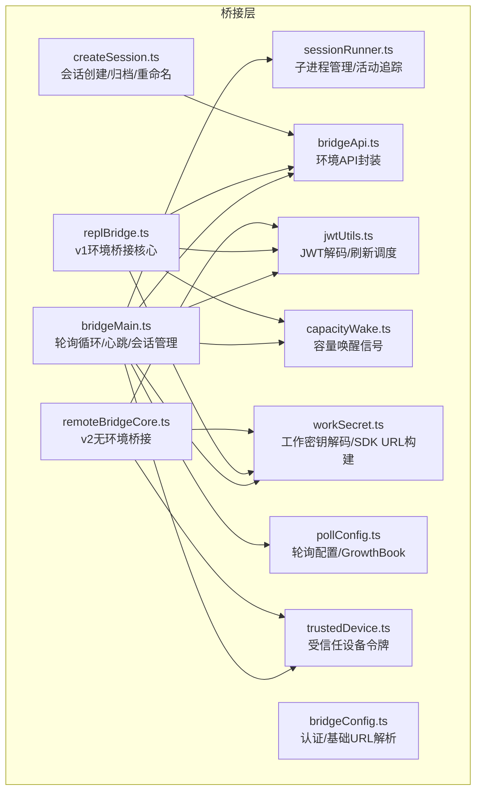
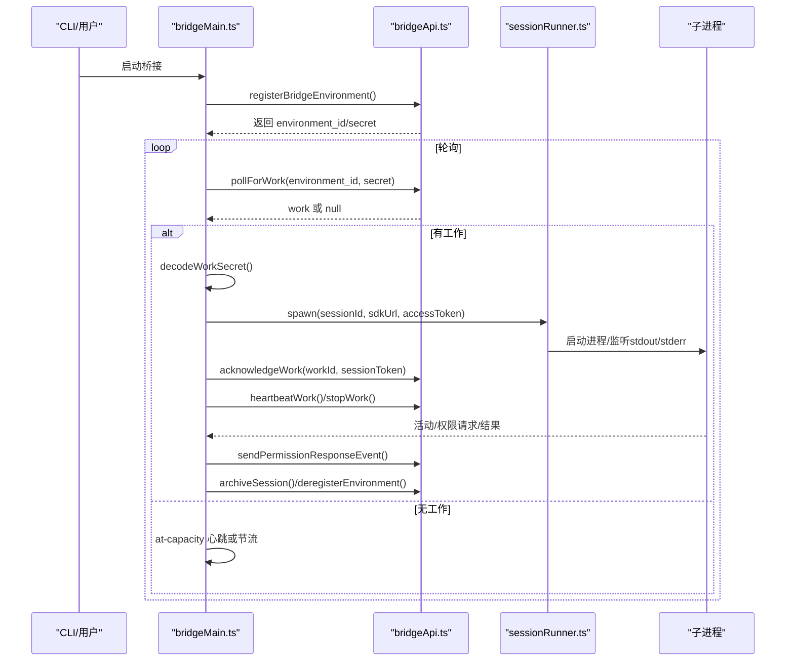
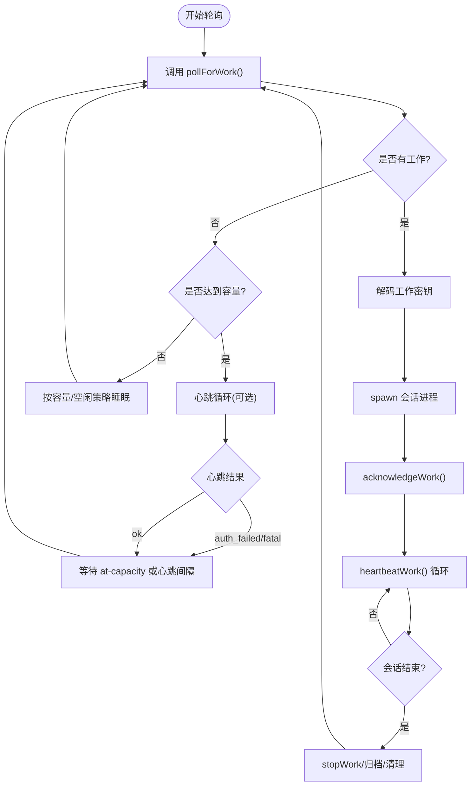
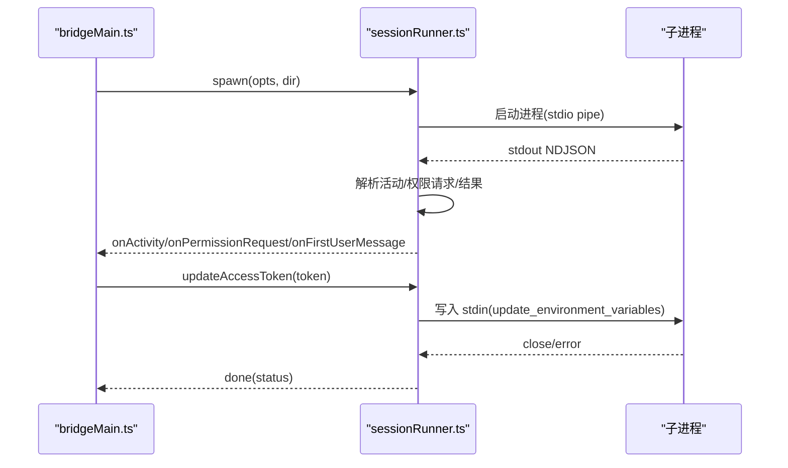
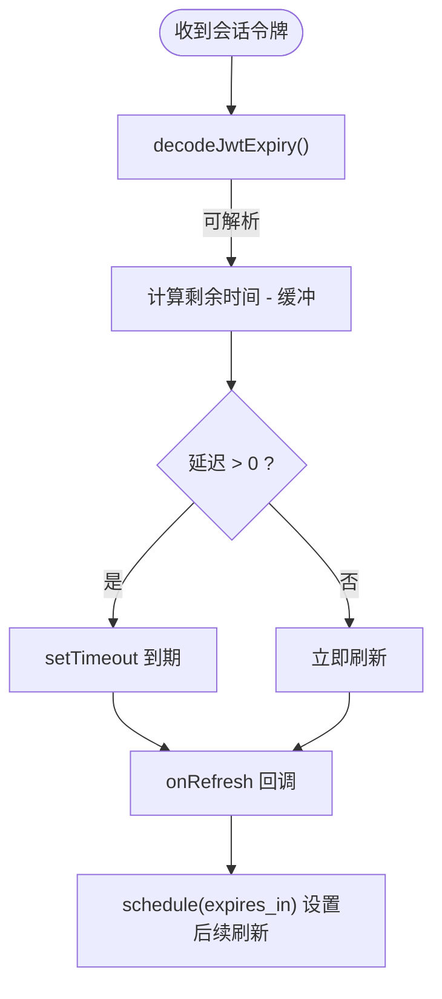
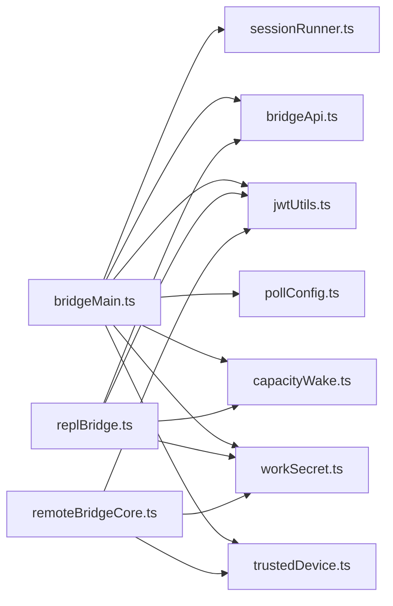

# 桥接层系统

<cite>
**本文档引用的文件**
- [bridgeMain.ts](file://src/bridge/bridgeMain.ts)
- [sessionRunner.ts](file://src/bridge/sessionRunner.ts)
- [jwtUtils.ts](file://src/bridge/jwtUtils.ts)
- [bridgeConfig.ts](file://src/bridge/bridgeConfig.ts)
- [types.ts](file://src/bridge/types.ts)
- [capacityWake.ts](file://src/bridge/capacityWake.ts)
- [workSecret.ts](file://src/bridge/workSecret.ts)
- [pollConfig.ts](file://src/bridge/pollConfig.ts)
- [bridgeApi.ts](file://src/bridge/bridgeApi.ts)
- [trustedDevice.ts](file://src/bridge/trustedDevice.ts)
- [pollConfigDefaults.ts](file://src/bridge/pollConfigDefaults.ts)
- [initReplBridge.ts](file://src/bridge/initReplBridge.ts)
- [replBridge.ts](file://src/bridge/replBridge.ts)
- [remoteBridgeCore.ts](file://src/bridge/remoteBridgeCore.ts)
- [createSession.ts](file://src/bridge/createSession.ts)
</cite>

## 目录
1. [简介](#简介)
2. [项目结构](#项目结构)
3. [核心组件](#核心组件)
4. [架构总览](#架构总览)
5. [详细组件分析](#详细组件分析)
6. [依赖关系分析](#依赖关系分析)
7. [性能考虑](#性能考虑)
8. [故障排除指南](#故障排除指南)
9. [结论](#结论)
10. [附录](#附录)

## 简介
本文件为 Claude Code 的桥接层系统技术文档，聚焦于以下目标：
- 解释 Claude Desktop 集成与远程会话管理机制
- 深入说明 JWT 认证与刷新、会话生命周期管理
- 描述桥接主控制器（bridgeMain）的轮询循环、心跳、会话运行器（sessionRunner）的进程管理与容量唤醒
- 提供配置示例、认证流程、会话恢复机制
- 说明本地与远程功能的无缝集成、网络异常与连接中断处理
- 给出安全配置与性能优化建议

## 项目结构
桥接层位于 src/bridge 目录，围绕“环境注册 → 工作轮询 → 会话创建/接入 → 进程管理/心跳/权限”构建，支持两类路径：
- 环境模式（env-based）：通过 Environments API 进行工作分发与心跳
- 无环境模式（env-less/v2）：直接通过 /v1/code/sessions 与 /bridge 获取凭证，使用 SSE + CCRClient

图表来源
- [bridgeMain.ts:141-800](file://src/bridge/bridgeMain.ts#L141-L800)
- [sessionRunner.ts:248-551](file://src/bridge/sessionRunner.ts#L248-L551)
- [bridgeApi.ts:68-452](file://src/bridge/bridgeApi.ts#L68-L452)
- [jwtUtils.ts:72-256](file://src/bridge/jwtUtils.ts#L72-L256)
- [bridgeConfig.ts:17-48](file://src/bridge/bridgeConfig.ts#L17-L48)
- [capacityWake.ts:28-56](file://src/bridge/capacityWake.ts#L28-L56)
- [workSecret.ts:6-127](file://src/bridge/workSecret.ts#L6-L127)
- [pollConfig.ts:102-111](file://src/bridge/pollConfig.ts#L102-L111)
- [trustedDevice.ts:54-87](file://src/bridge/trustedDevice.ts#L54-L87)
- [remoteBridgeCore.ts:140-800](file://src/bridge/remoteBridgeCore.ts#L140-L800)
- [replBridge.ts:260-800](file://src/bridge/replBridge.ts#L260-L800)
- [createSession.ts:34-180](file://src/bridge/createSession.ts#L34-L180)

章节来源
- [bridgeMain.ts:141-800](file://src/bridge/bridgeMain.ts#L141-L800)
- [sessionRunner.ts:248-551](file://src/bridge/sessionRunner.ts#L248-L551)
- [bridgeApi.ts:68-452](file://src/bridge/bridgeApi.ts#L68-L452)
- [jwtUtils.ts:72-256](file://src/bridge/jwtUtils.ts#L72-L256)
- [bridgeConfig.ts:17-48](file://src/bridge/bridgeConfig.ts#L17-L48)
- [capacityWake.ts:28-56](file://src/bridge/capacityWake.ts#L28-L56)
- [workSecret.ts:6-127](file://src/bridge/workSecret.ts#L6-L127)
- [pollConfig.ts:102-111](file://src/bridge/pollConfig.ts#L102-L111)
- [trustedDevice.ts:54-87](file://src/bridge/trustedDevice.ts#L54-L87)
- [remoteBridgeCore.ts:140-800](file://src/bridge/remoteBridgeCore.ts#L140-L800)
- [replBridge.ts:260-800](file://src/bridge/replBridge.ts#L260-L800)
- [createSession.ts:34-180](file://src/bridge/createSession.ts#L34-L180)

## 核心组件
- 桥接主控制器（bridgeMain）
  - 负责环境注册、工作轮询、心跳、会话生命周期、错误恢复与退出清理
  - 支持多会话模式、容量唤醒、按需心跳、空闲节流
- 会话运行器（sessionRunner）
  - 子进程管理、NDJSON 活动解析、stderr 捕获、权限请求转发、令牌热更新
- 环境 API 客户端（bridgeApi）
  - 封装 /v1/environments/* 与 /v1/sessions/* 接口，统一 401 刷新与致命错误处理
- JWT 工具（jwtUtils）
  - JWT 解码、过期时间提取、刷新调度（含缓冲与回退）
- 配置与认证（bridgeConfig、trustedDevice）
  - OAuth 令牌与基础 URL 解析；受信任设备令牌注入
- 轮询配置（pollConfig、pollConfigDefaults）
  - GrowthBook 驱动的轮询与心跳参数，支持 at-capacity 与非独占心跳
- 工作密钥工具（workSecret）
  - 工作密钥解码、SDK URL 构建、会话 ID 兼容转换
- REPL 桥接（replBridge、remoteBridgeCore）
  - v1 环境桥接（HybridTransport + SessionIngress）与 v2 无环境桥接（SSE + CCRClient）

章节来源
- [bridgeMain.ts:141-800](file://src/bridge/bridgeMain.ts#L141-L800)
- [sessionRunner.ts:248-551](file://src/bridge/sessionRunner.ts#L248-L551)
- [bridgeApi.ts:68-452](file://src/bridge/bridgeApi.ts#L68-L452)
- [jwtUtils.ts:72-256](file://src/bridge/jwtUtils.ts#L72-L256)
- [bridgeConfig.ts:17-48](file://src/bridge/bridgeConfig.ts#L17-L48)
- [trustedDevice.ts:54-87](file://src/bridge/trustedDevice.ts#L54-L87)
- [pollConfig.ts:102-111](file://src/bridge/pollConfig.ts#L102-L111)
- [pollConfigDefaults.ts:55-83](file://src/bridge/pollConfigDefaults.ts#L55-L83)
- [workSecret.ts:6-127](file://src/bridge/workSecret.ts#L6-L127)
- [replBridge.ts:260-800](file://src/bridge/replBridge.ts#L260-L800)
- [remoteBridgeCore.ts:140-800](file://src/bridge/remoteBridgeCore.ts#L140-L800)

## 架构总览
桥接层在本地与云端之间建立稳定通道：
- 环境模式（bridgeMain）
  - 注册环境 → 轮询工作 → 解码工作密钥 → 创建会话进程 → 心跳保活 → 权限请求转发 → 会话归档/停止
- 无环境模式（remoteBridgeCore）
  - 直接创建会话 → 获取 worker JWT → 建立 SSE + CCRClient → 刷新 JWT 并重建传输 → 401 自动恢复

图表来源
- [bridgeMain.ts:141-800](file://src/bridge/bridgeMain.ts#L141-L800)
- [bridgeApi.ts:142-451](file://src/bridge/bridgeApi.ts#L142-L451)
- [sessionRunner.ts:248-551](file://src/bridge/sessionRunner.ts#L248-L551)

## 详细组件分析

### 桥接主控制器（bridgeMain）
- 关键职责
  - 环境注册与凭据管理
  - 工作轮询与空闲节流（at-capacity 心跳/轮询）
  - 会话生命周期：启动、活动追踪、完成/失败/中断处理
  - 心跳保活与 JWT 过期处理（触发 requeue）
  - 令牌刷新调度（v1 直接替换，v2 触发 re-dispatch）
  - 清理与退出：stopWork、worktree 移除、环境注销
- 会话管理数据结构
  - activeSessions、sessionStartTimes、sessionWorkIds、sessionIngressTokens、sessionCompatIds、timedOutSessions、titledSessions
  - capacityWake 用于 at-capacity 时提前唤醒轮询
- 错误与恢复
  - BridgeFatalError 识别 401/403/404/410 等致命错误
  - 401/403：记录事件并尝试 reconnectSession 或停止工作
  - 404/410：标记 fatalExit，避免恢复提示
- 多会话与容量
  - maxSessions 控制并发；partial/at-capacity 不同轮询间隔
  - heartbeat-only 模式与非独占心跳组合，避免紧循环

图表来源
- [bridgeMain.ts:600-784](file://src/bridge/bridgeMain.ts#L600-L784)
- [bridgeApi.ts:199-417](file://src/bridge/bridgeApi.ts#L199-L417)

章节来源
- [bridgeMain.ts:141-800](file://src/bridge/bridgeMain.ts#L141-L800)
- [bridgeApi.ts:142-451](file://src/bridge/bridgeApi.ts#L142-L451)

### 会话运行器（sessionRunner）
- 进程管理
  - spawn 子进程，设置 CLAUDE_CODE_SESSION_ACCESS_TOKEN、调试日志、转录文件
  - stdout 解析 NDJSON 消息，提取活动、结果、错误、权限请求
  - stderr 缓存最近 N 行，便于诊断
- 活动追踪与权限
  - 维护最近活动列表（ring buffer），支持标题派生
  - 发现 control_request 时转发到上层处理
- 令牌热更新
  - 通过 stdin 发送 update_environment_variables，实时更新子进程环境变量
- 结束与清理
  - 监听 close/error，区分 completed/failed/interrupted
  - 支持 SIGTERM/SIGKILL 强制终止

图表来源
- [sessionRunner.ts:248-551](file://src/bridge/sessionRunner.ts#L248-L551)

章节来源
- [sessionRunner.ts:248-551](file://src/bridge/sessionRunner.ts#L248-L551)

### JWT 认证与刷新（jwtUtils）
- 功能
  - decodeJwtPayload/decodeJwtExpiry：解码 JWT 负载与过期时间
  - createTokenRefreshScheduler：基于过期时间提前刷新（默认 5 分钟缓冲）
  - 支持从 expires_in 直接调度（v2 场景）
  - 最大连续失败限制与回退刷新间隔
- 使用场景
  - bridgeMain：v1 直接更新子进程令牌；v2 触发 reconnectSession
  - remoteBridgeCore：v2 通过 /bridge 获取新 JWT/epoch，重建传输

图表来源
- [jwtUtils.ts:72-256](file://src/bridge/jwtUtils.ts#L72-L256)

章节来源
- [jwtUtils.ts:72-256](file://src/bridge/jwtUtils.ts#L72-L256)

### 认证与配置（bridgeConfig、trustedDevice）
- bridgeConfig
  - getBridgeAccessToken/getBridgeBaseUrl：优先 dev 覆盖，否则 OAuth 存储
- trustedDevice
  - 受信任设备令牌（X-Trusted-Device-Token）在 Elevated 安全级别下注入
  - Gate 控制是否启用，支持缓存与清除

章节来源
- [bridgeConfig.ts:17-48](file://src/bridge/bridgeConfig.ts#L17-L48)
- [trustedDevice.ts:54-87](file://src/bridge/trustedDevice.ts#L54-L87)

### 轮询与心跳（pollConfig、pollConfigDefaults）
- GrowthBook 驱动的配置项
  - 非容量/容量/多会话不同轮询间隔
  - 非独占心跳间隔（与轮询并行）
  - reclaim_older_than_ms：回收未确认工作
  - session_keepalive_interval_v2_ms：静默 keep-alive
- 默认值与校验
  - 严格的最小值约束与对象级互斥校验，防止紧循环

章节来源
- [pollConfig.ts:102-111](file://src/bridge/pollConfig.ts#L102-L111)
- [pollConfigDefaults.ts:55-83](file://src/bridge/pollConfigDefaults.ts#L55-L83)

### 工作密钥与 SDK URL（workSecret）
- decodeWorkSecret：校验版本与必需字段（session_ingress_token、api_base_url）
- buildSdkUrl/buildCCRv2SdkUrl：根据 apiBaseUrl 生成 ws/wss 或 HTTP(S) URL
- sameSessionId：兼容 cse_* 与 session_* 前缀

章节来源
- [workSecret.ts:6-127](file://src/bridge/workSecret.ts#L6-L127)

### REPL 桥接（replBridge、remoteBridgeCore）
- v1 环境桥接（replBridge）
  - registerBridgeEnvironment → createSession → pollForWork → HybridTransport → 权限/状态回调
  - 支持断线重连、环境重建、perpetual 指针恢复
- v2 无环境桥接（remoteBridgeCore）
  - createCodeSession → /bridge 获取 worker_jwt/epoch → SSE + CCRClient
  - proactive refresh + 401 自动恢复，重建传输保持序列号

章节来源
- [replBridge.ts:260-800](file://src/bridge/replBridge.ts#L260-L800)
- [remoteBridgeCore.ts:140-800](file://src/bridge/remoteBridgeCore.ts#L140-L800)

### 会话创建与归档（createSession）
- createBridgeSession：创建会话并附带初始事件与 Git 上下文
- getBridgeSession：查询会话的 environment_id 与 title
- archiveBridgeSession/updateBridgeSessionTitle：归档与重命名

章节来源
- [createSession.ts:34-385](file://src/bridge/createSession.ts#L34-L385)

## 依赖关系分析
- 组件耦合
  - bridgeMain 依赖 sessionRunner、bridgeApi、jwtUtils、pollConfig、capacityWake、workSecret、trustedDevice
  - replBridge/remoteBridgeCore 依赖 bridgeApi、workSecret、jwtUtils、capacityWake、trustedDevice
- 外部依赖
  - axios（HTTP）、child_process（子进程）、readline/fs（日志/转录）
- 数据与控制流
  - 工作密钥解码后驱动会话进程创建
  - 心跳与刷新调度贯穿 v1/v2 两条路径
  - 权限请求通过 API 事件回传给会话

图表来源
- [bridgeMain.ts:141-800](file://src/bridge/bridgeMain.ts#L141-L800)
- [replBridge.ts:260-800](file://src/bridge/replBridge.ts#L260-L800)
- [remoteBridgeCore.ts:140-800](file://src/bridge/remoteBridgeCore.ts#L140-L800)

章节来源
- [bridgeMain.ts:141-800](file://src/bridge/bridgeMain.ts#L141-L800)
- [replBridge.ts:260-800](file://src/bridge/replBridge.ts#L260-L800)
- [remoteBridgeCore.ts:140-800](file://src/bridge/remoteBridgeCore.ts#L140-L800)

## 性能考虑
- 轮询与心跳
  - 使用 GrowthBook 配置动态调整 at-capacity 与非独占心跳，避免服务器压力与本地 CPU 占用
  - reclaim_older_than_ms 与 session_keepalive_interval_v2_ms 平衡回收与静默保活
- 进程与 IO
  - sessionRunner 对 stdout/stderr 流进行缓冲与转录，避免阻塞主循环
  - 令牌刷新采用定时器与 generation 机制，避免竞态与孤儿计时器
- 资源清理
  - 会话结束时及时 stopWork、移除 worktree、取消刷新计时器
  - 环境注销与归档在退出前执行，减少资源泄漏

## 故障排除指南
- 常见错误类型
  - 401/403：认证失败，检查登录状态与受信任设备令牌
  - 404/410：环境/会话过期，需要重新注册/创建
  - 429：速率限制，降低轮询频率
- 诊断手段
  - debug 日志与转录文件（sessionRunner）
  - BridgeFatalError 事件与错误类型提取
  - 空闲轮询计数与 reconnected 事件
- 恢复策略
  - v1：reconnectSession 触发 re-dispatch；心跳失败后睡眠再轮询
  - v2：proactive refresh 或 401 自动重建传输；epoch 变化时必须重建

章节来源
- [bridgeApi.ts:454-540](file://src/bridge/bridgeApi.ts#L454-L540)
- [bridgeMain.ts:202-270](file://src/bridge/bridgeMain.ts#L202-L270)
- [remoteBridgeCore.ts:317-377](file://src/bridge/remoteBridgeCore.ts#L317-L377)

## 结论
桥接层通过清晰的职责分离与稳健的错误处理，实现了本地与远程功能的无缝集成。v1 与 v2 两条路径分别满足传统环境模式与无环境直连的需求，配合 JWT 刷新与容量唤醒机制，在复杂网络环境下仍能保持高可用性。

## 附录

### 配置示例与最佳实践
- 环境模式（bridgeMain）
  - maxSessions：根据机器性能与组织配额设置
  - poll_interval_ms_at_capacity 与 non_exclusive_heartbeat_interval_ms：在容量与心跳间取得平衡
  - sessionTimeoutMs：避免长时间挂起的会话占用资源
- 无环境模式（remoteBridgeCore）
  - token_refresh_buffer_ms：建议 5 分钟，确保刷新早于过期
  - connect_timeout_ms：监控首次连接超时
  - teardown_archive_timeout_ms：优雅关闭时的归档预算
- 安全建议
  - 启用受信任设备令牌（Gate 开启时自动注入）
  - 仅在必要时使用 dev 覆盖（CLAUDE_BRIDGE_*），生产环境使用 OAuth 存储
  - 严格校验工作密钥版本与字段完整性

章节来源
- [pollConfig.ts:102-111](file://src/bridge/pollConfig.ts#L102-L111)
- [pollConfigDefaults.ts:55-83](file://src/bridge/pollConfigDefaults.ts#L55-L83)
- [trustedDevice.ts:54-87](file://src/bridge/trustedDevice.ts#L54-L87)
- [workSecret.ts:6-32](file://src/bridge/workSecret.ts#L6-L32)