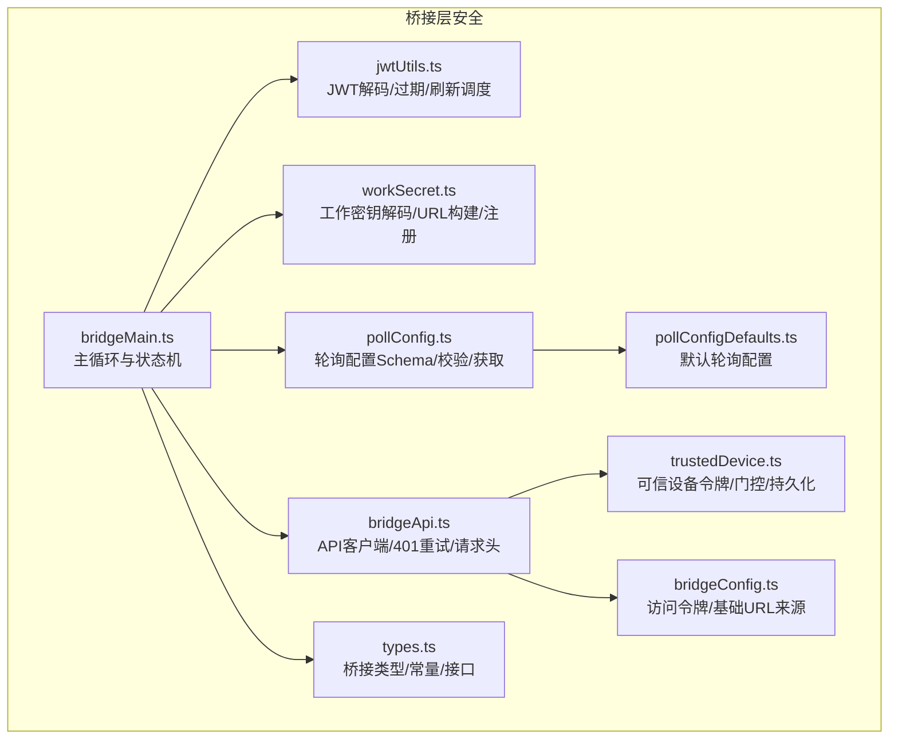
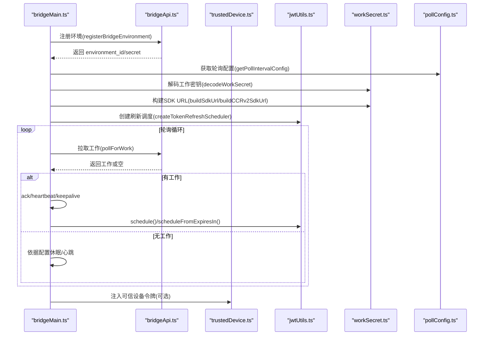
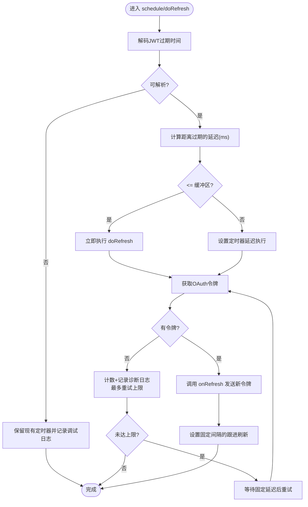
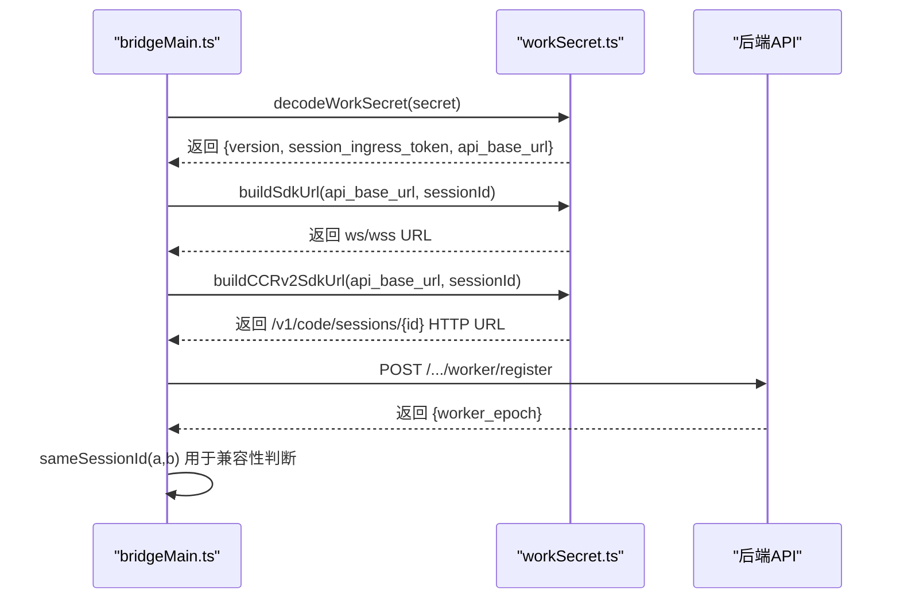
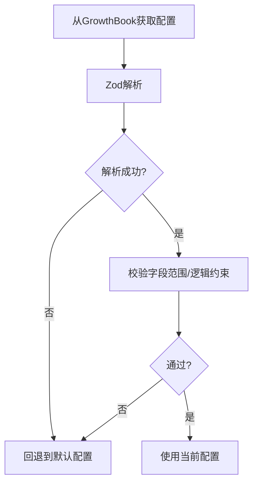
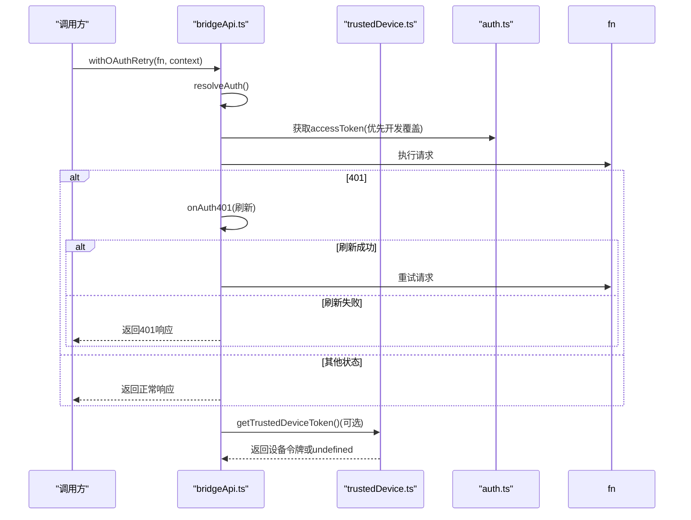
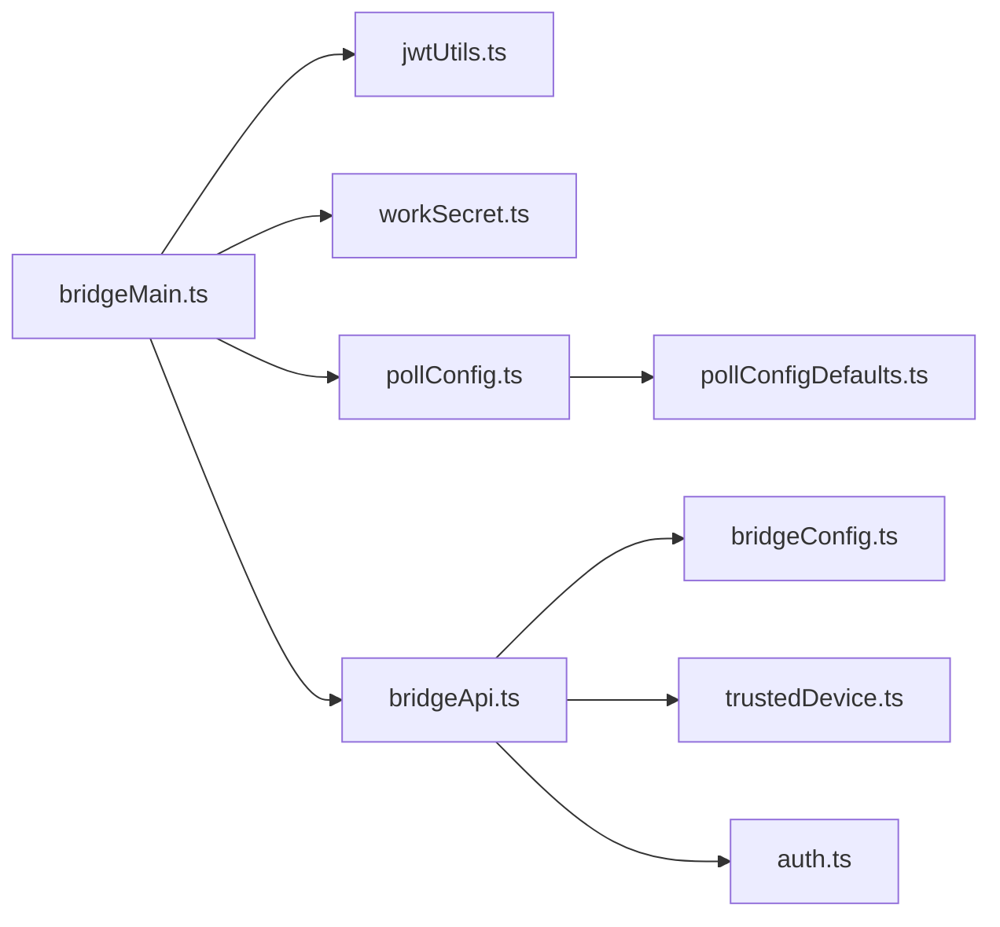

# 认证与安全

<cite>
**本文引用的文件**
- [jwtUtils.ts](file://src/bridge/jwtUtils.ts)
- [workSecret.ts](file://src/bridge/workSecret.ts)
- [pollConfig.ts](file://src/bridge/pollConfig.ts)
- [pollConfigDefaults.ts](file://src/bridge/pollConfigDefaults.ts)
- [bridgeMain.ts](file://src/bridge/bridgeMain.ts)
- [types.ts](file://src/bridge/types.ts)
- [bridgeConfig.ts](file://src/bridge/bridgeConfig.ts)
- [trustedDevice.ts](file://src/bridge/trustedDevice.ts)
- [bridgeApi.ts](file://src/bridge/bridgeApi.ts)
- [auth.ts](file://src/utils/auth.ts)
</cite>

## 目录
1. [简介](#简介)
2. [项目结构](#项目结构)
3. [核心组件](#核心组件)
4. [架构总览](#架构总览)
5. [详细组件分析](#详细组件分析)
6. [依赖关系分析](#依赖关系分析)
7. [性能考量](#性能考量)
8. [故障排查指南](#故障排查指南)
9. [结论](#结论)
10. [附录](#附录)

## 简介
本文件聚焦 Claude Code 桥接层的认证与安全机制，系统性阐述以下内容：
- JWT 工具函数：解码、过期时间解析、令牌刷新调度器与重试策略
- 工作密钥（workSecret）：解码校验、SDK URL 构建、会话 ID 兼容性、工作器注册与安全参数
- 轮询配置（pollConfig）：运行时安全策略、默认安全基线、动态更新与边界约束
- 认证流程与令牌验证：OAuth 访问令牌来源、可信设备令牌、请求头注入与 401 自动重试
- 安全参数动态更新：通过 GrowthBook 配置中心安全地推送与回退
- 安全审计与异常检测：调试日志、诊断日志、错误事件与告警
- 最佳实践与漏洞防护：最小权限、输入校验、超时与重试上限、心跳与保活

## 项目结构
桥接层安全相关代码主要位于 src/bridge 目录，围绕“认证令牌”“工作密钥”“轮询策略”三大支柱构建，并通过通用类型与工具模块进行协作。

**图表来源**
- [bridgeMain.ts:141-200](file://src/bridge/bridgeMain.ts#L141-L200)
- [jwtUtils.ts:72-256](file://src/bridge/jwtUtils.ts#L72-L256)
- [workSecret.ts:6-127](file://src/bridge/workSecret.ts#L6-L127)
- [pollConfig.ts:102-111](file://src/bridge/pollConfig.ts#L102-L111)
- [pollConfigDefaults.ts:55-83](file://src/bridge/pollConfigDefaults.ts#L55-L83)
- [bridgeApi.ts:68-197](file://src/bridge/bridgeApi.ts#L68-L197)
- [trustedDevice.ts:54-211](file://src/bridge/trustedDevice.ts#L54-L211)
- [types.ts:17-176](file://src/bridge/types.ts#L17-L176)
- [bridgeConfig.ts:38-48](file://src/bridge/bridgeConfig.ts#L38-L48)

**章节来源**
- [bridgeMain.ts:141-200](file://src/bridge/bridgeMain.ts#L141-L200)
- [types.ts:17-176](file://src/bridge/types.ts#L17-L176)

## 核心组件
- JWT 工具与令牌刷新
  - 解码 JWT 负载与 exp 过期时间
  - 基于过期时间与缓冲区提前刷新
  - 失败重试上限与后续定时刷新，避免会话断连
- 工作密钥（workSecret）
  - 版本校验与字段完整性检查
  - 构建 SDK WebSocket URL 与 CCR v2 HTTP URL
  - 会话 ID 兼容性比较，工作器注册返回 worker_epoch
- 轮询配置（pollConfig）
  - 使用 Zod Schema 对运行时配置进行强约束
  - 5 分钟缓存刷新窗口，拒绝异常值并回退到默认
  - 防止“心跳与轮询同时禁用”的逻辑校验
- 认证与请求头
  - OAuth 访问令牌来源优先级与开发覆盖
  - 可信设备令牌按门控条件注入请求头
  - 401 自动重试与刷新失败的致命错误处理

**章节来源**
- [jwtUtils.ts:21-256](file://src/bridge/jwtUtils.ts#L21-L256)
- [workSecret.ts:6-127](file://src/bridge/workSecret.ts#L6-L127)
- [pollConfig.ts:102-111](file://src/bridge/pollConfig.ts#L102-L111)
- [bridgeApi.ts:76-139](file://src/bridge/bridgeApi.ts#L76-L139)
- [bridgeConfig.ts:38-48](file://src/bridge/bridgeConfig.ts#L38-L48)
- [trustedDevice.ts:54-211](file://src/bridge/trustedDevice.ts#L54-L211)

## 架构总览
下图展示桥接主循环如何在认证与安全策略下拉取工作、维护会话令牌与轮询策略：

**图表来源**
- [bridgeMain.ts:141-200](file://src/bridge/bridgeMain.ts#L141-L200)
- [bridgeApi.ts:142-197](file://src/bridge/bridgeApi.ts#L142-L197)
- [trustedDevice.ts:54-87](file://src/bridge/trustedDevice.ts#L54-L87)
- [jwtUtils.ts:72-163](file://src/bridge/jwtUtils.ts#L72-L163)
- [workSecret.ts:6-87](file://src/bridge/workSecret.ts#L6-L87)
- [pollConfig.ts:102-111](file://src/bridge/pollConfig.ts#L102-L111)

## 详细组件分析

### JWT 工具与令牌刷新
- 解码与过期时间
  - 支持去除前缀的 JWT 字符串，Base64URL 解码第二段负载，提取 exp（Unix 秒）
  - 若无法解析，返回空值，避免误判
- 刷新调度器
  - 基于 exp 与刷新缓冲区计算延迟；若已过期则立即触发
  - 生成“代数”以取消过时的异步刷新任务，防止竞态
  - 当无法获取 OAuth 令牌时记录诊断日志并最多重试若干次后停止
  - 成功刷新后设置后续固定间隔的“跟进刷新”，确保长会话持续可用
- 关键常量
  - 刷新缓冲：距离过期前若干分钟触发
  - 固定跟进刷新间隔：避免长时间无刷新导致最终过期
  - 最大连续失败次数：超过阈值停止重试，防止风暴
  - 无令牌时重试延迟：避免频繁轮询

**图表来源**
- [jwtUtils.ts:102-230](file://src/bridge/jwtUtils.ts#L102-L230)

**章节来源**
- [jwtUtils.ts:21-49](file://src/bridge/jwtUtils.ts#L21-L49)
- [jwtUtils.ts:72-256](file://src/bridge/jwtUtils.ts#L72-L256)

### 工作密钥（workSecret）与会话安全
- 解码与校验
  - 版本必须为 1；缺失或为空的 session_ingress_token 视为无效
  - api_base_url 必须存在且为字符串
- URL 构建
  - SDK WebSocket URL：本地使用 ws，生产使用 wss；路径版本根据是否本地决定
  - CCR v2 HTTP URL：指向 /v1/code/sessions/{id}，供子进程派生 SSE 与工作端点
- 会话 ID 兼容性
  - 支持带前缀的兼容 ID（如 session_* 与 cse_*）的主体 UUID 比较
  - 防止因网关兼容层导致的“自会话被判定为外源”
- 工作器注册
  - 向 /v1/code/sessions/{id}/worker/register 发起注册，返回 worker_epoch
  - 返回值需为安全整数，否则抛出错误

**图表来源**
- [workSecret.ts:6-127](file://src/bridge/workSecret.ts#L6-L127)
- [bridgeMain.ts:163-194](file://src/bridge/bridgeMain.ts#L163-L194)

**章节来源**
- [workSecret.ts:6-127](file://src/bridge/workSecret.ts#L6-L127)
- [types.ts:33-51](file://src/bridge/types.ts#L33-L51)

### 轮询配置（pollConfig）与安全策略
- Schema 强约束
  - 所有轮询间隔最小值为 100ms；0 表示禁用，≥100ms 有效
  - 至少启用一个“容量时存活机制”：心跳或 at-capacity 轮询，防止无限空转
  - 多会话模式下的独立默认值，保持向后兼容
- 动态更新与回退
  - 通过 GrowthBook 获取配置，5 分钟缓存窗口；解析失败或部分字段非法则回退到默认
- 安全基线
  - 非容量轮询默认 2000ms；容量轮询默认 600000ms（10 分钟），兼顾 Redis TTL 与重排期
  - reclaim_older_than_ms 默认 5000ms，支持在令牌过期后找回未确认工作
  - session_keepalive_interval_v2_ms 默认 120000ms，抑制代理空闲回收

**图表来源**
- [pollConfig.ts:102-111](file://src/bridge/pollConfig.ts#L102-L111)
- [pollConfigDefaults.ts:55-83](file://src/bridge/pollConfigDefaults.ts#L55-L83)

**章节来源**
- [pollConfig.ts:28-92](file://src/bridge/pollConfig.ts#L28-L92)
- [pollConfig.ts:102-111](file://src/bridge/pollConfig.ts#L102-L111)
- [pollConfigDefaults.ts:13-83](file://src/bridge/pollConfigDefaults.ts#L13-L83)

### 认证流程与令牌验证
- 访问令牌来源
  - 开发覆盖优先：CLAUDE_BRIDGE_OAUTH_TOKEN
  - 正式来源：OAuth 存储中的 accessToken
- 请求头注入
  - 统一添加 Authorization、Content-Type、anthropic-version、anthropic-beta、runner 版本
  - 可选注入 X-Trusted-Device-Token（受门控与存储状态影响）
- 401 自动重试
  - 首次 401 触发刷新回调；刷新成功则重试一次；仍 401 则作为致命错误处理
- 错误与登录提示
  - 未登录场景抛出统一错误消息，引导用户登录

**图表来源**
- [bridgeApi.ts:106-139](file://src/bridge/bridgeApi.ts#L106-L139)
- [bridgeConfig.ts:38-48](file://src/bridge/bridgeConfig.ts#L38-L48)
- [trustedDevice.ts:54-87](file://src/bridge/trustedDevice.ts#L54-L87)
- [auth.ts:151-200](file://src/utils/auth.ts#L151-L200)

**章节来源**
- [bridgeApi.ts:76-139](file://src/bridge/bridgeApi.ts#L76-L139)
- [bridgeConfig.ts:38-48](file://src/bridge/bridgeConfig.ts#L38-L48)
- [trustedDevice.ts:54-211](file://src/bridge/trustedDevice.ts#L54-L211)
- [auth.ts:151-200](file://src/utils/auth.ts#L151-L200)

### 类型与常量（安全相关）
- WorkSecret：明确字段与版本要求，避免未知格式
- BridgeApiClient：统一的 API 接口契约，便于替换与测试
- 常量：登录提示、默认会话超时、错误类型等

**章节来源**
- [types.ts:33-51](file://src/bridge/types.ts#L33-L51)
- [types.ts:133-176](file://src/bridge/types.ts#L133-L176)
- [types.ts:1-12](file://src/bridge/types.ts#L1-L12)

## 依赖关系分析
- 模块耦合
  - bridgeMain 依赖 jwtUtils、workSecret、pollConfig、bridgeApi、trustedDevice
  - bridgeApi 依赖 bridgeConfig 与 trustedDevice
  - pollConfig 依赖 GrowthBook 与默认配置
- 外部依赖
  - axios 用于 HTTP 请求
  - Zod 用于运行时配置的强类型校验
  - 门控与缓存：GrowthBook、memoize、secureStorage

**图表来源**
- [bridgeMain.ts:34-57](file://src/bridge/bridgeMain.ts#L34-L57)
- [bridgeApi.ts:12-36](file://src/bridge/bridgeApi.ts#L12-L36)
- [pollConfig.ts:1-8](file://src/bridge/pollConfig.ts#L1-L8)
- [pollConfigDefaults.ts:1-83](file://src/bridge/pollConfigDefaults.ts#L1-L83)
- [bridgeConfig.ts:14-48](file://src/bridge/bridgeConfig.ts#L14-L48)
- [trustedDevice.ts:1-14](file://src/bridge/trustedDevice.ts#L1-L14)
- [auth.ts:151-200](file://src/utils/auth.ts#L151-L200)

**章节来源**
- [bridgeMain.ts:34-57](file://src/bridge/bridgeMain.ts#L34-L57)
- [bridgeApi.ts:12-36](file://src/bridge/bridgeApi.ts#L12-L36)

## 性能考量
- 刷新调度
  - 基于 exp 的提前刷新减少抖动；固定跟进刷新避免长会话尾部过期
  - 代数机制避免竞态与孤儿定时器
- 轮询策略
  - 非容量轮询短周期提升响应速度；容量轮询长周期降低服务器压力
  - reclaim_older_than_ms 平衡“找回遗失工作”与“查询频率”
- 请求与存储
  - 可信设备令牌读取使用 memoization，减少系统调用开销
  - 401 自动重试仅一次，避免放大网络压力

[本节为通用性能讨论，不直接分析具体文件]

## 故障排查指南
- 令牌刷新失败
  - 现象：连续重试、日志出现“无OAuth令牌可用”
  - 排查：确认 accessToken 来源、onRefresh 回调是否正确传递新令牌
  - 参考：[jwtUtils.ts:165-230](file://src/bridge/jwtUtils.ts#L165-L230)
- 401 未解决
  - 现象：withOAuthRetry 重试后仍 401
  - 排查：确认 onAuth401 是否成功刷新；检查 getAccessToken 实现
  - 参考：[bridgeApi.ts:106-139](file://src/bridge/bridgeApi.ts#L106-L139)
- 轮询配置异常
  - 现象：配置被拒绝或回退到默认
  - 排查：检查 GrowthBook 值是否满足最小约束；确认 at-capacity 或心跳至少一项启用
  - 参考：[pollConfig.ts:28-92](file://src/bridge/pollConfig.ts#L28-L92)
- 工作密钥无效
  - 现象：解码失败或字段缺失
  - 排查：确认版本为 1；检查 session_ingress_token 与 api_base_url
  - 参考：[workSecret.ts:6-32](file://src/bridge/workSecret.ts#L6-L32)
- 可信设备令牌未注入
  - 现象：请求缺少 X-Trusted-Device-Token
  - 排查：确认门控开启、存储中存在令牌、未被环境变量覆盖
  - 参考：[trustedDevice.ts:54-87](file://src/bridge/trustedDevice.ts#L54-L87)

**章节来源**
- [jwtUtils.ts:165-230](file://src/bridge/jwtUtils.ts#L165-L230)
- [bridgeApi.ts:106-139](file://src/bridge/bridgeApi.ts#L106-L139)
- [pollConfig.ts:28-92](file://src/bridge/pollConfig.ts#L28-L92)
- [workSecret.ts:6-32](file://src/bridge/workSecret.ts#L6-L32)
- [trustedDevice.ts:54-87](file://src/bridge/trustedDevice.ts#L54-L87)

## 结论
该桥接层通过“严格的运行时配置校验 + 令牌生命周期管理 + 可信设备门控 + 动态策略下发”的组合，实现了在复杂多会话、多环境场景下的安全与稳定。建议在生产中：
- 严格遵循轮询配置的最小值与启用约束
- 使用固定跟进刷新与失败上限，避免长尾风险
- 通过门控与缓存控制可信设备令牌的注入时机
- 在运维侧对 401 与令牌刷新事件进行监控与告警

[本节为总结性内容，不直接分析具体文件]

## 附录

### 安全参数与默认基线
- 轮询默认
  - 非容量轮询：2000ms
  - 容量轮询：600000ms
  - 多会话默认：与单会话一致
- 保活与找回
  - reclaim_older_than_ms：5000ms
  - keepalive：120000ms
- 令牌刷新
  - 刷新缓冲：5 分钟
  - 跟进刷新：30 分钟
  - 最大失败次数：3 次
  - 无令牌重试延迟：60 秒

**章节来源**
- [pollConfigDefaults.ts:13-83](file://src/bridge/pollConfigDefaults.ts#L13-L83)
- [jwtUtils.ts:51-62](file://src/bridge/jwtUtils.ts#L51-L62)

### 安全审计与异常检测
- 日志与事件
  - 调试日志：[bridgeMain.ts:15-20](file://src/bridge/bridgeMain.ts#L15-L20)、[jwtUtils.ts:109-112](file://src/bridge/jwtUtils.ts#L109-L112)
  - 诊断日志：[jwtUtils.ts:192](file://src/bridge/jwtUtils.ts#L192)
  - 事件上报：[jwtUtils.ts:214](file://src/bridge/jwtUtils.ts#L214)
- 异常检测
  - 令牌刷新失败计数与上限
  - 轮询配置 Schema 拒绝与回退
  - 401 自动重试与致命错误

**章节来源**
- [jwtUtils.ts:109-112](file://src/bridge/jwtUtils.ts#L109-L112)
- [jwtUtils.ts:192](file://src/bridge/jwtUtils.ts#L192)
- [jwtUtils.ts:214](file://src/bridge/jwtUtils.ts#L214)
- [pollConfig.ts:102-111](file://src/bridge/pollConfig.ts#L102-L111)

### 认证配置示例与最佳实践
- 示例要点
  - 使用 getBridgeAccessToken 作为统一入口，优先开发覆盖
  - 在需要时注入可信设备令牌，确保门控开启
  - 通过 GrowthBook 推送轮询配置，观察 5 分钟缓存生效
- 最佳实践
  - 令牌来源单一化，避免混用
  - 严格限制轮询间隔，避免对服务器造成压力
  - 对 401 与刷新失败进行集中告警
  - 使用固定跟进刷新保障长会话稳定性

**章节来源**
- [bridgeConfig.ts:38-48](file://src/bridge/bridgeConfig.ts#L38-L48)
- [trustedDevice.ts:54-87](file://src/bridge/trustedDevice.ts#L54-L87)
- [pollConfig.ts:102-111](file://src/bridge/pollConfig.ts#L102-L111)