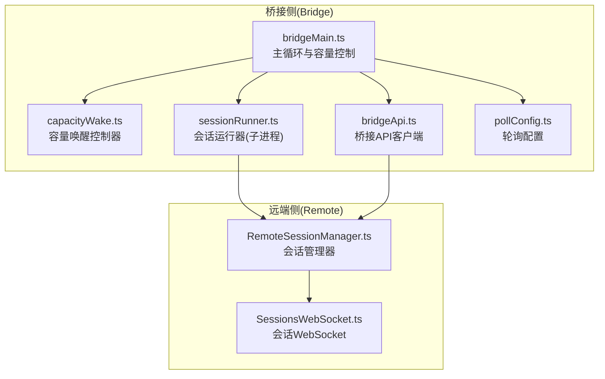
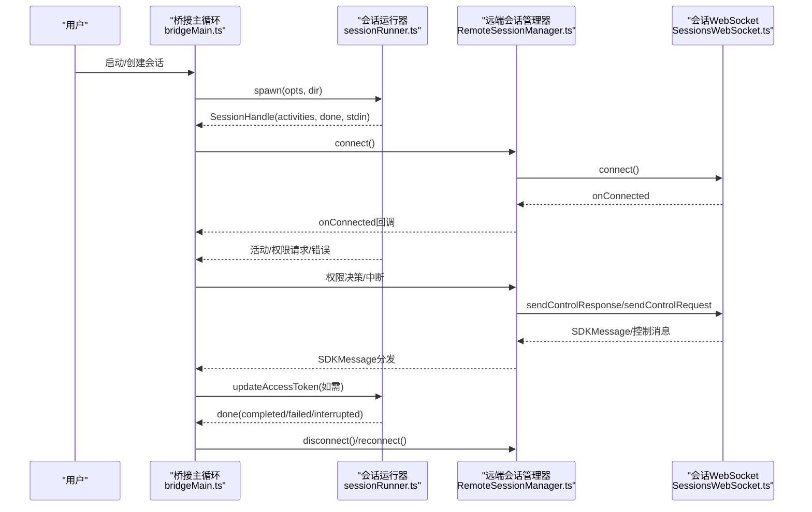
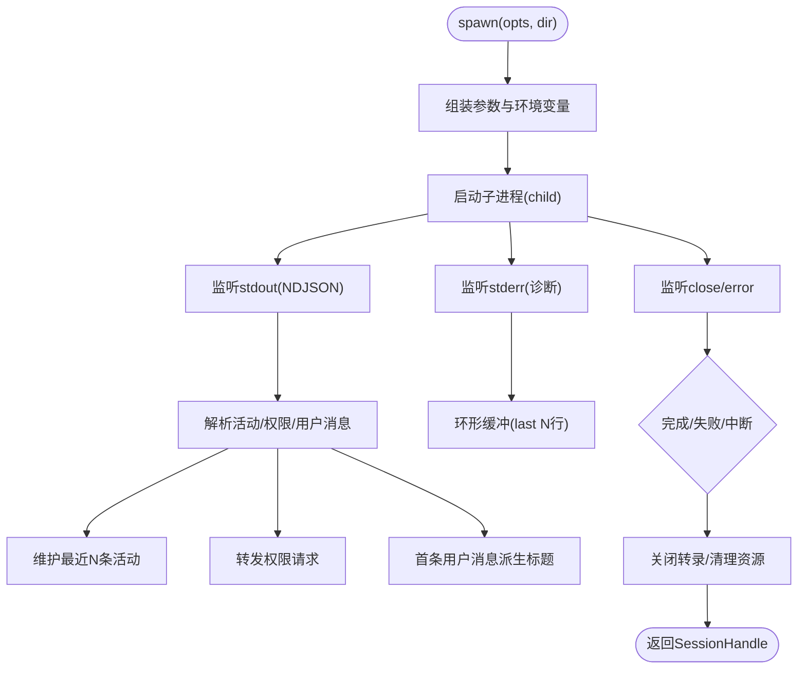
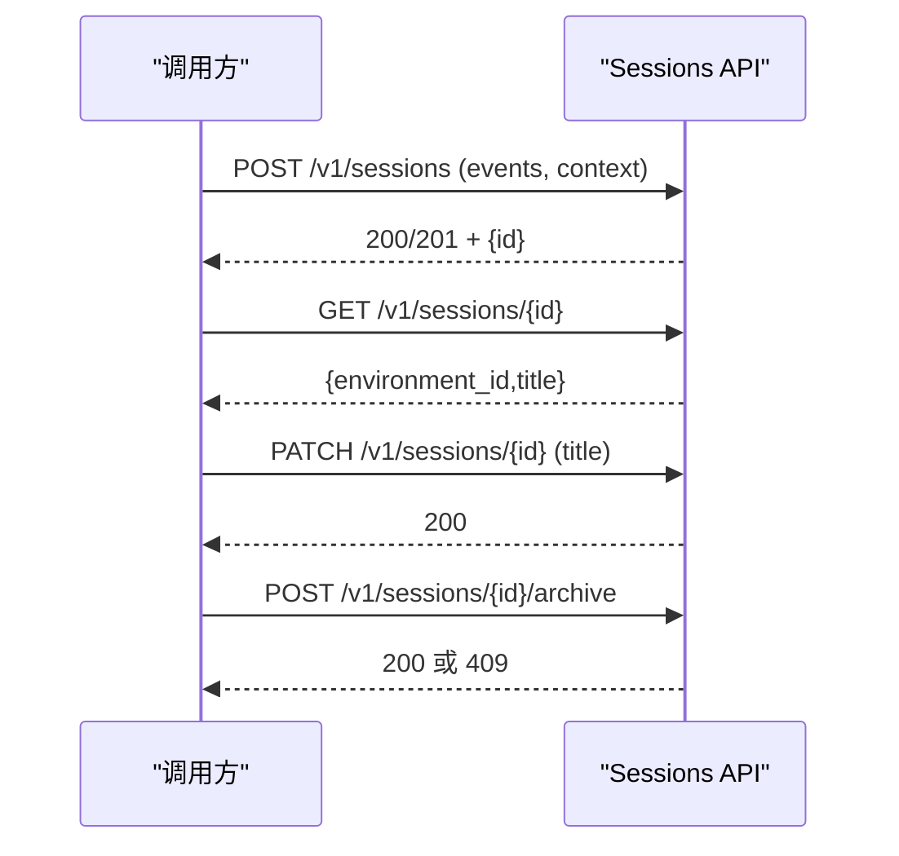
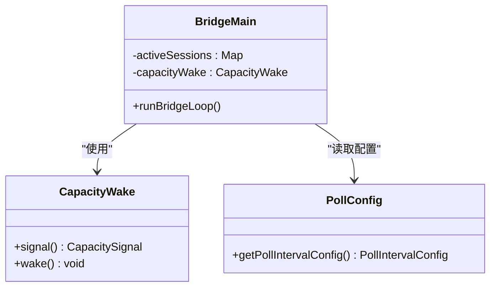
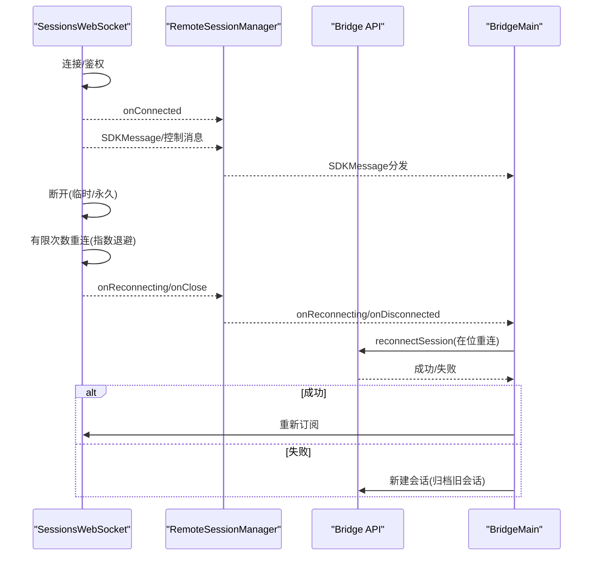
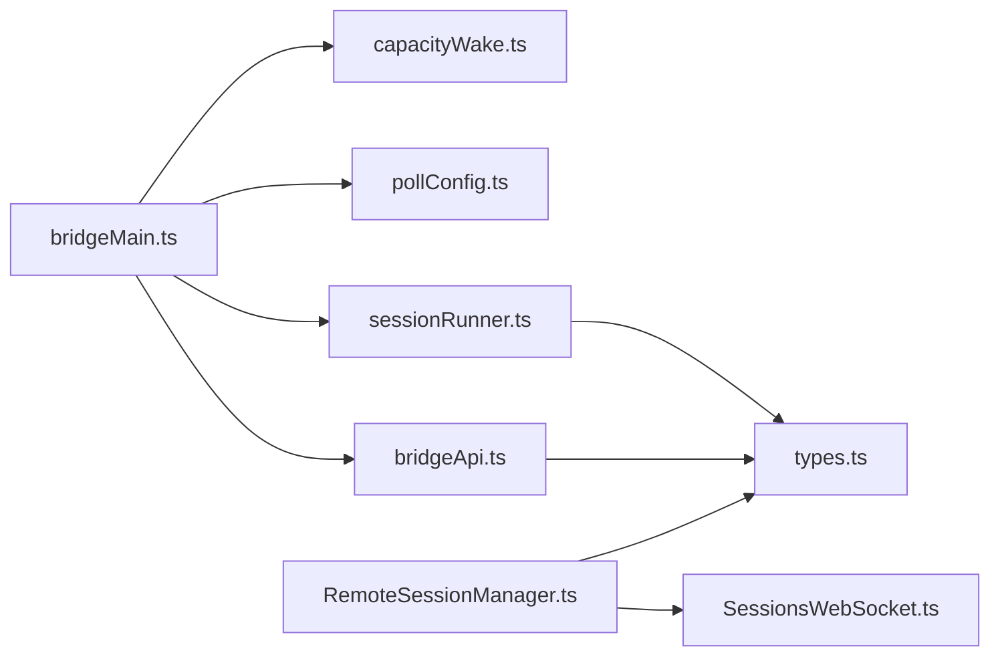

# 远程会话管理

<cite>
**本文引用的文件**
- [sessionRunner.ts](file://src/bridge/sessionRunner.ts)
- [createSession.ts](file://src/bridge/createSession.ts)
- [sessionIdCompat.ts](file://src/bridge/sessionIdCompat.ts)
- [capacityWake.ts](file://src/bridge/capacityWake.ts)
- [RemoteSessionManager.ts](file://src/remote/RemoteSessionManager.ts)
- [SessionsWebSocket.ts](file://src/remote/SessionsWebSocket.ts)
- [types.ts](file://src/bridge/types.ts)
- [bridgeApi.ts](file://src/bridge/bridgeApi.ts)
- [bridgeMain.ts](file://src/bridge/bridgeMain.ts)
- [pollConfig.ts](file://src/bridge/pollConfig.ts)
- [pollConfigDefaults.ts](file://src/bridge/pollConfigDefaults.ts)
</cite>

## 目录
1. [简介](#简介)
2. [项目结构](#项目结构)
3. [核心组件](#核心组件)
4. [架构总览](#架构总览)
5. [详细组件分析](#详细组件分析)
6. [依赖关系分析](#依赖关系分析)
7. [性能考量](#性能考量)
8. [故障排查指南](#故障排查指南)
9. [结论](#结论)
10. [附录](#附录)

## 简介
本文件系统性阐述 Claude Code 的远程会话管理系统，聚焦于会话运行器（sessionRunner）的进程管理机制、会话生命周期控制、容量唤醒策略；深入解析会话创建流程（createSession）、会话 ID 兼容性处理、资源容量管理；解释会话恢复机制、断线重连策略、会话状态持久化；并提供会话配置参数、性能监控指标、资源使用优化建议，以及最佳实践与常见问题解决方案。

## 项目结构
围绕“远程会话管理”的关键模块分布如下：
- 桥接侧（Bridge）
  - 会话运行器：负责子进程（CLI）的启动、标准流解析、活动追踪、权限请求转发、令牌更新等
  - 会话创建与管理：通过 HTTP 接口创建/获取/归档会话，并维护标题同步
  - 容量唤醒：在“满载”状态下实现可中断睡眠与提前唤醒
  - 轮询配置：统一的轮询间隔与心跳策略
  - 桥接 API 客户端：封装环境注册、工作轮询、心跳、重连、事件发送等
  - 主循环：桥接主循环，协调多会话、容量控制、心跳、超时与恢复
- 远端侧（Remote）
  - 会话管理器：负责 WebSocket 订阅、消息分发、权限请求处理、中断发送
  - 会话 WebSocket：连接 /v1/sessions/ws/{id}/subscribe，实现断线重连、心跳保活、错误码处理

图表来源
- [bridgeMain.ts:141-200](file://src/bridge/bridgeMain.ts#L141-L200)
- [sessionRunner.ts:248-548](file://src/bridge/sessionRunner.ts#L248-L548)
- [bridgeApi.ts:68-451](file://src/bridge/bridgeApi.ts#L68-L451)
- [capacityWake.ts:28-56](file://src/bridge/capacityWake.ts#L28-L56)
- [pollConfig.ts:102-111](file://src/bridge/pollConfig.ts#L102-L111)
- [RemoteSessionManager.ts:95-324](file://src/remote/RemoteSessionManager.ts#L95-L324)
- [SessionsWebSocket.ts:82-404](file://src/remote/SessionsWebSocket.ts#L82-L404)

章节来源
- [bridgeMain.ts:141-200](file://src/bridge/bridgeMain.ts#L141-L200)
- [sessionRunner.ts:248-548](file://src/bridge/sessionRunner.ts#L248-L548)
- [bridgeApi.ts:68-451](file://src/bridge/bridgeApi.ts#L68-L451)
- [capacityWake.ts:28-56](file://src/bridge/capacityWake.ts#L28-L56)
- [pollConfig.ts:102-111](file://src/bridge/pollConfig.ts#L102-L111)
- [RemoteSessionManager.ts:95-324](file://src/remote/RemoteSessionManager.ts#L95-L324)
- [SessionsWebSocket.ts:82-404](file://src/remote/SessionsWebSocket.ts#L82-L404)

## 核心组件
- 会话运行器（sessionRunner）
  - 子进程启动与参数拼装、调试日志与转录文件、NDJSON 流解析、活动追踪、权限请求转发、令牌热更新、进程信号控制（SIGTERM/SIGKILL）
- 会话创建与管理（createSession）
  - 通过 HTTP 创建会话、获取会话信息、归档会话、标题同步（兼容层 ID 转换）
- 会话 ID 兼容性（sessionIdCompat）
  - v1/v2 兼容层 ID 转换（session_* 与 cse_*），支持网关开关
- 容量唤醒（capacityWake）
  - 统一的“满载”睡眠与唤醒控制器，合并外层信号与容量释放信号
- 远端会话管理（RemoteSessionManager）
  - WebSocket 订阅、HTTP 发送消息、权限请求处理、中断发送、断线重连
- 会话 WebSocket（SessionsWebSocket）
  - 连接、鉴权、消息解析、心跳保活、断线重连、错误码处理
- 桥接 API 客户端（bridgeApi）
  - 环境注册、工作轮询、心跳、重连、事件发送、归档、鉴权刷新
- 主循环（bridgeMain）
  - 多会话调度、容量控制、心跳模式、超时与恢复、工作项回收

章节来源
- [sessionRunner.ts:248-548](file://src/bridge/sessionRunner.ts#L248-L548)
- [createSession.ts:34-180](file://src/bridge/createSession.ts#L34-L180)
- [sessionIdCompat.ts:38-57](file://src/bridge/sessionIdCompat.ts#L38-L57)
- [capacityWake.ts:28-56](file://src/bridge/capacityWake.ts#L28-L56)
- [RemoteSessionManager.ts:95-324](file://src/remote/RemoteSessionManager.ts#L95-L324)
- [SessionsWebSocket.ts:82-404](file://src/remote/SessionsWebSocket.ts#L82-L404)
- [bridgeApi.ts:68-451](file://src/bridge/bridgeApi.ts#L68-L451)
- [bridgeMain.ts:141-200](file://src/bridge/bridgeMain.ts#L141-L200)

## 架构总览
远程会话管理由“桥接侧 + 远端侧”协同完成：
- 桥接侧负责本地子进程（CLI）的生命周期、NDJSON 活动解析、权限请求转发、令牌更新、容量控制与心跳
- 远端侧负责 WebSocket 订阅、消息分发、权限请求处理、断线重连与中断发送
- 两者通过 HTTP 与 WebSocket 协议交互，配合轮询配置与容量唤醒策略，实现稳定高效的会话运行

图表来源
- [bridgeMain.ts:141-200](file://src/bridge/bridgeMain.ts#L141-L200)
- [sessionRunner.ts:248-548](file://src/bridge/sessionRunner.ts#L248-L548)
- [RemoteSessionManager.ts:95-324](file://src/remote/RemoteSessionManager.ts#L95-L324)
- [SessionsWebSocket.ts:82-404](file://src/remote/SessionsWebSocket.ts#L82-L404)

## 详细组件分析

### 会话运行器（sessionRunner）
- 进程管理
  - 使用子进程启动 CLI，注入 SDK URL、会话 ID、输入输出格式、调试与权限模式等参数
  - 标准错误缓冲（ring buffer）用于诊断，标准输出按 NDJSON 行解析
  - 支持 SIGTERM/SIGKILL 终止，Windows 下自动降级处理
- 会话生命周期
  - 活动追踪：工具调用、文本生成、结果与错误事件聚合为最近 10 条活动
  - 首条真实用户消息检测：用于派生会话标题
  - 关闭事件：区分退出码与信号，返回完成/失败/中断状态
- 权限与令牌
  - 权限请求转发：当子进程发出 control_request 时，桥接转发到服务器等待用户决策
  - 令牌热更新：通过 stdin 发送更新环境变量指令，使子进程在下一次刷新头时使用新令牌
- 调试与转录
  - 可选调试文件与转录文件（JSONL），便于事后分析与排障

图表来源
- [sessionRunner.ts:248-548](file://src/bridge/sessionRunner.ts#L248-L548)

章节来源
- [sessionRunner.ts:248-548](file://src/bridge/sessionRunner.ts#L248-L548)

### 会话创建流程（createSession）
- 创建会话
  - 通过 HTTP POST /v1/sessions 提交事件与上下文（模型、源码仓库等），返回会话 ID
  - 使用组织级头部与 OAuth 令牌，支持权限模式透传
- 获取与归档
  - GET /v1/sessions/{id} 获取环境 ID 与标题
  - POST /v1/sessions/{id}/archive 归档（幂等，409 视为成功）
- 标题同步与 ID 兼容
  - PATCH /v1/sessions/{id} 更新标题（兼容层 ID 转换）
  - 使用 toCompatSessionId 将 cse_* 转为 session_*，反之亦然

图表来源
- [createSession.ts:34-180](file://src/bridge/createSession.ts#L34-L180)
- [createSession.ts:190-244](file://src/bridge/createSession.ts#L190-L244)
- [createSession.ts:263-317](file://src/bridge/createSession.ts#L263-L317)
- [createSession.ts:327-384](file://src/bridge/createSession.ts#L327-L384)
- [sessionIdCompat.ts:38-57](file://src/bridge/sessionIdCompat.ts#L38-L57)

章节来源
- [createSession.ts:34-180](file://src/bridge/createSession.ts#L34-L180)
- [createSession.ts:190-244](file://src/bridge/createSession.ts#L190-L244)
- [createSession.ts:263-317](file://src/bridge/createSession.ts#L263-L317)
- [createSession.ts:327-384](file://src/bridge/createSession.ts#L327-L384)
- [sessionIdCompat.ts:38-57](file://src/bridge/sessionIdCompat.ts#L38-L57)

### 会话 ID 兼容性处理
- v1 与 v2 兼容层
  - cse_* 与 session_* 的互转，确保会话管理 API 使用 session_*，而基础设施层使用 cse_*
  - 支持网关开关以启用/禁用 shim
- 会话管理调用中的 ID 规范化
  - 所有对外会话管理接口（获取、归档、事件）使用兼容 ID
  - 基础设施层（重连、worker 注册）使用 infra ID

章节来源
- [sessionIdCompat.ts:38-57](file://src/bridge/sessionIdCompat.ts#L38-L57)

### 资源容量管理与唤醒策略
- 容量唤醒（CapacityWake）
  - 合并外层循环信号与容量释放信号，实现“满载”时可中断睡眠
  - 提供 wake() 在会话结束或传输丢失时立即唤醒，缩短新工作接受延迟
- 主循环中的容量控制
  - 根据活跃会话数量与最大容量决定轮询与心跳策略
  - 在“满载”时采用非独占心跳或周期性轮询，避免过度拉取
- 轮询配置
  - 通过 GrowthBook 动态下发轮询间隔、心跳间隔、会话保活间隔等
  - 默认值与校验规则保证安全边界（≥100ms，0 或 ≥100ms）

图表来源
- [capacityWake.ts:28-56](file://src/bridge/capacityWake.ts#L28-L56)
- [bridgeMain.ts:141-200](file://src/bridge/bridgeMain.ts#L141-L200)
- [pollConfig.ts:102-111](file://src/bridge/pollConfig.ts#L102-L111)

章节来源
- [capacityWake.ts:28-56](file://src/bridge/capacityWake.ts#L28-L56)
- [bridgeMain.ts:141-200](file://src/bridge/bridgeMain.ts#L141-L200)
- [pollConfig.ts:102-111](file://src/bridge/pollConfig.ts#L102-L111)
- [pollConfigDefaults.ts:55-82](file://src/bridge/pollConfigDefaults.ts#L55-L82)

### 会话恢复机制与断线重连
- 远端侧
  - SessionsWebSocket：支持指数退避重连、心跳保活、特定错误码（如 4001）有限重试
  - RemoteSessionManager：处理控制请求、权限取消、中断发送、强制重连
- 桥接侧
  - 通过桥接 API 的 reconnectSession 实现“在位重连”，或在环境变更后回退到新建会话
  - 令牌刷新与心跳维持会话活性，避免被服务端回收

图表来源
- [SessionsWebSocket.ts:234-288](file://src/remote/SessionsWebSocket.ts#L234-L288)
- [SessionsWebSocket.ts:290-399](file://src/remote/SessionsWebSocket.ts#L290-L399)
- [RemoteSessionManager.ts:108-141](file://src/remote/RemoteSessionManager.ts#L108-L141)
- [RemoteSessionManager.ts:316-323](file://src/remote/RemoteSessionManager.ts#L316-L323)
- [bridgeApi.ts:358-385](file://src/bridge/bridgeApi.ts#L358-L385)
- [bridgeMain.ts:585-618](file://src/bridge/bridgeMain.ts#L585-L618)

章节来源
- [SessionsWebSocket.ts:234-288](file://src/remote/SessionsWebSocket.ts#L234-L288)
- [SessionsWebSocket.ts:290-399](file://src/remote/SessionsWebSocket.ts#L290-L399)
- [RemoteSessionManager.ts:108-141](file://src/remote/RemoteSessionManager.ts#L108-L141)
- [RemoteSessionManager.ts:316-323](file://src/remote/RemoteSessionManager.ts#L316-L323)
- [bridgeApi.ts:358-385](file://src/bridge/bridgeApi.ts#L358-L385)
- [bridgeMain.ts:585-618](file://src/bridge/bridgeMain.ts#L585-L618)

### 会话状态持久化与活动追踪
- 会话运行器内部维护最近 N 条活动与最后 N 行 stderr，便于 UI 展示与诊断
- 会话标题派生与同步：首次真实用户消息可用于派生标题，后续通过 PATCH 同步至远端
- 转录文件（JSONL）记录原始 NDJSON，便于事后分析

章节来源
- [sessionRunner.ts:107-200](file://src/bridge/sessionRunner.ts#L107-L200)
- [sessionRunner.ts:268-285](file://src/bridge/sessionRunner.ts#L268-L285)
- [createSession.ts:327-384](file://src/bridge/createSession.ts#L327-L384)

## 依赖关系分析
- 组件耦合
  - bridgeMain 依赖 capacityWake、pollConfig、bridgeApi、sessionRunner
  - RemoteSessionManager 依赖 SessionsWebSocket 与远端 API
  - sessionRunner 依赖 types 中的协议与工具函数
- 外部依赖
  - HTTP 客户端（axios）、WebSocket 客户端（Bun/Node ws）
  - 环境变量与组织 UUID 用于鉴权与路由
- 循环依赖规避
  - sessionIdCompat 独立于 workSecret，避免打包链路中的静态导入环

图表来源
- [bridgeMain.ts:1-200](file://src/bridge/bridgeMain.ts#L1-L200)
- [capacityWake.ts:1-56](file://src/bridge/capacityWake.ts#L1-L56)
- [pollConfig.ts:1-111](file://src/bridge/pollConfig.ts#L1-L111)
- [bridgeApi.ts:1-540](file://src/bridge/bridgeApi.ts#L1-L540)
- [sessionRunner.ts:1-551](file://src/bridge/sessionRunner.ts#L1-L551)
- [RemoteSessionManager.ts:1-344](file://src/remote/RemoteSessionManager.ts#L1-L344)
- [SessionsWebSocket.ts:1-405](file://src/remote/SessionsWebSocket.ts#L1-L405)
- [types.ts:1-263](file://src/bridge/types.ts#L1-L263)

章节来源
- [bridgeMain.ts:1-200](file://src/bridge/bridgeMain.ts#L1-L200)
- [capacityWake.ts:1-56](file://src/bridge/capacityWake.ts#L1-L56)
- [pollConfig.ts:1-111](file://src/bridge/pollConfig.ts#L1-L111)
- [bridgeApi.ts:1-540](file://src/bridge/bridgeApi.ts#L1-L540)
- [sessionRunner.ts:1-551](file://src/bridge/sessionRunner.ts#L1-L551)
- [RemoteSessionManager.ts:1-344](file://src/remote/RemoteSessionManager.ts#L1-L344)
- [SessionsWebSocket.ts:1-405](file://src/remote/SessionsWebSocket.ts#L1-L405)
- [types.ts:1-263](file://src/bridge/types.ts#L1-L263)

## 性能考量
- 轮询与心跳
  - 使用非独占心跳与周期性轮询，避免在“满载”时过度拉取
  - 通过 GrowthBook 动态调整轮询间隔与心跳间隔，平衡延迟与资源占用
- 令牌刷新与会话保活
  - 通过心跳与 keep-alive 机制维持会话活性，减少因令牌过期导致的重连
  - 令牌热更新通过 stdin 推送，避免重启子进程
- 资源限制
  - 最大会话数限制与容量唤醒结合，防止资源耗尽
  - 超时监控与 SIGKILL 保护，避免僵尸进程

## 故障排查指南
- 常见错误与处理
  - 401/403：触发鉴权刷新或提示登录；刷新失败则抛出致命错误
  - 404/410：环境/会话过期，提示重启或重新连接
  - 4001：会话未找到（可能短暂），进行有限次重试
  - 429：速率限制，降低轮询频率
- 诊断手段
  - 启用 --debug-file 与转录文件（JSONL），捕获 NDJSON 与 stderr
  - 使用 --verbose 输出原始 NDJSON 到 stderr，辅助定位
  - 检查最近 stderr 行与活动列表，快速定位异常阶段
- 重连策略
  - 远端 WebSocket：指数退避、心跳保活、特定错误码有限重试
  - 桥接侧：优先在位重连（reconnectSession），失败则归档旧会话并创建新会话

章节来源
- [bridgeApi.ts:454-508](file://src/bridge/bridgeApi.ts#L454-L508)
- [SessionsWebSocket.ts:234-288](file://src/remote/SessionsWebSocket.ts#L234-L288)
- [SessionsWebSocket.ts:290-399](file://src/remote/SessionsWebSocket.ts#L290-L399)
- [sessionRunner.ts:352-366](file://src/bridge/sessionRunner.ts#L352-L366)
- [sessionRunner.ts:376-385](file://src/bridge/sessionRunner.ts#L376-L385)

## 结论
该远程会话管理系统通过“桥接侧 + 远端侧”的协作，实现了稳健的会话生命周期管理、灵活的容量控制与高效的断线重连。会话运行器负责子进程与活动追踪，会话创建与管理保障会话状态一致性，容量唤醒与轮询配置优化资源使用，远端 WebSocket 与会话管理器提供可靠的通信与权限控制。配合完善的诊断与重连策略，系统在复杂网络环境下仍能保持高可用与低延迟。

## 附录

### 会话配置参数
- 桥接配置（BridgeConfig）
  - 最大会话数、工作目录、分支、Git 仓库、运行模式、调试文件、会话超时等
- 轮询配置（PollIntervalConfig）
  - 未满载轮询间隔、满载轮询间隔、非独占心跳间隔、多会话轮询间隔、回收阈值、会话保活间隔
- 会话运行器参数（SessionSpawnOpts）
  - 会话 ID、SDK URL、访问令牌、是否使用 CCR v2、worker epoch、首条用户消息回调

章节来源
- [types.ts:81-115](file://src/bridge/types.ts#L81-L115)
- [pollConfig.ts:28-92](file://src/bridge/pollConfig.ts#L28-L92)
- [pollConfigDefaults.ts:44-82](file://src/bridge/pollConfigDefaults.ts#L44-L82)
- [types.ts:192-207](file://src/bridge/types.ts#L192-L207)

### 性能监控指标
- 活动追踪：最近 N 条工具调用/文本/结果/错误
- 连接状态：已连接/重连中/断开
- 资源使用：活跃会话数、最大会话数、轮询间隔、心跳周期
- 错误统计：401/403/404/410/429/4001 等错误计数与重试次数

章节来源
- [sessionRunner.ts:107-200](file://src/bridge/sessionRunner.ts#L107-L200)
- [RemoteSessionManager.ts:113-131](file://src/remote/RemoteSessionManager.ts#L113-L131)
- [SessionsWebSocket.ts:130-159](file://src/remote/SessionsWebSocket.ts#L130-L159)
- [bridgeApi.ts:454-508](file://src/bridge/bridgeApi.ts#L454-L508)

### 资源使用优化建议
- 合理设置轮询与心跳间隔，避免在“满载”时频繁轮询
- 使用容量唤醒，缩短会话结束后的新工作接受延迟
- 启用令牌热更新与会话保活，减少因令牌过期导致的重连
- 限制最大会话数，结合工作树模式隔离不同会话的工作区

章节来源
- [pollConfig.ts:102-111](file://src/bridge/pollConfig.ts#L102-L111)
- [capacityWake.ts:28-56](file://src/bridge/capacityWake.ts#L28-L56)
- [sessionRunner.ts:527-542](file://src/bridge/sessionRunner.ts#L527-L542)
- [SessionsWebSocket.ts:301-313](file://src/remote/SessionsWebSocket.ts#L301-L313)

### 最佳实践
- 使用兼容层 ID 转换，确保会话管理 API 与基础设施层 ID 一致
- 在首次真实用户消息出现时派生标题，并通过 PATCH 同步至远端
- 在网络不稳定场景下，优先使用远端 WebSocket 的断线重连与桥接侧的在位重连
- 对于长时间无活动的会话，启用会话保活以避免被上游代理回收

章节来源
- [sessionIdCompat.ts:38-57](file://src/bridge/sessionIdCompat.ts#L38-L57)
- [createSession.ts:327-384](file://src/bridge/createSession.ts#L327-L384)
- [SessionsWebSocket.ts:290-399](file://src/remote/SessionsWebSocket.ts#L290-L399)
- [bridgeApi.ts:358-385](file://src/bridge/bridgeApi.ts#L358-L385)