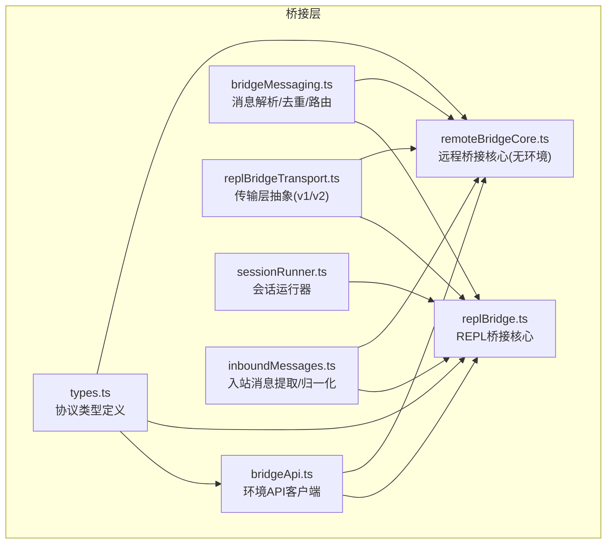
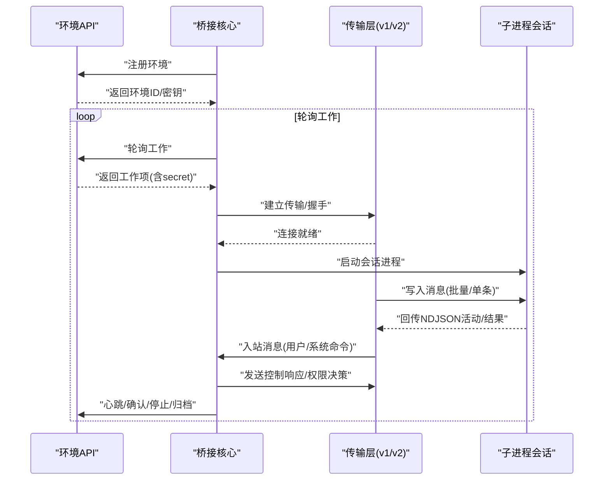
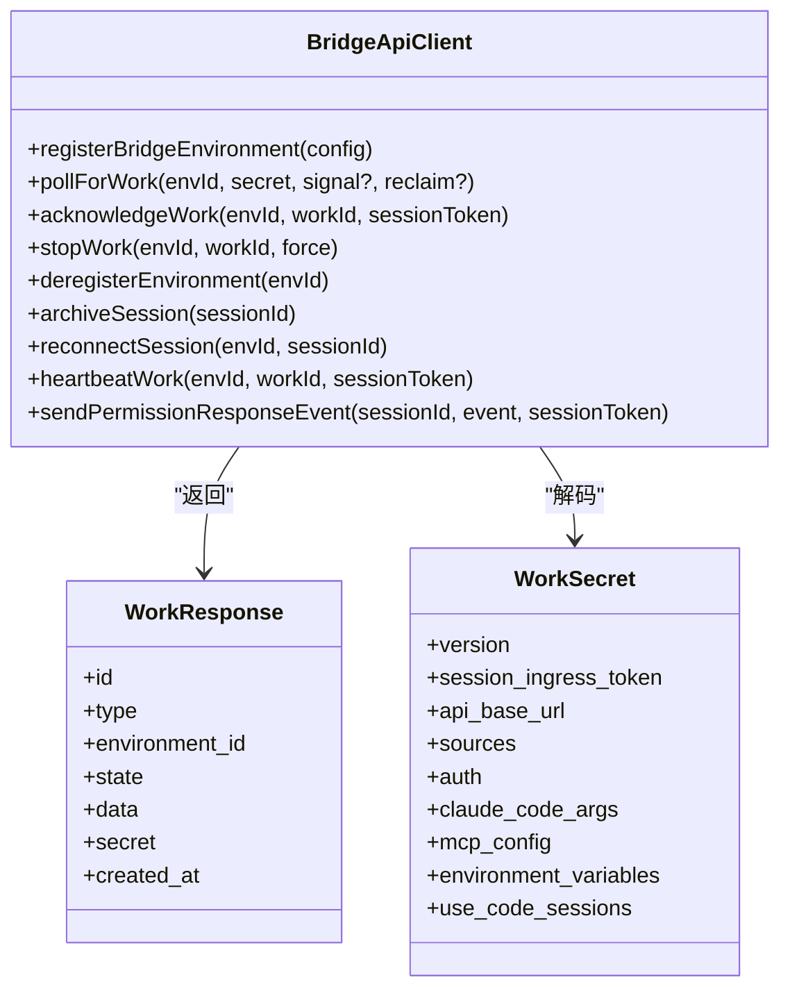
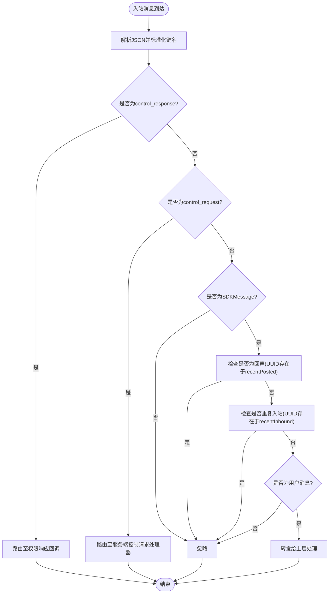
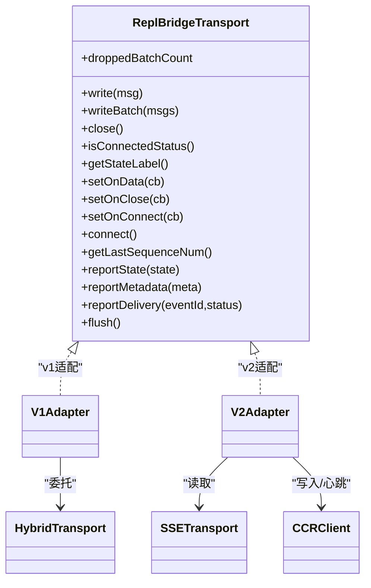
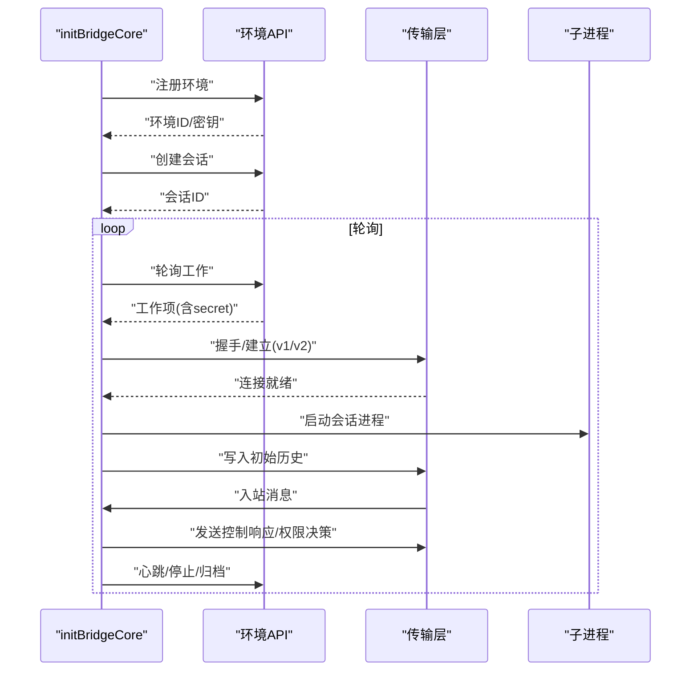
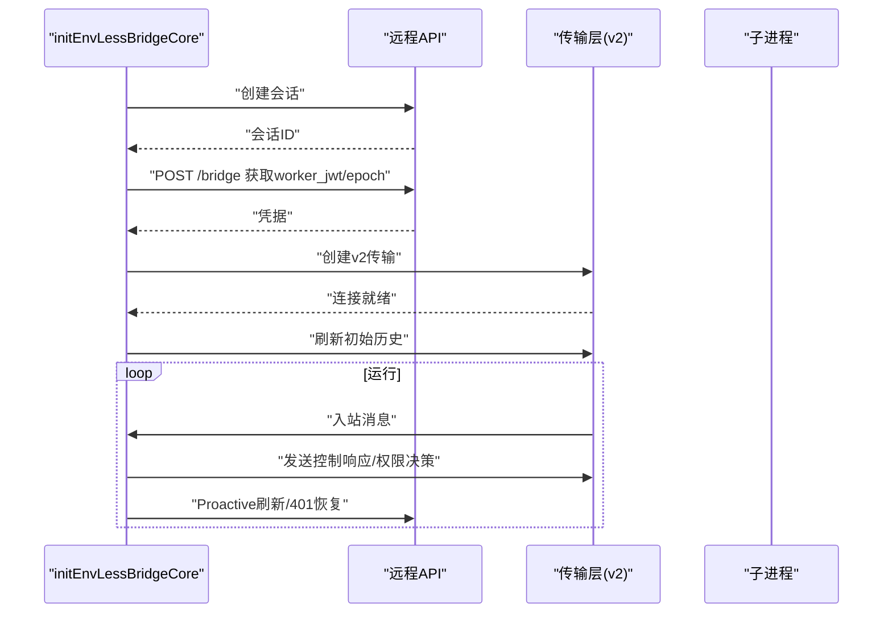
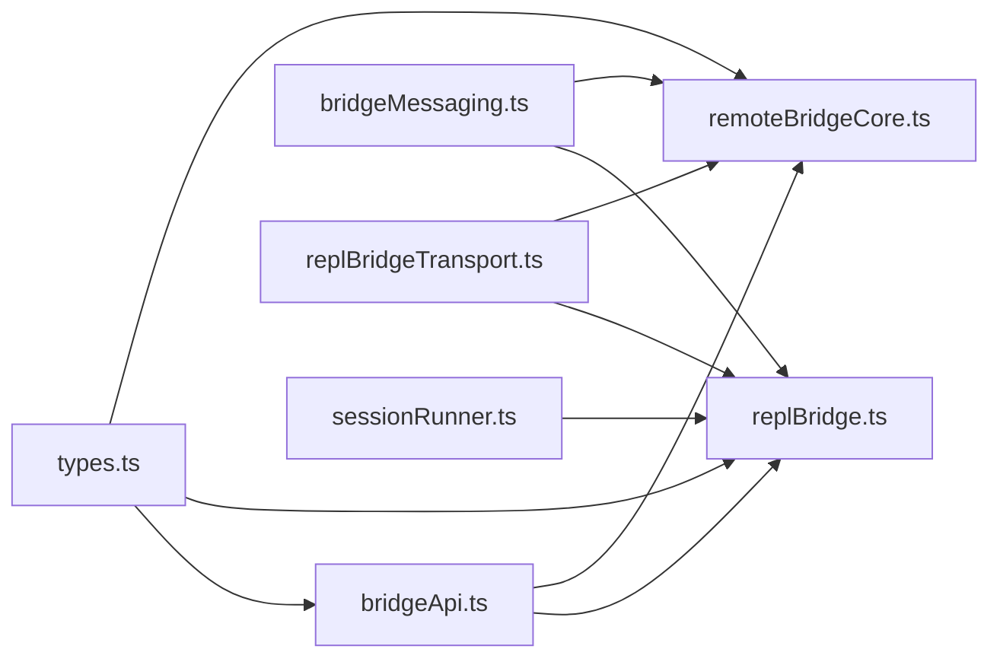

# 通信协议

<cite>
**本文引用的文件**
- [bridgeApi.ts](file://src/bridge/bridgeApi.ts)
- [bridgeMessaging.ts](file://src/bridge/bridgeMessaging.ts)
- [bridgeMain.ts](file://src/bridge/bridgeMain.ts)
- [types.ts](file://src/bridge/types.ts)
- [inboundMessages.ts](file://src/bridge/inboundMessages.ts)
- [replBridge.ts](file://src/bridge/replBridge.ts)
- [replBridgeTransport.ts](file://src/bridge/replBridgeTransport.ts)
- [remoteBridgeCore.ts](file://src/bridge/remoteBridgeCore.ts)
- [initReplBridge.ts](file://src/bridge/initReplBridge.ts)
- [sessionRunner.ts](file://src/bridge/sessionRunner.ts)
</cite>

## 目录
1. [引言](#引言)
2. [项目结构](#项目结构)
3. [核心组件](#核心组件)
4. [架构总览](#架构总览)
5. [详细组件分析](#详细组件分析)
6. [依赖关系分析](#依赖关系分析)
7. [性能考量](#性能考量)
8. [故障排查指南](#故障排查指南)
9. [结论](#结论)
10. [附录](#附录)

## 引言
本文件系统性阐述 Claude Code 桥接层（Bridge）的通信协议与实现细节，覆盖环境 API（Environments API）与会话传输（Session Transport）两层：前者负责工作项派发与心跳、权限事件上报等；后者负责入站/出站消息在 REPL/远程控制场景中的可靠传输。文档重点包括：
- 协议设计与消息传递机制
- 入站与出站消息处理流程
- 数据格式、序列化与错误处理
- 消息路由策略、优先级与流量控制
- 通信性能优化、网络异常处理、重试与恢复
- 协议扩展与版本演进

## 项目结构
桥接层位于 src/bridge 目录，围绕“环境注册—轮询工作—建立会话—消息编解码—传输层抽象—会话生命周期”展开，关键模块如下：
- 环境 API 客户端：负责注册环境、轮询工作、确认、停止、心跳、归档、重连等
- 消息处理与去重：统一解析入站消息、过滤非用户消息、防重放与回声过滤
- 传输层抽象：v1（HybridTransport）与 v2（SSETransport + CCRClient）双栈
- REPL/远程控制桥接核心：环境模式与无环境模式两条路径
- 会话运行器：子进程会话生命周期管理与活动追踪

图表来源
- [bridgeApi.ts:68-452](file://src/bridge/bridgeApi.ts#L68-L452)
- [bridgeMessaging.ts:132-208](file://src/bridge/bridgeMessaging.ts#L132-L208)
- [replBridgeTransport.ts:23-70](file://src/bridge/replBridgeTransport.ts#L23-L70)
- [replBridge.ts:260-545](file://src/bridge/replBridge.ts#L260-L545)
- [remoteBridgeCore.ts:140-256](file://src/bridge/remoteBridgeCore.ts#L140-L256)
- [sessionRunner.ts:248-547](file://src/bridge/sessionRunner.ts#L248-L547)
- [types.ts:18-263](file://src/bridge/types.ts#L18-L263)
- [inboundMessages.ts:21-81](file://src/bridge/inboundMessages.ts#L21-L81)

章节来源
- [bridgeApi.ts:68-452](file://src/bridge/bridgeApi.ts#L68-L452)
- [bridgeMessaging.ts:132-208](file://src/bridge/bridgeMessaging.ts#L132-L208)
- [replBridgeTransport.ts:23-70](file://src/bridge/replBridgeTransport.ts#L23-L70)
- [replBridge.ts:260-545](file://src/bridge/replBridge.ts#L260-L545)
- [remoteBridgeCore.ts:140-256](file://src/bridge/remoteBridgeCore.ts#L140-L256)
- [sessionRunner.ts:248-547](file://src/bridge/sessionRunner.ts#L248-L547)
- [types.ts:18-263](file://src/bridge/types.ts#L18-L263)
- [inboundMessages.ts:21-81](file://src/bridge/inboundMessages.ts#L21-L81)

## 核心组件
- 环境 API 客户端（BridgeApiClient）
  - 提供注册环境、轮询工作、确认、停止、注销、归档、重连、心跳、发送权限事件等方法
  - 统一封装认证头、Beta 头、Runner 版本头、可信设备令牌等
  - 对 401 进行一次性刷新重试，对 403/404/410/429 等进行语义化错误抛出
- 消息处理与去重（handleIngressMessage）
  - 解析入站消息，区分 control_response 与 control_request
  - 基于 UUID 防回声与重复入站消息
  - 仅转发用户消息到上层，系统命令等内部消息丢弃
- 传输层抽象（ReplBridgeTransport）
  - v1：HybridTransport（WebSocket 读 + Session-Ingress POST 写）
  - v2：SSETransport（读）+ CCRClient（写/心跳/状态/交付跟踪）
  - 支持按需关闭、连接状态查询、序列号承载、批量写入、刷新
- REPL/远程桥接核心
  - 环境模式：先注册环境，再轮询工作，建立会话，进入心跳/轮询循环
  - 无环境模式：直接创建会话，获取 worker JWT，直连 v2 传输
- 会话运行器（SessionSpawner）
  - 子进程会话生命周期管理，NDJSON 流解析，活动追踪，权限请求透传

章节来源
- [bridgeApi.ts:68-452](file://src/bridge/bridgeApi.ts#L68-L452)
- [bridgeMessaging.ts:132-208](file://src/bridge/bridgeMessaging.ts#L132-L208)
- [replBridgeTransport.ts:23-70](file://src/bridge/replBridgeTransport.ts#L23-L70)
- [replBridge.ts:260-545](file://src/bridge/replBridge.ts#L260-L545)
- [remoteBridgeCore.ts:140-256](file://src/bridge/remoteBridgeCore.ts#L140-L256)
- [sessionRunner.ts:248-547](file://src/bridge/sessionRunner.ts#L248-L547)

## 架构总览
桥接层采用“环境派发 + 传输层”的分层设计：
- 环境层（Environments API）
  - 注册/注销环境、轮询工作、确认/停止工作、心跳、归档、重连
- 会话层（Session Transport）
  - v1：WebSocket 读 + Session-Ingress POST 写
  - v2：SSE 读 + CCRClient POST 写，支持 worker_epoch 与心跳
- 控制面（Control）
  - server-initiated control_request（初始化、设置模型、最大思考 token、权限模式、中断）
  - client-initiated control_response（权限决策等）

图表来源
- [bridgeApi.ts:141-323](file://src/bridge/bridgeApi.ts#L141-L323)
- [replBridgeTransport.ts:119-371](file://src/bridge/replBridgeTransport.ts#L119-L371)
- [replBridge.ts:537-571](file://src/bridge/replBridge.ts#L537-L571)
- [remoteBridgeCore.ts:188-256](file://src/bridge/remoteBridgeCore.ts#L188-L256)

## 详细组件分析

### 环境 API 客户端（BridgeApiClient）
- 关键能力
  - 注册环境 registerBridgeEnvironment：携带机器名、目录、分支、Git 仓库、最大会话数、worker 类型元数据、可复用环境 ID
  - 轮询工作 pollForWork：支持 reclaim_older_than_ms 参数，空响应表示无可用工作
  - 确认工作 acknowledgeWork：使用会话令牌
  - 停止工作 stopWork：支持强制停止，带一次性 OAuth 刷新重试
  - 注销环境 deregisterEnvironment：带一次性 OAuth 刷新重试
  - 归档会话 archiveSession：409 视为幂等成功
  - 重连会话 reconnectSession：用于 JWT 过期或环境重启后的重新派发
  - 心跳 heartbeatWork：使用会话令牌，返回是否延长租约与当前状态
  - 发送权限事件 sendPermissionResponseEvent：通过会话事件接口上报权限决策
- 认证与安全
  - 默认头：Authorization、Content-Type、anthropic-version、anthropic-beta、runner 版本头
  - 可选可信设备令牌头（X-Trusted-Device-Token），用于增强安全
  - 401 自动刷新重试（若注入刷新回调），失败则抛出致命错误
- 错误处理
  - 200/204 成功
  - 401/403/404/410/429 分别映射为致命错误或速率限制提示
  - 409 幂等场景（如归档）不视为错误
- 数据结构
  - WorkResponse：工作项标识、环境 ID、状态、数据负载（类型/会话 ID/密文）、创建时间
  - WorkSecret：版本、会话入口 JWT、API 基址、来源信息、鉴权凭据、可选 MCP 配置与环境变量、服务器驱动的 CCR v2 选择器

图表来源
- [bridgeApi.ts:133-176](file://src/bridge/bridgeApi.ts#L133-L176)
- [types.ts:23-51](file://src/bridge/types.ts#L23-L51)

章节来源
- [bridgeApi.ts:68-452](file://src/bridge/bridgeApi.ts#L68-L452)
- [types.ts:18-51](file://src/bridge/types.ts#L18-L51)

### 消息处理与去重（handleIngressMessage）
- 入站消息解析
  - 使用统一解析器，标准化控制消息键名
  - 区分 control_response 与 control_request，分别交由不同回调处理
  - 非 SDKMessage 直接忽略
- 回声与重复防护
  - 基于最近发送 UUID 集合（BoundedUUIDSet）过滤自身回声
  - 基于最近接收 UUID 集合（BoundedUUIDSet）过滤重复入站提示
  - 防守性去重：即使主索引已过期，仍能捕获 seq-num 协商失败或传输交换导致的历史重放
- 消息筛选
  - 仅转发用户消息；系统本地命令等内部消息丢弃
  - 提供标题提取工具，从首个真实用户消息中派生会话标题
- 结果消息
  - 生成最小 SDKResultSuccess 事件，用于会话归档前的收尾

图表来源
- [bridgeMessaging.ts:132-208](file://src/bridge/bridgeMessaging.ts#L132-L208)
- [bridgeMessaging.ts:419-462](file://src/bridge/bridgeMessaging.ts#L419-L462)

章节来源
- [bridgeMessaging.ts:132-208](file://src/bridge/bridgeMessaging.ts#L132-L208)
- [bridgeMessaging.ts:419-462](file://src/bridge/bridgeMessaging.ts#L419-L462)

### 传输层抽象（ReplBridgeTransport）
- v1（HybridTransport）
  - WebSocket 读取 + Session-Ingress POST 写入
  - 适配器包装以统一接口
- v2（SSETransport + CCRClient）
  - SSE 读取事件流，支持从上次序列号续播
  - CCRClient 写入事件与心跳，支持 worker_epoch 与状态/元数据/交付跟踪
  - 409 epoch 不匹配时主动关闭并通知上层重建
  - 批量写入串行排队，保证顺序与一致性
- 关键能力
  - 连接状态查询、最后序列号、丢包计数（v1）
  - 报告状态/元数据/交付、刷新写队列
  - 出站只读/只写模式（镜像模式）

图表来源
- [replBridgeTransport.ts:23-70](file://src/bridge/replBridgeTransport.ts#L23-L70)
- [replBridgeTransport.ts:78-103](file://src/bridge/replBridgeTransport.ts#L78-L103)
- [replBridgeTransport.ts:119-371](file://src/bridge/replBridgeTransport.ts#L119-L371)

章节来源
- [replBridgeTransport.ts:23-70](file://src/bridge/replBridgeTransport.ts#L23-L70)
- [replBridgeTransport.ts:78-103](file://src/bridge/replBridgeTransport.ts#L78-L103)
- [replBridgeTransport.ts:119-371](file://src/bridge/replBridgeTransport.ts#L119-L371)

### REPL 桥接核心（initBridgeCore）
- 生命周期
  - 注册环境 → 创建会话 → 启动轮询 → 建立传输 → 初始历史刷新 → 心跳/轮询循环 → 会话完成/归档/停止
- 重连策略
  - 环境丢失：尝试“原位重连”（复用同一环境 ID 与会话 ID），否则归档旧会话并创建新会话
  - 传输丢失：唤醒轮询以快速获取新凭证并重建
- 会话标题派生
  - 基于首个真实用户消息与第 3 条消息触发标题生成，避免覆盖显式标题
- 传输握手
  - 根据 secret.use_code_sessions 与环境变量选择 v1/v2
  - v2 通过 registerWorker 获取 worker_epoch，随后建立 SSE/CCRClient

图表来源
- [replBridge.ts:260-545](file://src/bridge/replBridge.ts#L260-L545)
- [bridgeApi.ts:141-323](file://src/bridge/bridgeApi.ts#L141-L323)
- [replBridgeTransport.ts:119-371](file://src/bridge/replBridgeTransport.ts#L119-L371)

章节来源
- [replBridge.ts:260-545](file://src/bridge/replBridge.ts#L260-L545)
- [bridgeApi.ts:141-323](file://src/bridge/bridgeApi.ts#L141-L323)
- [replBridgeTransport.ts:119-371](file://src/bridge/replBridgeTransport.ts#L119-L371)

### 远程桥接核心（initEnvLessBridgeCore）
- 无环境模式
  - 直接创建会话，POST /bridge 获取 worker_jwt 与 worker_epoch，直连 v2 传输
  - 无需注册/轮询/确认/停止/心跳/注销环境
- JWT 刷新
  - 在 expires_in 前 5 分钟调度刷新，刷新后重建传输（epoch 必须同步更新）
  - 401 时自动刷新并重建
- 初始历史刷新
  - 仅刷新符合条件的用户消息，支持上限裁剪
- 传输回调
  - 权限响应触发状态报告
  - 控制请求处理器支持模型/权限/中断等

图表来源
- [remoteBridgeCore.ts:140-256](file://src/bridge/remoteBridgeCore.ts#L140-L256)
- [remoteBridgeCore.ts:317-377](file://src/bridge/remoteBridgeCore.ts#L317-L377)
- [remoteBridgeCore.ts:468-527](file://src/bridge/remoteBridgeCore.ts#L468-L527)

章节来源
- [remoteBridgeCore.ts:140-256](file://src/bridge/remoteBridgeCore.ts#L140-L256)
- [remoteBridgeCore.ts:317-377](file://src/bridge/remoteBridgeCore.ts#L317-L377)
- [remoteBridgeCore.ts:468-527](file://src/bridge/remoteBridgeCore.ts#L468-L527)

### 入站消息提取与归一化（inboundMessages）
- 提取用户消息内容与 UUID，支持字符串与多块内容（含图片）
- 归一化图片块字段：确保媒体类型字段一致，避免后端校验失败
- 返回值用于入站消息过滤与后续处理

章节来源
- [inboundMessages.ts:21-81](file://src/bridge/inboundMessages.ts#L21-L81)

### 会话运行器（SessionSpawner）
- 子进程会话生命周期
  - 启动参数：SDK URL、会话 ID、输入/输出格式、调试文件、权限模式
  - 环境变量：剥离桥接 OAuth、注入会话访问令牌、启用 CCR v2（可选）
- 输出解析
  - NDJSON 行解析，提取活动、文本、结果等
  - 提供权限请求透传与首个真实用户消息回调
- 资源管理
  - 标准错误缓冲、调试日志、转录文件、信号处理（SIGTERM/SIGKILL）

章节来源
- [sessionRunner.ts:248-547](file://src/bridge/sessionRunner.ts#L248-L547)

## 依赖关系分析
- 模块耦合
  - bridgeApi.ts 与 types.ts 高内聚，定义环境 API 接口与数据结构
  - bridgeMessaging.ts 与 replBridge.ts/remoteBridgeCore.ts 低耦合，纯函数便于复用
  - replBridgeTransport.ts 将 v1/v2 差异封装为统一接口
  - sessionRunner.ts 与 replBridge/remoteBridgeCore 通过回调与事件交互
- 外部依赖
  - HTTP 客户端（axios）用于环境 API
  - SSE/HTTP 客户端（SSETransport/CCRClient）用于 v2 传输
  - 子进程（child_process）用于会话执行

图表来源
- [types.ts:18-263](file://src/bridge/types.ts#L18-L263)
- [bridgeApi.ts:68-452](file://src/bridge/bridgeApi.ts#L68-L452)
- [bridgeMessaging.ts:132-208](file://src/bridge/bridgeMessaging.ts#L132-L208)
- [replBridgeTransport.ts:23-70](file://src/bridge/replBridgeTransport.ts#L23-L70)
- [replBridge.ts:260-545](file://src/bridge/replBridge.ts#L260-L545)
- [remoteBridgeCore.ts:140-256](file://src/bridge/remoteBridgeCore.ts#L140-L256)
- [sessionRunner.ts:248-547](file://src/bridge/sessionRunner.ts#L248-L547)

章节来源
- [types.ts:18-263](file://src/bridge/types.ts#L18-L263)
- [bridgeApi.ts:68-452](file://src/bridge/bridgeApi.ts#L68-L452)
- [bridgeMessaging.ts:132-208](file://src/bridge/bridgeMessaging.ts#L132-L208)
- [replBridgeTransport.ts:23-70](file://src/bridge/replBridgeTransport.ts#L23-L70)
- [replBridge.ts:260-545](file://src/bridge/replBridge.ts#L260-L545)
- [remoteBridgeCore.ts:140-256](file://src/bridge/remoteBridgeCore.ts#L140-L256)
- [sessionRunner.ts:248-547](file://src/bridge/sessionRunner.ts#L248-L547)

## 性能考量
- 轮询与心跳
  - 空闲时采用容量阈值下的慢速轮询，活跃时使用心跳保持连接
  - 在容量饱和时，心跳与轮询组合避免相互抑制
- 序列号承载
  - v2 通过 SSE 事件序列号续播，避免全量历史重放
  - v1 通过服务端游标续播
- 批量写入
  - v2 内部批量化上传，串行入队保证顺序
- 去重与回声过滤
  - 双缓冲环形集合（BoundedUUIDSet）维持常数空间复杂度，过滤回声与重复
- 超时与背压
  - HTTP 请求超时、AbortSignal 中断、FlushGate 防止乱序与拥塞

## 故障排查指南
- 常见错误与处理
  - 401：尝试一次性 OAuth 刷新重试；失败则视为致命错误
  - 403：权限不足或会话过期，区分可抑制 403 与不可抑制错误
  - 404/410：环境/会话不存在或过期，触发重连或重建
  - 429：速率限制，降低轮询频率
- 传输异常
  - v2 epoch 不匹配：主动关闭并重建传输
  - 401（SSE）：刷新 JWT 并重建传输
  - 连接超时：记录原因并重试
- 日志与诊断
  - 详细调试日志、诊断日志、错误摘要、统计事件上报

章节来源
- [bridgeApi.ts:454-500](file://src/bridge/bridgeApi.ts#L454-L500)
- [remoteBridgeCore.ts:468-527](file://src/bridge/remoteBridgeCore.ts#L468-L527)
- [replBridgeTransport.ts:209-232](file://src/bridge/replBridgeTransport.ts#L209-L232)

## 结论
该桥接层通信协议以“环境 API + 传输层抽象”为核心，实现了高可用、可扩展、可观测的远程控制与 REPL 会话通道。通过严格的去重、序列号承载、JWT 刷新与传输重建机制，协议在复杂网络环境下仍能保持稳定与高效。建议在生产环境中结合业务特性调整轮询与心跳策略，并充分利用 FlushGate 与批量写入提升吞吐。

## 附录
- 协议版本与头
  - anthropic-version：固定版本
  - anthropic-beta：Beta 头标识
  - x-environment-runner-version：运行器版本
  - X-Trusted-Device-Token：可信设备令牌（可选）
- 数据格式
  - 入站/出站消息遵循 SDKMessage/SDKControlRequest/SDKControlResponse 约定
  - 图片块媒体类型字段归一化，避免后端校验失败
- 扩展指南
  - 新增控制请求/响应：在 handleServerControlRequest 中扩展分发
  - 新增传输：实现 ReplBridgeTransport 接口并接入 REPL/远程桥接核心
  - 新增消息类型：在 isSDKMessage/isSDKControlResponse 中扩展类型守卫