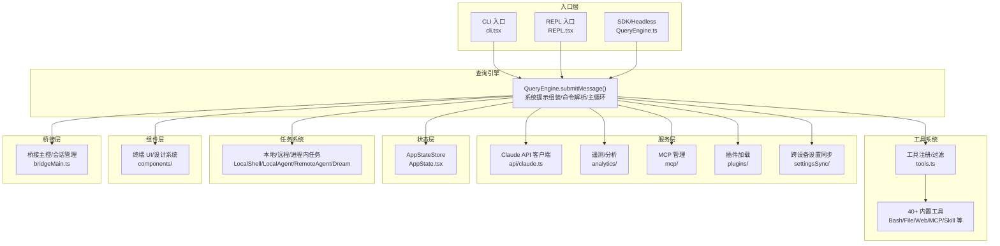
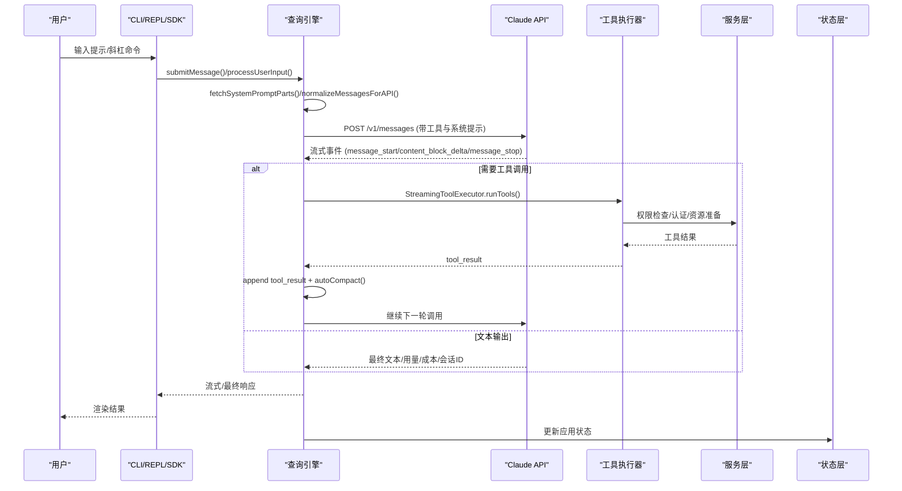
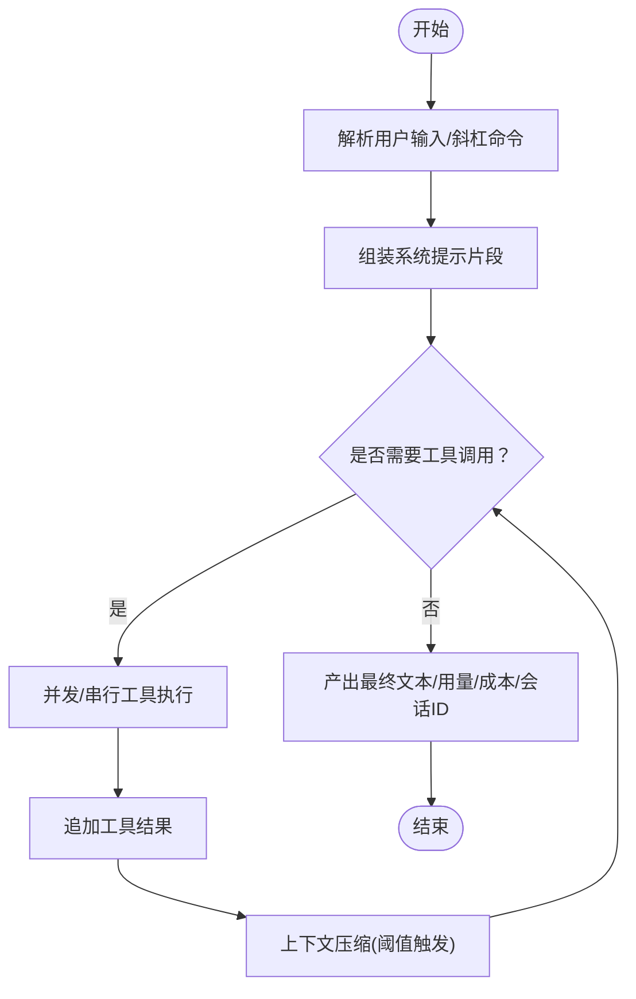
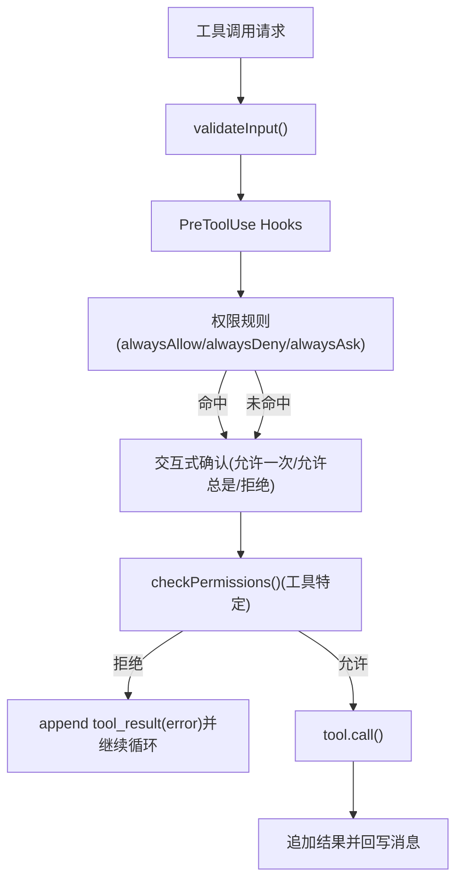
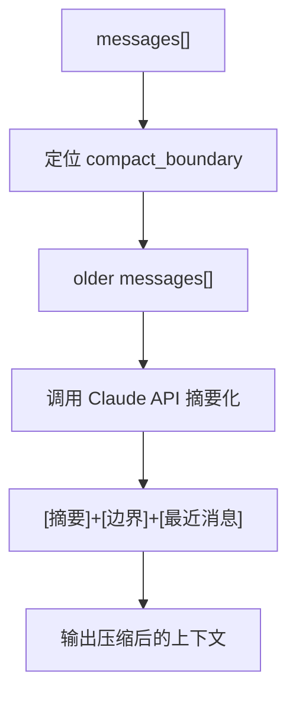
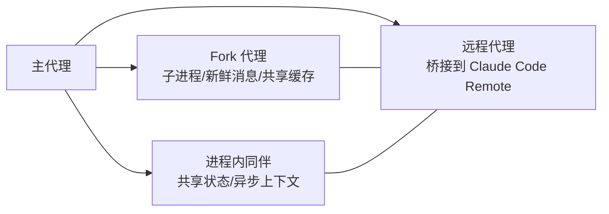
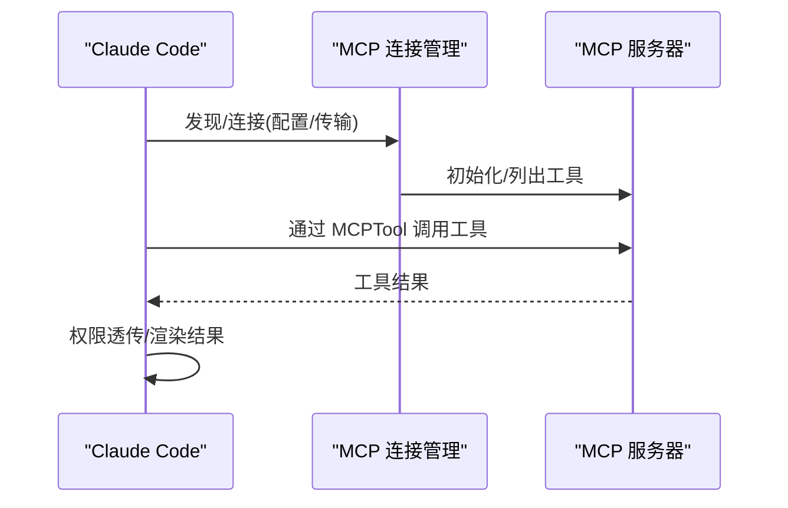
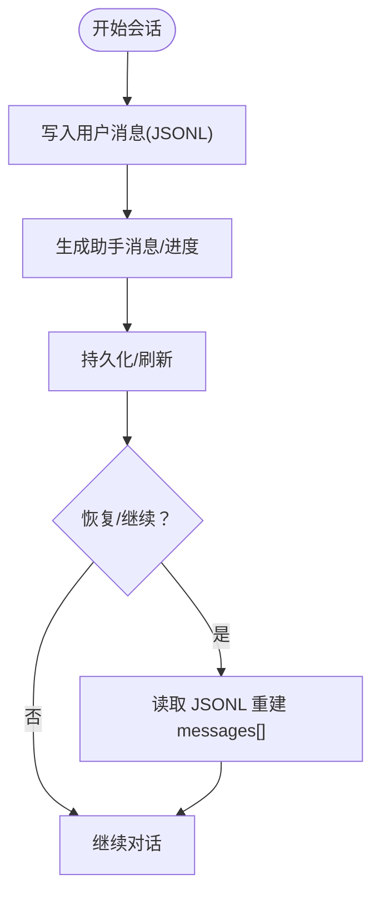
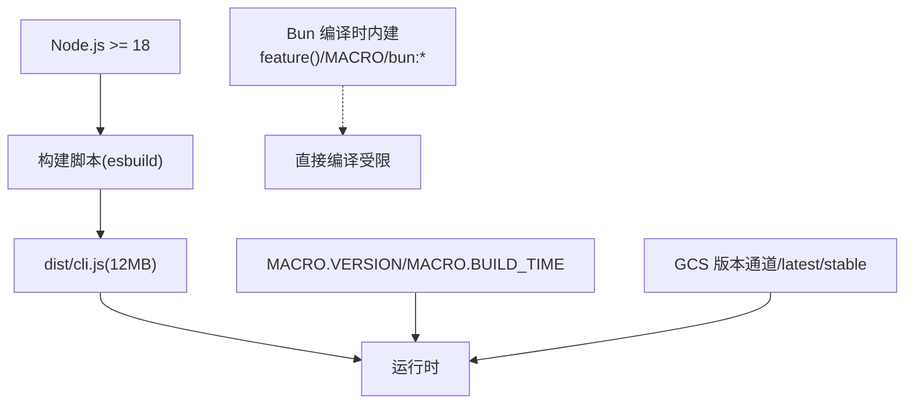

# 项目介绍

<cite>
**本文档引用的文件**
- [README.md](file://README.md)
- [README_CN.md](file://README_CN.md)
- [QUICKSTART.md](file://QUICKSTART.md)
- [package.json](file://package.json)
- [docs/en/01-telemetry-and-privacy.md](file://docs/en/01-telemetry-and-privacy.md)
- [docs/en/05-future-roadmap.md](file://docs/en/05-future-roadmap.md)
- [src/constants/systemPromptSections.ts](file://src/constants/systemPromptSections.ts)
- [src/commands/review.ts](file://src/commands/review.ts)
- [src/commands/version.ts](file://src/commands/version.ts)
- [src/utils/releaseNotes.ts](file://src/utils/releaseNotes.ts)
- [src/utils/autoUpdater.ts](file://src/utils/autoUpdater.ts)
</cite>

## 目录
1. [引言](#引言)
2. [项目结构](#项目结构)
3. [核心组件](#核心组件)
4. [架构总览](#架构总览)
5. [详细组件分析](#详细组件分析)
6. [依赖关系分析](#依赖关系分析)
7. [性能考量](#性能考量)
8. [故障排查指南](#故障排查指南)
9. [结论](#结论)
10. [附录](#附录)

## 引言
Claude Code v2.1.88 是由 Anthropic 与 Claude 提供的智能代码助手，其源码仓库严格限定为“仅供学术研究与教育交流”。该项目以“智能代理模式”为核心，围绕 Claude API 的消息流与工具调用循环，构建了具备权限控制、上下文压缩、多代理协作、会话持久化与 MCP 协议集成的生产级能力框架。它旨在通过 AI 驱动的方式，显著提升开发者在“编写、审查、调试”等关键环节的效率，并为个人开发者与企业团队提供可扩展的智能开发体验。

本项目强调开源研究性质与教育价值，明确禁止商业使用；同时，其未来路线图显示正从“反应式助手”向“主动自治代理”演进，具备语音输入、KAIROS 自主模式、多模态浏览器自动化等前沿能力线索。

## 项目结构
仓库采用按职责分层的组织方式：
- 入口层：CLI、REPL、SDK 入口点，负责初始化与交互
- 查询引擎：封装消息提交、系统提示组装、主代理循环与工具编排
- 工具系统：内置 40+ 工具，覆盖文件读写、搜索、网络访问、子代理、计划与工作流等
- 服务层：API 客户端、分析与遥测、MCP 管理、插件加载、设置同步等
- 状态层：应用状态存储与 React Provider
- 任务系统：本地/远程/进程内子代理、DreamTask 等
- 组件层：终端 UI（Ink）、设计系统与各类交互组件
- 桥接层：与 Claude Desktop/远程环境的会话桥接
- 工具与实用函数：权限规则、消息格式化、沙箱适配、Git/GitHub、遥测等

图表来源
- [README.md:383-445](file://README.md#L383-L445)
- [README.md:250-379](file://README.md#L250-L379)

章节来源
- [README.md:250-379](file://README.md#L250-L379)
- [README.md:383-445](file://README.md#L383-L445)

## 核心组件
- 智能代理循环：用户输入经命令解析与系统提示组装后进入主循环，当模型请求工具调用时，通过并发安全与串行工具执行器进行调度，完成后回写消息并继续迭代，直至停止原因非工具调用。
- 权限与安全：工具调用前经过输入校验、预工具钩子、规则匹配与交互式确认三段式流程，支持只读/破坏性/并发安全等能力标注与渲染。
- 上下文压缩：当 token 预算接近阈值时，自动触发压缩，将旧消息摘要化并保留边界标记，确保近期高保真对话与历史高效利用。
- 多代理与协作：支持在进程内、子进程、隔离工作树与远程桥接等多种派生代理模式，共享/隔离状态并可通过消息与任务板协同。
- MCP 协议：统一接入第三方工具与资源，动态发现、认证与工具注册，权限透传至 Claude Code。
- 会话持久化：以 JSONL 追加日志形式保存用户/助手/进度消息与压缩边界，支持继续、恢复与派生新会话。
- 遥测与隐私：双通道遥测（1P Anthropic 与 Datadog），环境指纹、进程指标与仓库指纹随事件上报；默认不可关闭，存在工具输入细节开关。

章节来源
- [README.md:226-246](file://README.md#L226-L246)
- [README.md:567-605](file://README.md#L567-L605)
- [README.md:650-689](file://README.md#L650-L689)
- [README.md:693-724](file://README.md#L693-L724)
- [README.md:751-776](file://README.md#L751-L776)
- [docs/en/01-telemetry-and-privacy.md:1-125](file://docs/en/01-telemetry-and-privacy.md#L1-L125)

## 架构总览
下图展示了从入口到查询引擎再到工具/服务/状态层的整体交互路径，以及关键数据流与控制流。

图表来源
- [README.md:449-496](file://README.md#L449-L496)
- [README.md:500-533](file://README.md#L500-L533)

章节来源
- [README.md:449-496](file://README.md#L449-L496)
- [README.md:500-533](file://README.md#L500-L533)

## 详细组件分析

### 智能代理模式与核心循环
- 设计理念：以最小代理循环为基础，叠加权限、流式传输、并发、压缩、子代理、持久化与 MCP，形成生产级“智能代理 harness”。
- 关键流程：命令解析 → 系统提示组装 → 主循环 → 工具调用 → 结果回写 → 压缩/继续迭代 → 输出。
- 价值主张：将“思考—行动—反馈”的闭环稳定化、规模化，降低重复劳动，加速复杂任务完成。

图表来源
- [README.md:226-246](file://README.md#L226-L246)
- [README.md:449-496](file://README.md#L449-L496)

章节来源
- [README.md:226-246](file://README.md#L226-L246)
- [README.md:449-496](file://README.md#L449-L496)

### 权限系统与安全控制
- 三阶段控制：输入校验 → 预工具钩子 → 规则匹配/交互确认 → 工具特定权限检查 → 执行。
- 能力标注：只读/破坏性/并发安全/中断行为等，辅助 UI 渲染与风险提示。
- 教育价值：通过可配置的权限策略与交互式确认，帮助用户理解工具潜在影响，培养安全使用习惯。

图表来源
- [README.md:567-605](file://README.md#L567-L605)

章节来源
- [README.md:567-605](file://README.md#L567-L605)

### 上下文压缩与记忆管理
- 触发条件：token 预算超阈值时自动压缩。
- 压缩策略：旧消息摘要化 + 边界标记 + 最近高保真消息。
- 价值：在长对话与大规模工程中维持上下文窗口的可用性与稳定性。

图表来源
- [README.md:650-689](file://README.md#L650-L689)

章节来源
- [README.md:650-689](file://README.md#L650-L689)

### 多代理与协作模式
- 派生模式：进程内共享缓存、子进程新鲜消息与共享文件缓存、隔离工作树 + fork、远程桥接。
- 协作机制：消息传递、任务板共享、团队生命周期管理。
- 适用场景：复杂重构、跨模块探索、并行方案对比与风险评估。

图表来源
- [README.md:609-646](file://README.md#L609-L646)

章节来源
- [README.md:609-646](file://README.md#L609-L646)

### MCP 协议集成
- 发现与连接：支持 stdio、sse、http、ws、sdk 等多种传输；OAuth 2.0、XAA/SEP-990、API Key 等认证方式。
- 工具注册：命名规范、动态 Schema、权限透传与资源列举。
- 价值：将第三方能力无缝纳入代理工作流，扩展工具生态。

图表来源
- [README.md:693-724](file://README.md#L693-L724)

章节来源
- [README.md:693-724](file://README.md#L693-L724)

### 会话持久化与恢复
- 存储：JSONL 追加日志，包含用户/助手/进度消息与压缩边界。
- 恢复：支持继续、指定会话恢复、派生新会话复制历史。
- 价值：保障崩溃恢复与跨会话延续，提升开发连续性。

图表来源
- [README.md:751-776](file://README.md#L751-L776)

章节来源
- [README.md:751-776](file://README.md#L751-L776)

### 遥测与隐私
- 双通道遥测：1P Anthropic 与 Datadog；环境指纹、进程指标、仓库指纹随事件上报。
- 不可关闭性：直接 API 用户无法关闭首方日志；存在工具输入细节开关。
- 价值：为产品优化与风险评估提供数据基础，同时提醒用户关注隐私边界。

章节来源
- [docs/en/01-telemetry-and-privacy.md:1-125](file://docs/en/01-telemetry-and-privacy.md#L1-L125)

### 未来路线图与演进方向
- 新模型：Numbat（下一代）、Opus 4.7、Sonnet 4.8。
- 自主代理：KAIROS 模式，心跳驱动、主动行动、推送通知、PR 订阅。
- 多模态：语音输入（push-to-talk）已实现但受特征门控；浏览器自动化、工作流脚本等工具待上线。
- 价值：从“反应式助手”向“始终在线的自治开发代理”演进，持续增强生产力与主动性。

章节来源
- [docs/en/05-future-roadmap.md:1-168](file://docs/en/05-future-roadmap.md#L1-L168)

## 依赖关系分析
- 运行时与构建：Node.js >= 18；构建脚本基于 esbuild，但源码使用 Bun 编译时内建（feature()、MACRO、bun:bundle 等），因此直接从本仓库编译受限。
- 版本与更新：内置版本号与构建时间由宏注入；支持从 GCS 获取最新/稳定通道版本；提供发行说明解析与展示。
- 依赖规模：约 192 个 npm 依赖，源文件约 1884 个，代码行数约 51 万行。

图表来源
- [QUICKSTART.md:1-122](file://QUICKSTART.md#L1-L122)
- [package.json:1-21](file://package.json#L1-L21)
- [src/commands/version.ts:1-23](file://src/commands/version.ts#L1-L23)
- [src/utils/autoUpdater.ts:389-429](file://src/utils/autoUpdater.ts#L389-L429)
- [src/utils/releaseNotes.ts:187-360](file://src/utils/releaseNotes.ts#L187-L360)

章节来源
- [QUICKSTART.md:1-122](file://QUICKSTART.md#L1-L122)
- [package.json:1-21](file://package.json#L1-L21)
- [src/commands/version.ts:1-23](file://src/commands/version.ts#L1-L23)
- [src/utils/autoUpdater.ts:389-429](file://src/utils/autoUpdater.ts#L389-L429)
- [src/utils/releaseNotes.ts:187-360](file://src/utils/releaseNotes.ts#L187-L360)

## 性能考量
- 上下文压缩：在高 token 使用率时自动触发，减少 API 调用成本与延迟。
- 并行工具执行：对并发安全工具进行并行调度，串行工具按需排队，平衡吞吐与一致性。
- 提示缓存与系统提示分段：通过分段与缓存控制，避免不必要的重复计算。
- 会话持久化：阻塞式写入用户消息保障崩溃恢复，后台队列写入保证顺序与性能。

章节来源
- [README.md:650-689](file://README.md#L650-L689)
- [README.md:500-533](file://README.md#L500-L533)
- [src/constants/systemPromptSections.ts:1-69](file://src/constants/systemPromptSections.ts#L1-L69)

## 故障排查指南
- 构建失败（esbuild）：由于缺少 Bun 编译时内建与 108 个特征门控模块，建议使用预编译的 cli.js 或在具备 Bun 的环境中进行完整构建。
- 权限拒绝：检查权限规则与交互式确认；必要时调整 alwaysAllow/alwaysDeny/alwaysAsk 规则或通过预工具钩子修改输入。
- 会话恢复异常：确认 JSONL 文件完整性与编码；尝试 --fork-session 复制历史以排除损坏。
- 遥测与隐私：若需规避工具输入细节采集，可在运行时设置相关环境变量；注意首方日志默认不可关闭。
- 版本与更新：通过内置版本命令查看当前版本与构建时间；如需更新，检查 GCS 通道与发行说明。

章节来源
- [QUICKSTART.md:1-122](file://QUICKSTART.md#L1-L122)
- [README.md:567-605](file://README.md#L567-L605)
- [README.md:751-776](file://README.md#L751-L776)
- [docs/en/01-telemetry-and-privacy.md:88-125](file://docs/en/01-telemetry-and-privacy.md#L88-L125)
- [src/commands/version.ts:1-23](file://src/commands/version.ts#L1-L23)
- [src/utils/autoUpdater.ts:389-429](file://src/utils/autoUpdater.ts#L389-L429)
- [src/utils/releaseNotes.ts:187-360](file://src/utils/releaseNotes.ts#L187-L360)

## 结论
Claude Code v2.1.88 以“智能代理模式”为核心，结合权限控制、上下文压缩、多代理协作与 MCP 生态，构建了面向实际开发场景的生产力工具。其开源研究性质与教育价值突出，明确禁止商业使用；同时，未来路线图表明项目正向“主动自治代理”演进，具备语音、浏览器自动化与工作流等前沿能力线索。对于个人开发者与企业团队而言，Claude Code 提供了从日常编码、审查到复杂调试与规划的全链路智能支持，值得在合规前提下深入研究与实践。

## 附录
- 术语对照
  - 智能代理：以消息流与工具调用为核心的自动化决策与执行单元
  - 权限系统：工具调用前的三段式控制与交互确认机制
  - 上下文压缩：在 token 预算压力下对历史消息进行摘要化处理
  - 多代理：主代理派生出的子代理，支持进程内/子进程/隔离工作树/远程桥接
  - MCP：模型上下文协议，用于统一接入第三方工具与资源
  - 会话持久化：以 JSONL 追加日志的形式保存对话与进度，支持恢复与继续