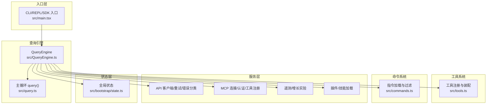
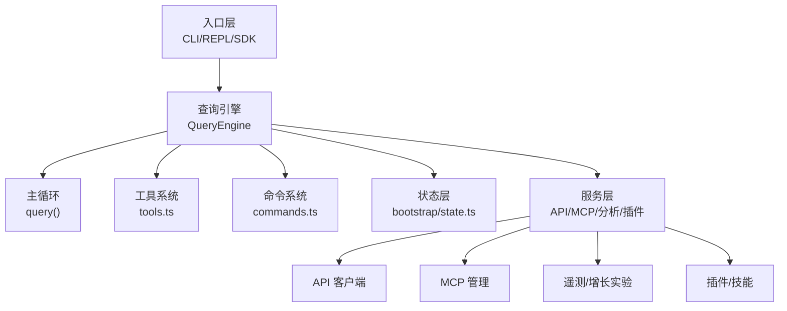
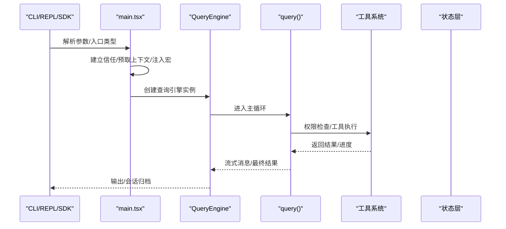
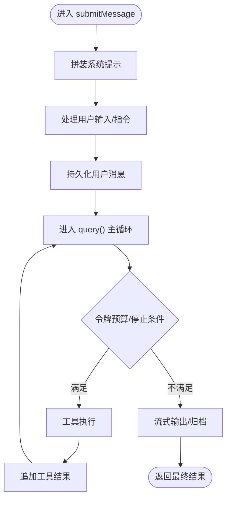
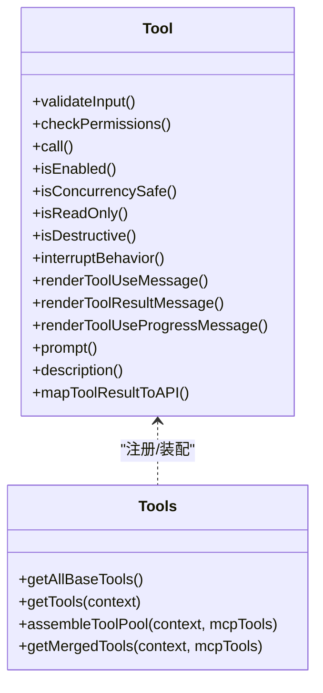
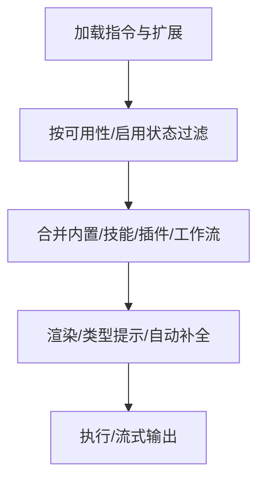
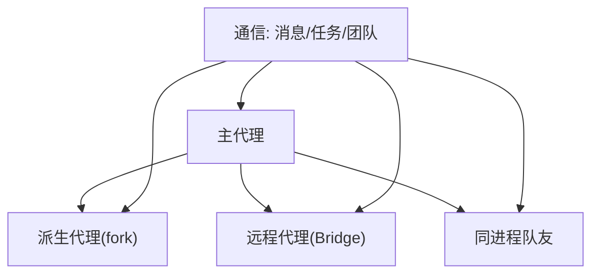
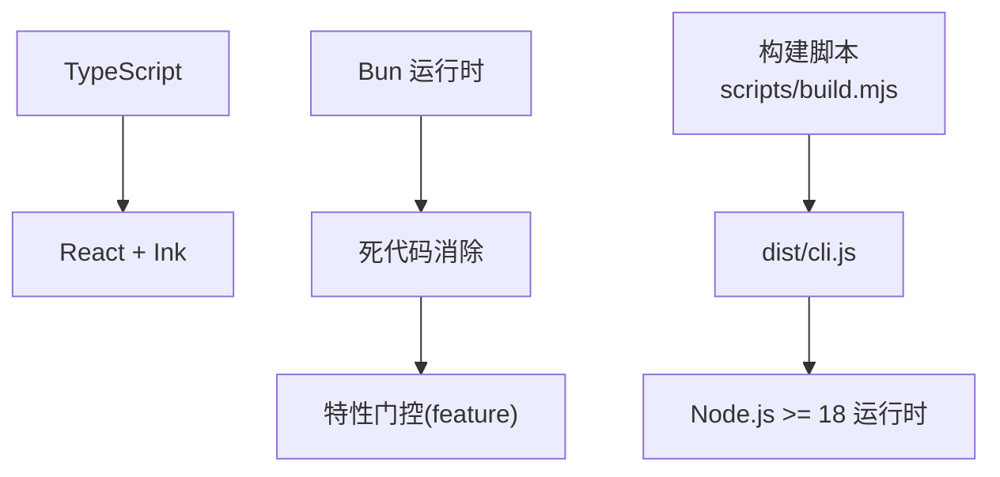

# 项目概述

<cite>
**本文引用的文件**
- [README.md](file://README.md)
- [QUICKSTART.md](file://QUICKSTART.md)
- [package.json](file://package.json)
- [src/main.tsx](file://src/main.tsx)
- [src/bootstrap/state.ts](file://src/bootstrap/state.ts)
- [src/QueryEngine.ts](file://src/QueryEngine.ts)
- [src/query.ts](file://src/query.ts)
- [src/tools.ts](file://src/tools.ts)
- [src/commands.ts](file://src/commands.ts)
- [docs/zh/05-未来路线图.md](file://docs/zh/05-未来路线图.md)
</cite>

## 目录
1. [引言](#引言)
2. [项目结构](#项目结构)
3. [核心组件](#核心组件)
4. [架构总览](#架构总览)
5. [详细组件分析](#详细组件分析)
6. [依赖关系分析](#依赖关系分析)
7. [性能考量](#性能考量)
8. [故障排查指南](#故障排查指南)
9. [结论](#结论)
10. [附录](#附录)

## 引言
Claude Code v2.1.88 是一个面向开发者的智能代码助手，基于“代理循环”（agent loop）构建，结合工具系统、权限控制、上下文压缩与多代理协作，提供从 AI 驱动的代码编写、审查到调试的全链路能力。该项目采用分层架构：入口层负责交互与会话初始化；查询引擎承载核心推理与工具调度；工具/服务/状态层分别提供执行能力、业务逻辑与持久化。

项目强调生产级“夹 Harness”机制，围绕权限、流式传输、并发、压缩、子代理与 MCP 协议进行工程化增强，确保在复杂工程场景下的稳定性与可扩展性。同时，项目内置 40+ 工具、80+ 指令、权限规则、上下文压缩策略，并支持桥接桌面/远程环境与多代理协作。

## 项目结构
仓库采用按职责分层的组织方式：
- 入口层：CLI/REPL/SDK 入口与初始化流程
- 查询引擎：消息组装、系统提示拼装、主循环与工具执行
- 工具系统：内置工具与 MCP 工具的统一抽象与注册
- 命令系统：80+ 指令的动态加载与可用性过滤
- 服务层：API 客户端、分析与遥测、MCP 管理、插件与技能
- 状态层：全局会话状态与 UI 状态管理
- 桥接层：与 Claude Desktop/远程环境的会话桥接

**图表来源**
- [src/main.tsx:585-800](file://src/main.tsx#L585-L800)
- [src/QueryEngine.ts:184-212](file://src/QueryEngine.ts#L184-L212)
- [src/query.ts:181-200](file://src/query.ts#L181-L200)
- [src/tools.ts:193-251](file://src/tools.ts#L193-L251)
- [src/commands.ts:258-346](file://src/commands.ts#L258-L346)
- [src/bootstrap/state.ts:45-257](file://src/bootstrap/state.ts#L45-L257)

**章节来源**
- [README.md:250-379](file://README.md#L250-L379)

## 核心组件
- 入口与初始化（src/main.tsx）
  - 负责解析参数、建立信任与托管设置、预取系统上下文、延迟启动后台任务、注入运行时环境变量与宏常量、初始化分析与 MCP 配置。
  - 支持多种入口形态：CLI、SDK、MCP 服务、直接连接、SSH 远程等。
- 查询引擎（src/QueryEngine.ts）
  - 封装会话生命周期与消息流转，负责系统提示拼装、用户输入处理、工具权限检查、工具执行与结果归档、进度与最终结果的流式产出。
- 主循环（src/query.ts）
  - 实现代理循环：消息标准化、令牌预算与自动压缩、工具执行编排、停止钩子与恢复逻辑、错误处理与重试。
- 工具系统（src/tools.ts）
  - 统一工具接口与工厂，内置 40+ 工具（文件读写、搜索、网络、交互、计划/任务、MCP、技能等），支持条件编译与 REPL 模式屏蔽。
- 命令系统（src/commands.ts）
  - 动态加载 80+ 指令，按可用性与启用状态过滤，支持技能/插件/工作流扩展，提供远程安全指令白名单。
- 全局状态（src/bootstrap/state.ts）
  - 会话级指标、计数器、时间戳、模型用量、代理颜色映射、提示缓存标记、遥测提供者等，支撑跨模块的状态一致性。

**章节来源**
- [src/main.tsx:585-800](file://src/main.tsx#L585-L800)
- [src/QueryEngine.ts:184-212](file://src/QueryEngine.ts#L184-L212)
- [src/query.ts:181-200](file://src/query.ts#L181-L200)
- [src/tools.ts:193-251](file://src/tools.ts#L193-L251)
- [src/commands.ts:258-346](file://src/commands.ts#L258-L346)
- [src/bootstrap/state.ts:45-257](file://src/bootstrap/state.ts#L45-L257)

## 架构总览
项目采用“入口层 → 查询引擎 → 工具/服务/状态”的分层设计，配合“特性门控（feature flags）”与“死代码消除（DCE）”实现按需裁剪与内部分支隔离。查询引擎是核心枢纽，贯穿系统提示拼装、消息标准化、工具执行与结果归档；工具系统与命令系统提供能力扩展；状态层提供会话级数据与指标；服务层封装外部集成（API/MCP/分析）。

**图表来源**
- [README.md:383-445](file://README.md#L383-L445)
- [src/QueryEngine.ts:184-212](file://src/QueryEngine.ts#L184-L212)
- [src/query.ts:181-200](file://src/query.ts#L181-L200)
- [src/tools.ts:193-251](file://src/tools.ts#L193-L251)
- [src/commands.ts:258-346](file://src/commands.ts#L258-L346)
- [src/bootstrap/state.ts:45-257](file://src/bootstrap/state.ts#L45-L257)

## 详细组件分析

### 入口层与初始化流程
- 初始化阶段完成：
  - 解析早期参数与入口类型（CLI/SDK/MCP/远程等）
  - 建立信任与托管设置，预取系统上下文
  - 注入运行时宏与环境变量，延迟启动后台任务
  - 初始化分析与 MCP 配置，准备会话状态
- 特性门控与死代码消除：
  - 通过 Bun 编译期特性门控（feature()）在构建时裁剪分支
  - 108 个内部模块在外部包中被 DCE 移除，仅在内部构建保留

**图表来源**
- [src/main.tsx:585-800](file://src/main.tsx#L585-L800)
- [src/QueryEngine.ts:209-236](file://src/QueryEngine.ts#L209-L236)
- [src/query.ts:181-200](file://src/query.ts#L181-L200)

**章节来源**
- [src/main.tsx:585-800](file://src/main.tsx#L585-L800)
- [README.md:70-194](file://README.md#L70-L194)

### 查询引擎与主循环
- 查询引擎职责：
  - 系统提示拼装（含工具、权限、记忆等）
  - 用户输入处理与指令解析
  - 会话消息持久化与回放
  - 工具权限检查与执行编排
  - 结果归档与流式输出
- 主循环关键流程：
  - 消息标准化与令牌预算检查
  - 自动压缩与上下文折叠
  - 工具执行与结果聚合
  - 停止钩子与恢复逻辑
  - 错误处理与重试策略

**图表来源**
- [src/QueryEngine.ts:209-236](file://src/QueryEngine.ts#L209-L236)
- [src/query.ts:181-200](file://src/query.ts#L181-L200)

**章节来源**
- [src/QueryEngine.ts:184-212](file://src/QueryEngine.ts#L184-L212)
- [src/query.ts:181-200](file://src/query.ts#L181-L200)

### 工具系统与权限控制
- 工具抽象与工厂：
  - 统一工具接口，支持校验、权限检查、并发安全、只读/破坏性判定、中断行为
  - 内置 40+ 工具：文件读写、搜索、网络、交互、计划/任务、MCP、技能等
  - 条件编译与 REPL 屏蔽，避免直接暴露底层工具
- 权限控制：
  - 输入校验前置、预工具钩子、规则匹配（允许/拒绝/询问）、交互确认
  - 工具特定权限检查（如路径沙箱）
  - 会话级权限模式与策略

**图表来源**
- [README.md:500-563](file://README.md#L500-L563)
- [src/tools.ts:193-251](file://src/tools.ts#L193-L251)

**章节来源**
- [README.md:500-563](file://README.md#L500-L563)
- [src/tools.ts:193-251](file://src/tools.ts#L193-L251)

### 命令系统与上下文管理
- 命令系统：
  - 动态加载 80+ 指令，按可用性与启用状态过滤
  - 技能/插件/工作流扩展，远程安全指令白名单
- 上下文管理：
  - 三类压缩策略：自动压缩、快照压缩、上下文折叠
  - 压缩边界与摘要消息，保证历史与近期高保真消息的平衡

**图表来源**
- [src/commands.ts:258-346](file://src/commands.ts#L258-L346)
- [README.md:650-689](file://README.md#L650-L689)

**章节来源**
- [src/commands.ts:258-346](file://src/commands.ts#L258-L346)
- [README.md:650-689](file://README.md#L650-L689)

### 多代理协作与桥接层
- 多代理协作：
  - 主代理、派生代理（fork）、远程代理、同进程队友
  - 通信：消息传递、任务板、团队生命周期管理
- 桥接层：
  - 与 Claude Desktop/远程环境的会话桥接，JWT 认证、工作密钥交换、会话生命周期管理

**图表来源**
- [README.md:609-646](file://README.md#L609-L646)

**章节来源**
- [README.md:609-646](file://README.md#L609-L646)

## 依赖关系分析
- 技术栈选择动机：
  - TypeScript：强类型保障与大规模工程维护性
  - React + Ink：终端 UI 渲染与交互体验
  - Bun 运行时：编译期特性门控与打包优化，支持死代码消除
- 依赖与构建：
  - 包管理与脚本：package.json 定义构建与检查脚本
  - 快速开始：支持预编译 CLI 直接运行或最佳努力 esbuild 构建
  - 特性门控：Bun feature() 在构建时决定是否包含内部模块与工具

**图表来源**
- [README.md:222-223](file://README.md#L222-L223)
- [QUICKSTART.md:3-22](file://QUICKSTART.md#L3-L22)
- [package.json:7-11](file://package.json#L7-L11)

**章节来源**
- [README.md:222-223](file://README.md#L222-L223)
- [QUICKSTART.md:3-22](file://QUICKSTART.md#L3-L22)
- [package.json:7-11](file://package.json#L7-L11)

## 性能考量
- 启动性能与延迟：
  - 并行预取系统上下文与用户上下文，延迟非关键后台任务
  - 启动阶段旁路某些昂贵操作，减少首帧阻塞
- 查询性能：
  - 令牌预算与自动压缩，避免上下文溢出
  - 工具执行并发与串行分区，提升吞吐
- 存储与回放：
  - 会话日志按需写入，支持断点续回与快照
  - 进度与工具结果内联记录，避免重复写入

[本节为通用指导，无需具体文件分析]

## 故障排查指南
- 常见问题定位：
  - 权限拒绝：检查权限规则与交互确认流程
  - 工具执行失败：查看工具结果与错误日志，确认输入合法性
  - 上下文过长：触发自动压缩或手动压缩指令
  - 远程桥接异常：核对 JWT/工作密钥与会话状态
- 诊断与日志：
  - 内存错误日志与增量追踪，便于定位问题根因
  - 分析遥测与增长实验配置，辅助性能回归定位

**章节来源**
- [src/QueryEngine.ts:244-271](file://src/QueryEngine.ts#L244-L271)
- [src/query.ts:123-149](file://src/query.ts#L123-L149)
- [README.md:609-646](file://README.md#L609-L646)

## 结论
Claude Code v2.1.88 以“代理循环”为核心，通过入口层、查询引擎、工具/服务/状态三层架构，结合特性门控与死代码消除，实现了可扩展、可治理、可远程协作的智能代码助手。其内置 40+ 工具、权限控制、上下文压缩与多代理协作，覆盖从 AI 驱动的代码编写、审查到调试的完整场景。未来路线图显示模型演进（Numbat/Opus/Sonnet）、KAIROS 自主代理模式、语音输入与多模态工具等方向，项目正从“编程助手”向“全天候自主开发代理”演进。

[本节为总结性内容，无需具体文件分析]

## 附录

### 快速开始
- 运行预编译 CLI（推荐）
  - 设置认证后直接运行：node cli.js --version 或 node cli.js -p "Hello Claude"
  - 或全局安装后使用 claude --version
- 最佳努力构建（esbuild）
  - 安装 esbuild，运行 scripts/build.mjs，产物位于 dist/cli.js
  - 注意：108 个内部模块缺失，需手工创建桩文件或改用 Bun 全量构建
- Bun 全量构建（内部访问）
  - 使用 Bun 的特性门控与宏替换，生成完整包

**章节来源**
- [QUICKSTART.md:3-22](file://QUICKSTART.md#L3-L22)
- [QUICKSTART.md:72-87](file://QUICKSTART.md#L72-L87)
- [package.json:7-11](file://package.json#L7-L11)

### 未来路线图要点
- 新模型：Numbat（下一代）、Opus 4.7、Sonnet 4.8
- 自主代理：KAIROS 模式（心跳、焦点自适应、主动行动、推送通知）
- 多模态：语音输入（push-to-talk）、浏览器工具、工作流自动化
- 协调器模式与 Buddy 系统（虚拟宠物）等

**章节来源**
- [docs/zh/05-未来路线图.md:1-150](file://docs/zh/05-未来路线图.md#L1-L150)